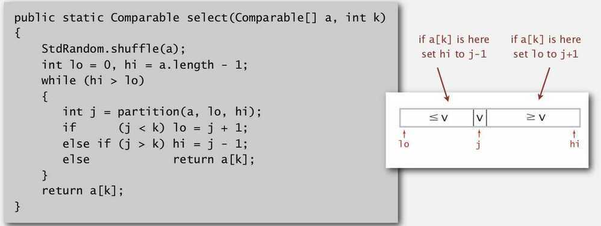

# Quick Select

Randomized quickselect, a quicksort variant which finds the kth smallest item in linear time.

Goal - Given an array of N items, find a kth smallest item.

## Quick-select

- Partition array so that:
  - Entry a[j] is in place.
  - No larger entry to the left of j
  - No smaller entry to the right of j
- Takes linear time on average

