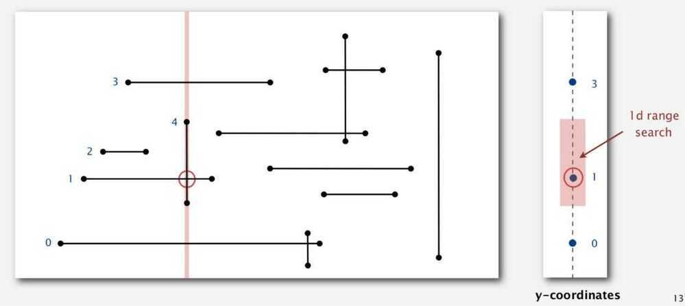

# Sweep Line Algorithm

## Orthogonal Line Segment Intersection

Given N horizontal and vertical line segments, find all intersections

Naïve and brute-force algorithm - Check all pairs of line segments for intersection.

Non degeneracy Assumption - All x- and y- coordinates are distinct

## Sweep-line algorithm (Sweep vertical line from left to right)

- x - coordinates define events.
- h-segment (left endpoint): insert y-coordinate into BST
- h-segment (right endpoint): remove y-coordinate from BST
- v-segment: 1 d range search for interval of y-endpoints

## Sweep-line analysis

Proposition: The sweep-line algorithm takes time proportional to N log N + R to find all R intersections among N orthogonal line segments

Bottom line: Sweep line reduces 2d orthogonal line segment intersection search to 1d range search
