# Types of algorithms

1. Simple recursive algorithms

   - solves the base care directly

   - recurs with a simpler subproblem

2. Backtracking algorithms

   - Based on a depth-first recursive search

   - ex- graph colouring (To color a map with no more than four colors)

https://www.freecodecamp.org/news/solve-coding-interview-backtracking-problem

3. Divide and conquer algorithms

   - divide the problems into smaller subproblems of the same type, and solve these subproblems recursively

   - combine the solutions to the subproblems into a solution to the original problem

   - ex- quicksort, mergesort

4. Dynamic programming algorithms

   - remembers past results and use it to find new results

   - Optimal substructure

   - Overlapping subproblems

5. Greedy algorithms

   - optimization problem is one in which you want to find, not just a solution, but the best solution. (take the best you can get right now, without regard for future consequences)

   - ex- counting money

6. Branch and bound algorithms

   - generally used for optimization problems

   - as the algorithm progresses, a tree of subproblems is formed

   - The original problem is considered the "root problem"

   - A method is used to construct an upper and lower bound for a given problem

   - At each node, apply the bounding methods

       - If the bounds match, it is deemed a feasible solution to that particular subproblem

       - If bounds do not match, partition the problem represented by that node, and make the two subproblems into children nodes

   - Continue, using the best known feasible solution to trim sections of the tree, until all nodes have been solved or trimmed.

   - ex - Travelling salesman problem

7. Brute force algorithms

   - simply tries all possibilities until a satisfactory solution is found

   - To improve brute force algorithms following can be used -

       - Heuristic - A "rule of thumb" that helps you decide which possibilities to look at first.

       - Optimization - A way to eliminate certain possibilities without fully exploring them

8. Randomized algorithms

   - ex - Quicksort, uses a random number to choose a pivot

|     | 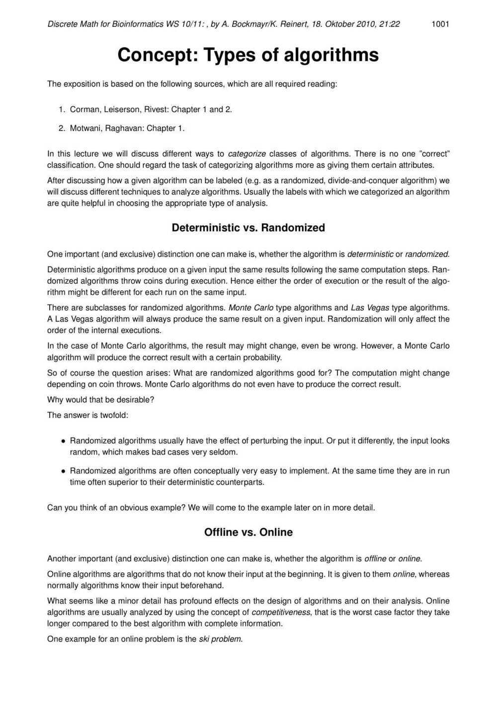 |
|--|----------------------------------------------------------------------|

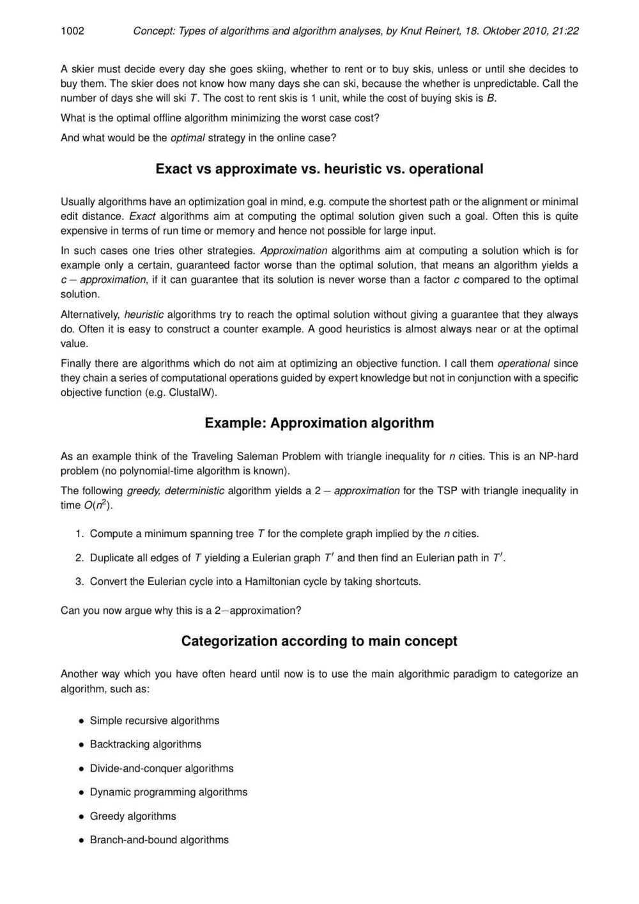

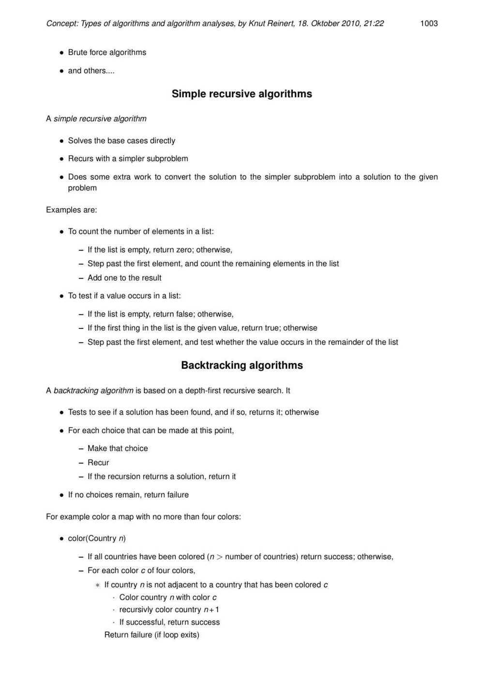

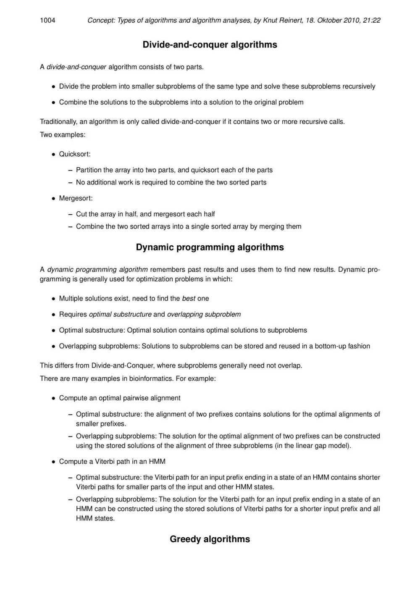

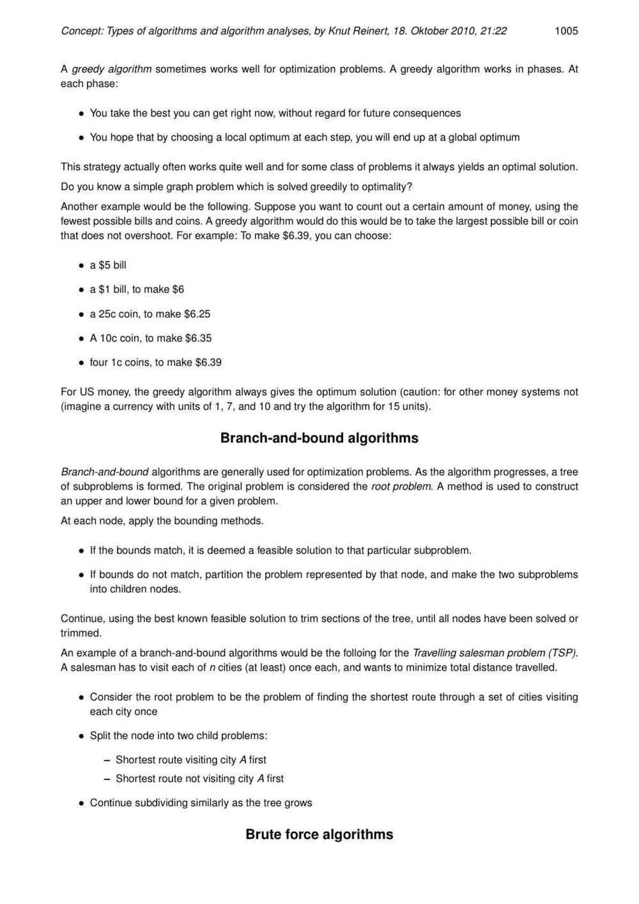

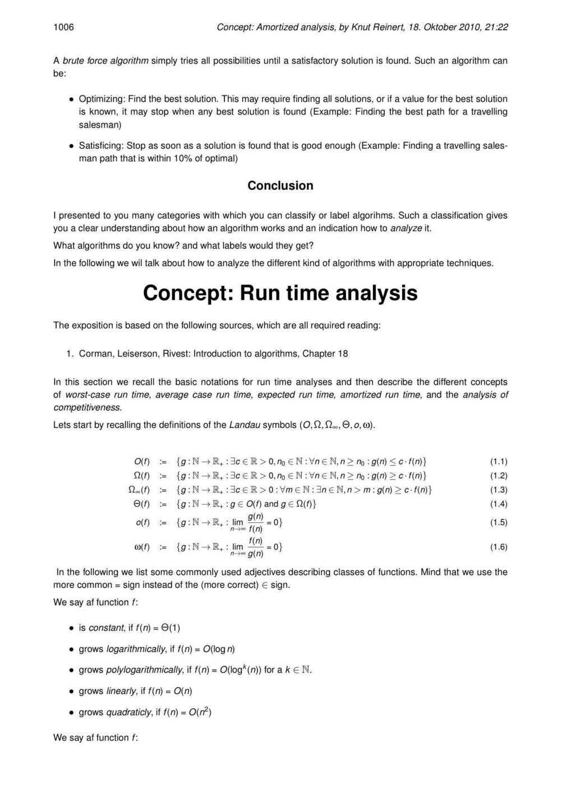

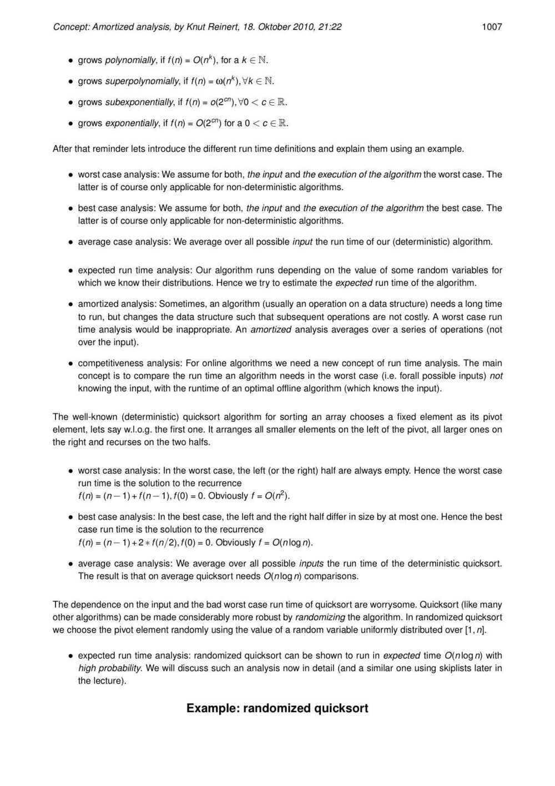

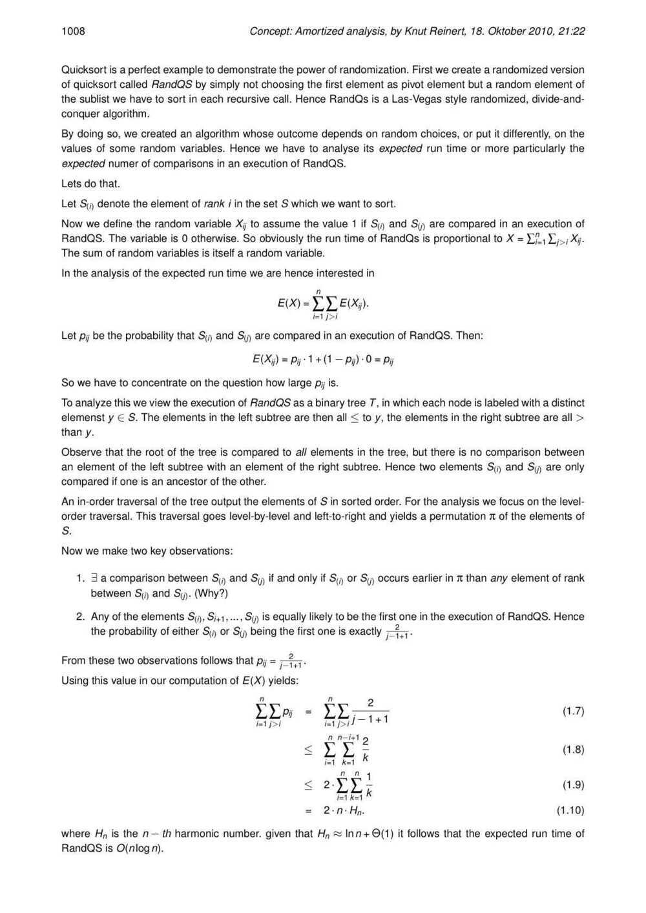

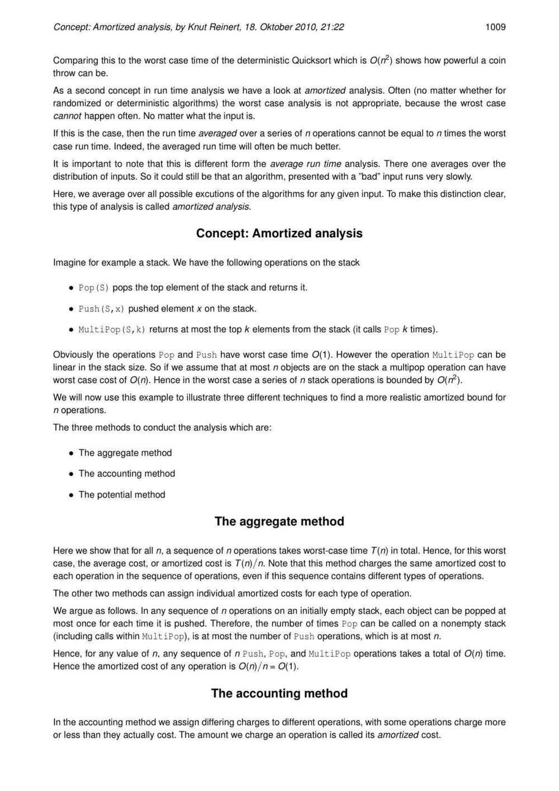

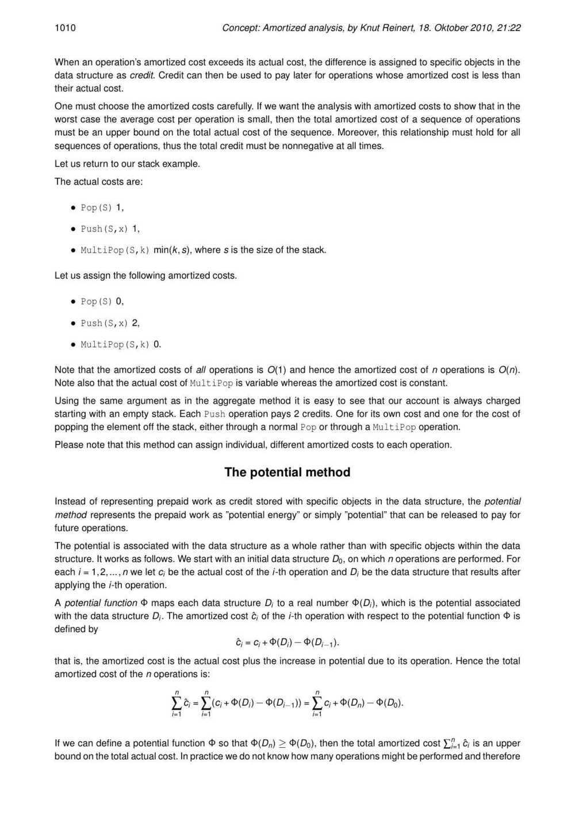

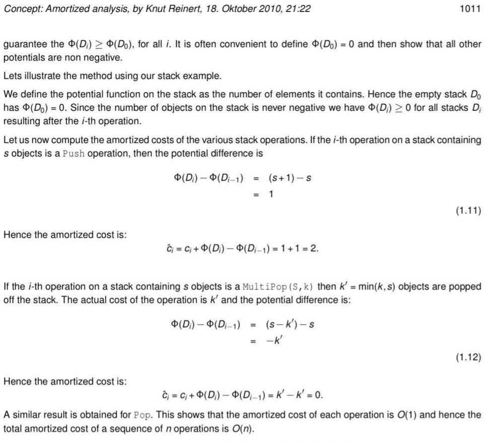
