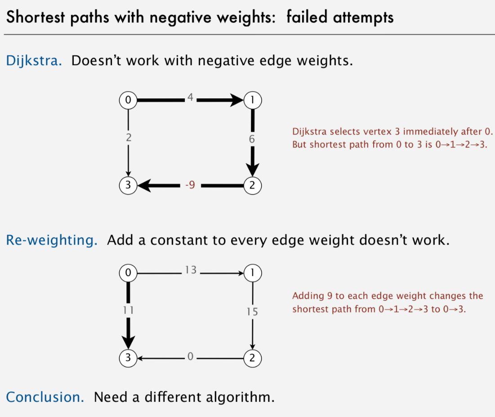
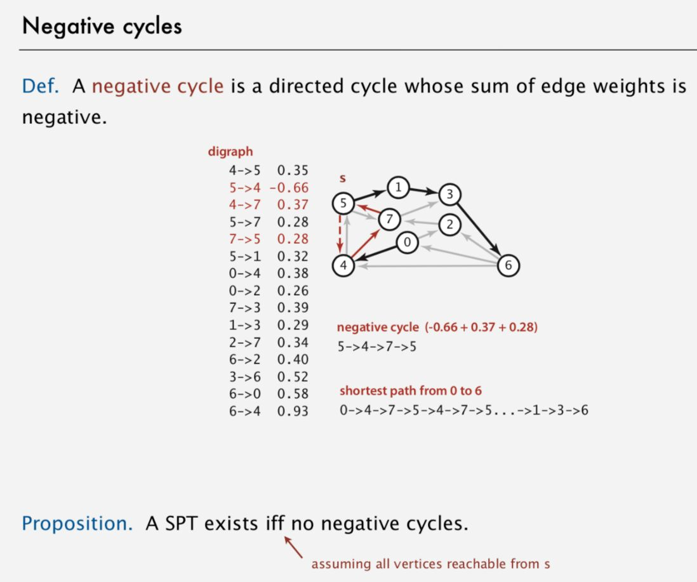
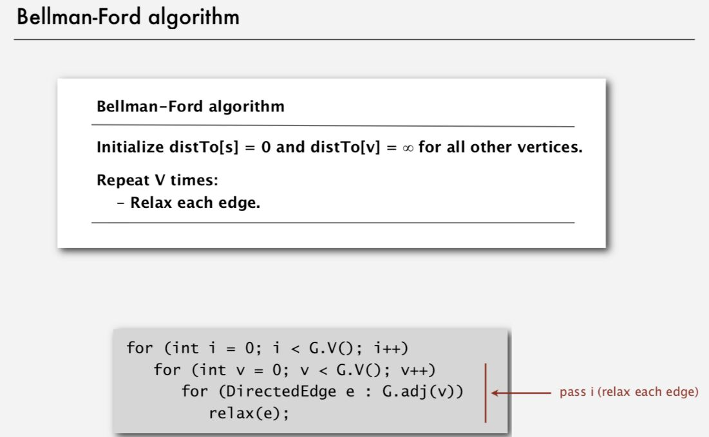
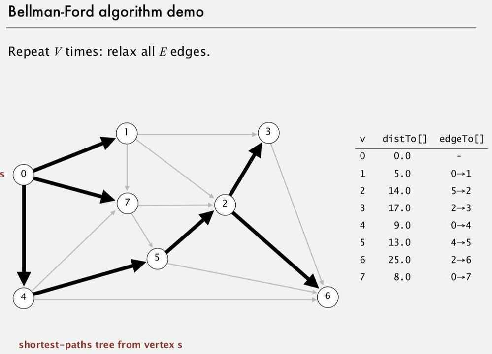
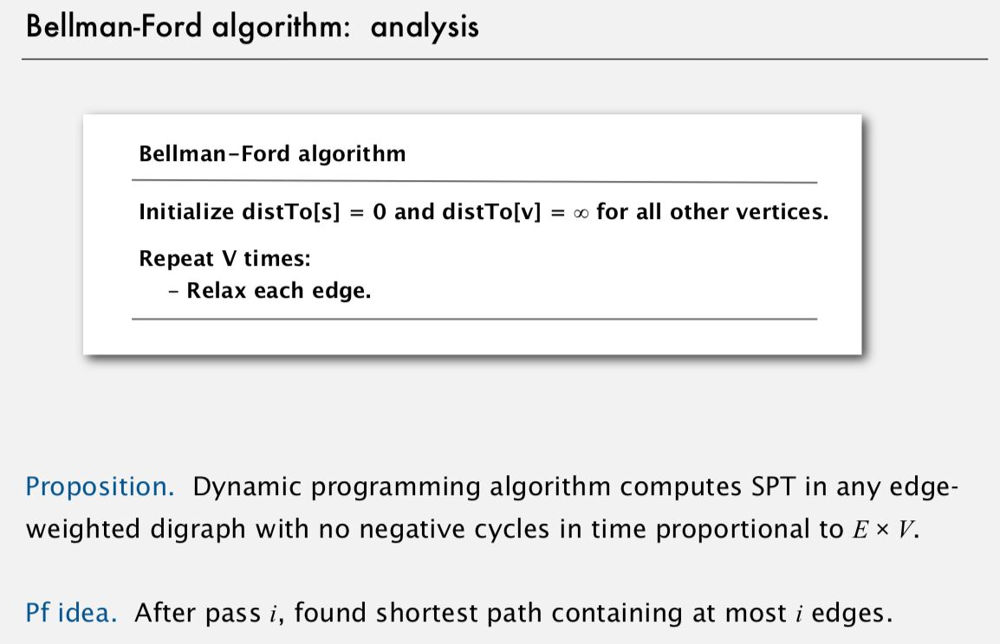
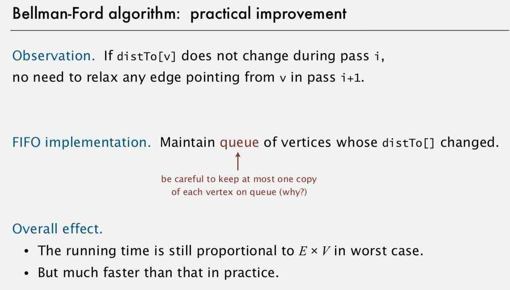
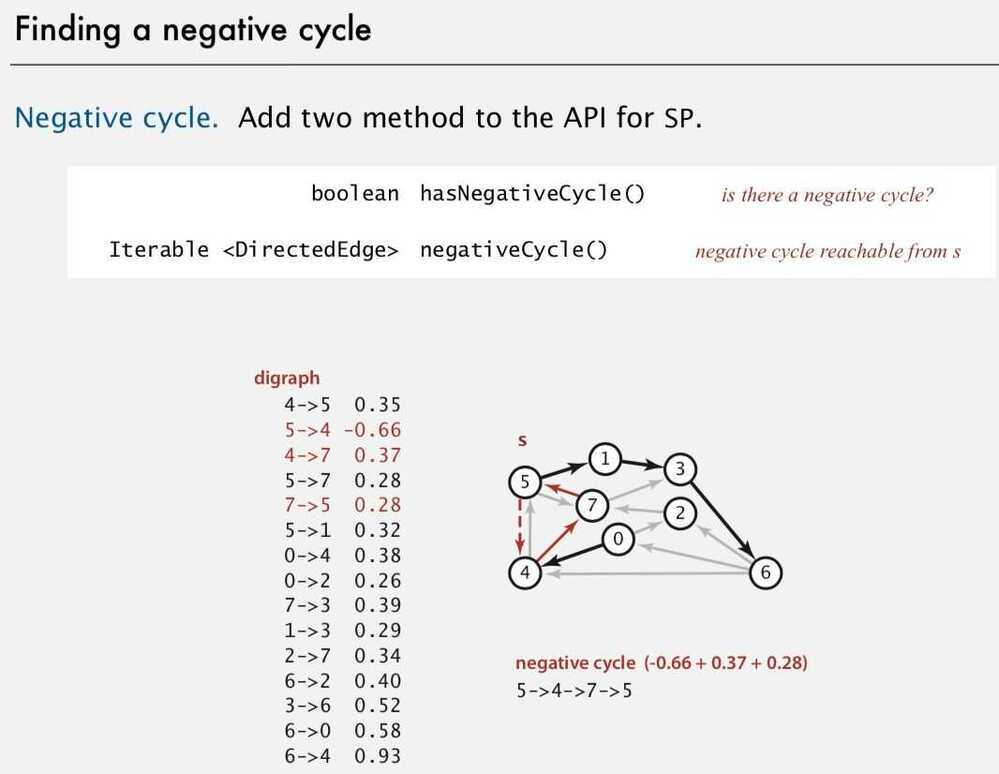
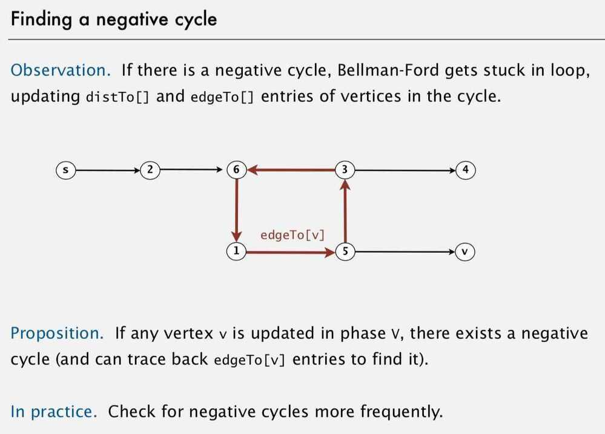

# Bellman Ford Algorithm

Negative Cycles should not exists in the graph while calculating shortest paths, because if negative cycle exists between the source and destination, than path can be reduced to as low as possible just by cycling through the negative cycle.

