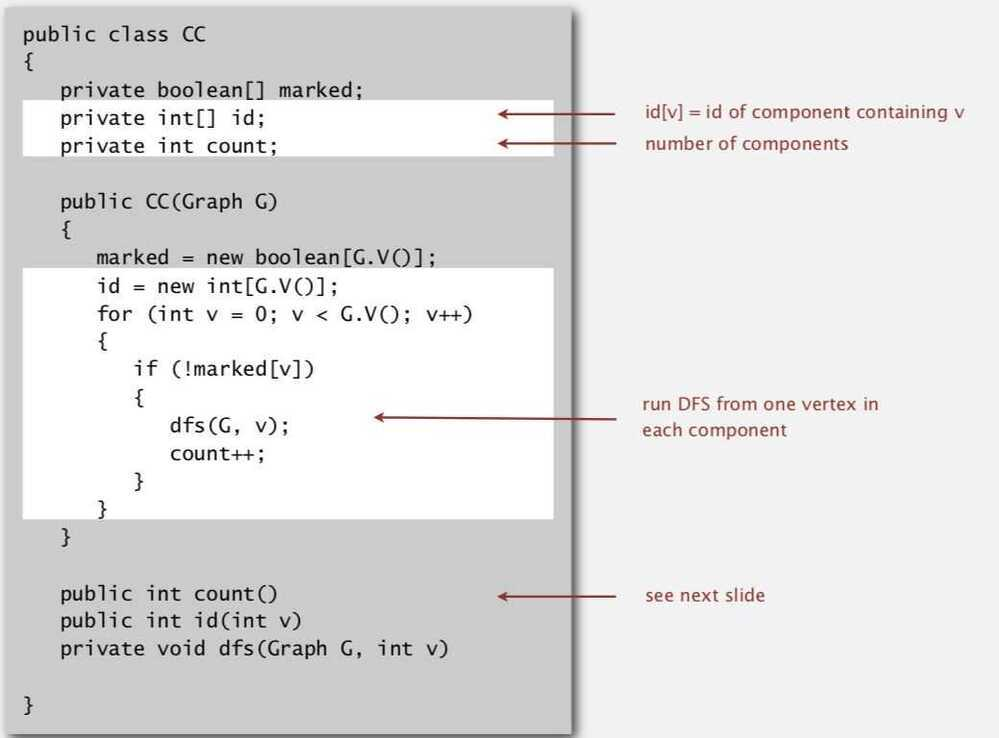

# Connected Components

## Connected Components

Definition: Vertices v and w are connected if there is a path between them.

Goal: Preprocess graph to answer queries of the form is v connected to w in constant time.

Union-find: Does not answer in constant time

## Union-Find vs DFS

The union-find algorithm is best suited for situations where the equivalence relationship is changing, i.e., there are "Union" operations which need to be performed on your set of partitions. Given a fixed undirected graph, you don't have the equivalence relationships changing at all - the edges are all fixed. OTOH, if you have a graph with new edges being added, DFS won't cut it. While DFS is asymptotically faster than union-find, in practice, the likely deciding factor would be the actual problem that you are trying to solve.

## Static graph - DFS

## Dynamic graph - Union-find
