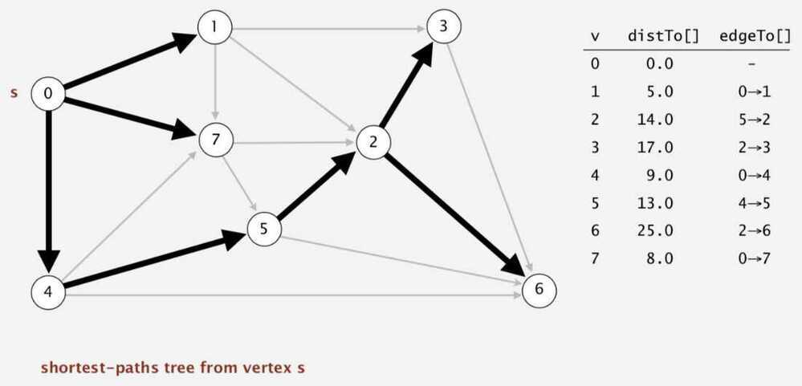
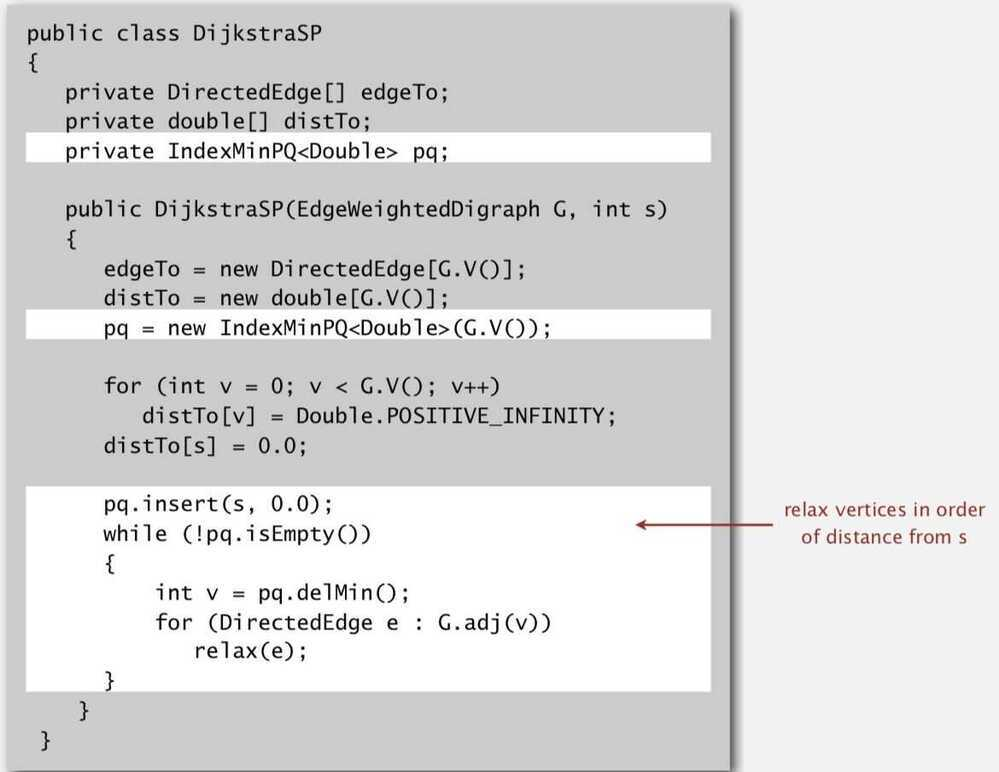
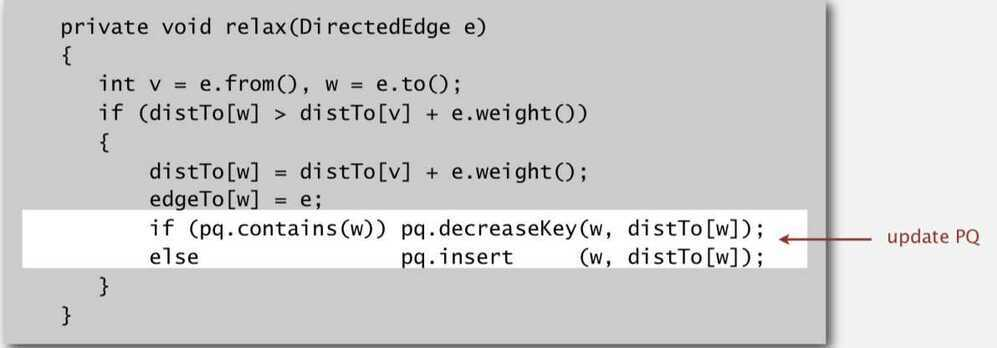

# Dijkstra's Algorithm

## Properties

- For directed graphs
- Single source vertex to all other vertex
- Non-negative weights
- Time complexity O(V^2) using adjacency matrix representation
- Time Complexity O(E log V) using binary heap and adjacency list representation (it takes O(log n) for decrease key operation)
- Time Complexity O(E + V log V) using Fibonacci heap (it takes O(1) for decrease key operation)
- Doesn't work for graph with negative weight edges

Dijkstra's algorithm is very similar to [Prim's algorithm for minimum spanning tree](https://www.geeksforgeeks.org/archives/27455). Like Prim's MST, we generate a*SPT (shortest path tree)*with given source as root. We maintain two sets, one set contains vertices included in shortest path tree, other set includes vertices not yet included in shortest path tree. At every step of the algorithm, we find a vertex which is in the other set (set of not yet included) and has minimum distance from source.

1. Lazy version

2. Eager version

## Why use Dijkstra's Algorithm if Breadth First Search (BFS) can do the same thing faster?

Dijkstra allows assigning distances other than 1 for each step. For example, in routing the distances (or weights) could be assigned by speed, cost, preference, etc. The algorithm then gives you the shortest path from your source to every node in the traversed graph.

Meanwhile BFS basically just expands the search by one "step" (link, edge, whatever you want to call it in your application) on every iteration, which happens to have the effect of finding the smallestnumber of stepsit takes to get to any given node from your source ("root").

<https://stackoverflow.com/questions/3818079/why-use-dijkstras-algorithm-if-breadth-first-search-bfs-can-do-the-same-thing>

<https://deployeveryday.com/2019/10/16/dijkstra-algorithm-golang.html>

<https://medium.com/cantors-paradise/dijkstras-shortest-path-algorithm-in-python-d955744c7064>

<https://medium.com/basecs/finding-the-shortest-path-with-a-little-help-from-dijkstra-613149fbdc8e>
