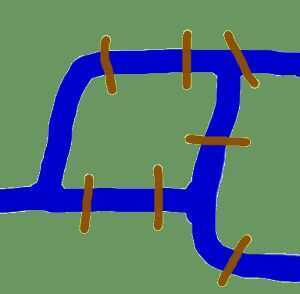
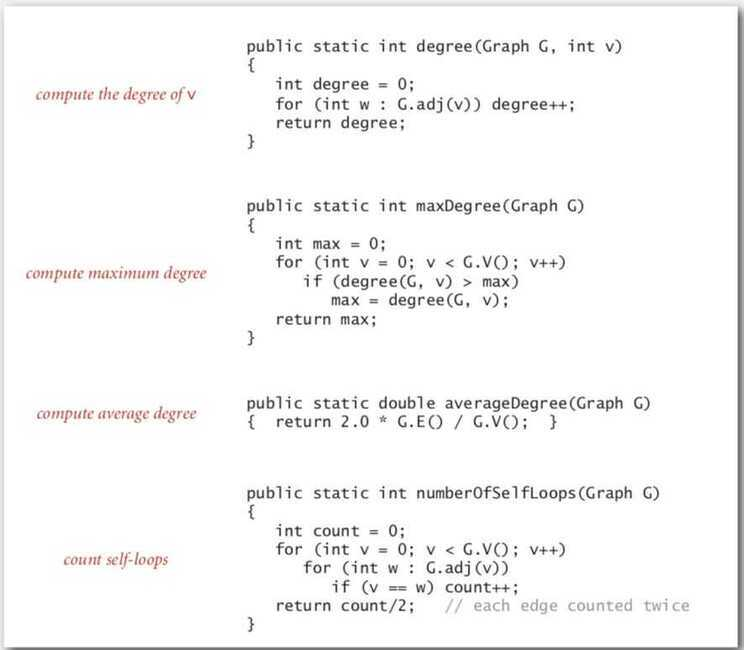
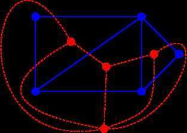

# Intro

## Origins of Graph Theory

The seven bridge of Künigsberg.

Königsberg was a city in Prussia that time. The river Pregel flowed through the town, creating two islands.

City and islands were connected by 7 bridges

Question: if it was possible to take a walk through the town by visiting each area of the town and crossing each bridge only once?

Leonhard Euler solved the problem in 1735 by proving that it is not possible.

## Introduction

1. Path
2. Cycle - Is a path that starts and ends at the same vertex
3. Acyclic graph - A graph with no cycles
4. Directed Acyclic Graph (DAG) - A directed graph with no cycles

## Graph-Processing problems / Graph Challenges

1. Path: Is there a path between s and t?
2. Shortest-Path: What is the shortest path between s and t?
3. Cycle: Is there a cycle in the graph? (Use DFS)
4. **Euler tour / Eulerian Path**: Is there a cycle that uses each edge exactly once? (Bridges of Konigsberg). Answer: A connected graph is Eulerian if and only if all vertices have even edges
5. **Hamiltonian Path -** is a path in an undirected or directed path that visits each vertex exactly once.
6. **Hamilton tour / Hamiltonian Cycle / TSP:** Is there a cycle that uses each vertex exactly once? (Intractable - NP-complete problem) - Is a hamiltonian path that is a cycle
7. Connectivity: Is there a way to connect all of the vertices?
8. MST: What is the best way to connect all of the vertices?
9. Bi-connectivity: Is there a vertex whose removal disconnects the graph?
10. Bipartite - Is a graph bipartite (Use DFS)
11. Planarity: Can you draw the graph in the plane with no crossing edges (linear time using DFS discoverd by Tarjan in 1970s)
12. Graph isomorphism: Do two adjacency lists represent the same graph? (No one knows, longstanding open problem)

## Planar Graph

In [graph theory](https://en.wikipedia.org/wiki/Graph_theory), a **planar graph** is a [graph](https://en.wikipedia.org/wiki/Graph_(discrete_mathematics)) that can be [embedded](https://en.wikipedia.org/wiki/Graph_embedding) in the [plane](https://en.wikipedia.org/wiki/Plane_(geometry)), i.e., it can be drawn on the plane in such a way that its edges intersect only at their endpoints. In other words, it can be drawn in such a way that no edges cross each other. Such a drawing is called a **plane graph** or **planar embedding of the graph**. A plane graph can be defined as a planar graph with a mapping from every node to a point on a plane, and from every edge to a [plane curve](https://en.wikipedia.org/wiki/Plane_curve) on that plane, such that the extreme points of each curve are the points mapped from its end nodes, and all curves are disjoint except on their extreme points.

## Euler's Formula

Euler's formula states that if a finite, [connected](https://en.wikipedia.org/wiki/Connectivity_(graph_theory)), planar graph is drawn in the plane without any edge intersections, and *v* is the number of vertices, *e* is the number of edges and *f* is the number of faces (regions bounded by edges, including the outer, infinitely large region), then

`v - e + f = 2`

### example - cube

- v = 8
- e = 12
- f = 6
- 8 - 12 + 6 = 2

## Dual Graph

In the [mathematical](https://en.wikipedia.org/wiki/Mathematics) discipline of [graph theory](https://en.wikipedia.org/wiki/Graph_theory), the dual graph of a [plane graph](https://en.wikipedia.org/wiki/Plane_graph) G is a graph that has a [vertex](https://en.wikipedia.org/wiki/Vertex_(graph_theory)) for each [face](https://en.wikipedia.org/wiki/Face_(graph_theory)) of G. The dual graph has an [edge](https://en.wikipedia.org/wiki/Edge_(graph_theory)) whenever two faces of G are separated from each other by an edge, and a [self-loop](https://en.wikipedia.org/wiki/Self-loop) when the same face appears on both sides of an edge. Thus, each edge e of G has a corresponding dual edge, whose endpoints are the dual vertices corresponding to the faces on either side of e. The definition of the dual depends on the choice of embedding of the graph G, so it is a property of plane graphs (graphs that are already embedded in the plane) rather than [planar graphs](https://en.wikipedia.org/wiki/Planar_graph)(graphs that may be embedded but for which the embedding is not yet known). For planar graphs generally, there may be multiple dual graphs, depending on the choice of planar embedding of the graph.

**Red dotted graph is the dual graph of blue graph**

[Dual graph - Wikipedia](https://en.wikipedia.org/wiki/Dual_graph)

## Links

[Algorithms Course - Graph Theory Tutorial from a Google Engineer - YouTube](https://www.youtube.com/watch?v=09_LlHjoEiY)

https://www.freecodecamp.org/news/graph-algorithms-for-technical-interviews

https://www.freecodecamp.org/news/learn-how-graph-algorithms-work
