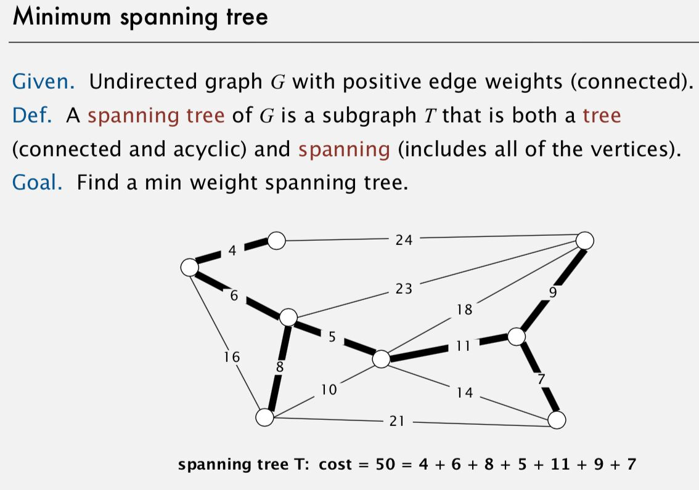
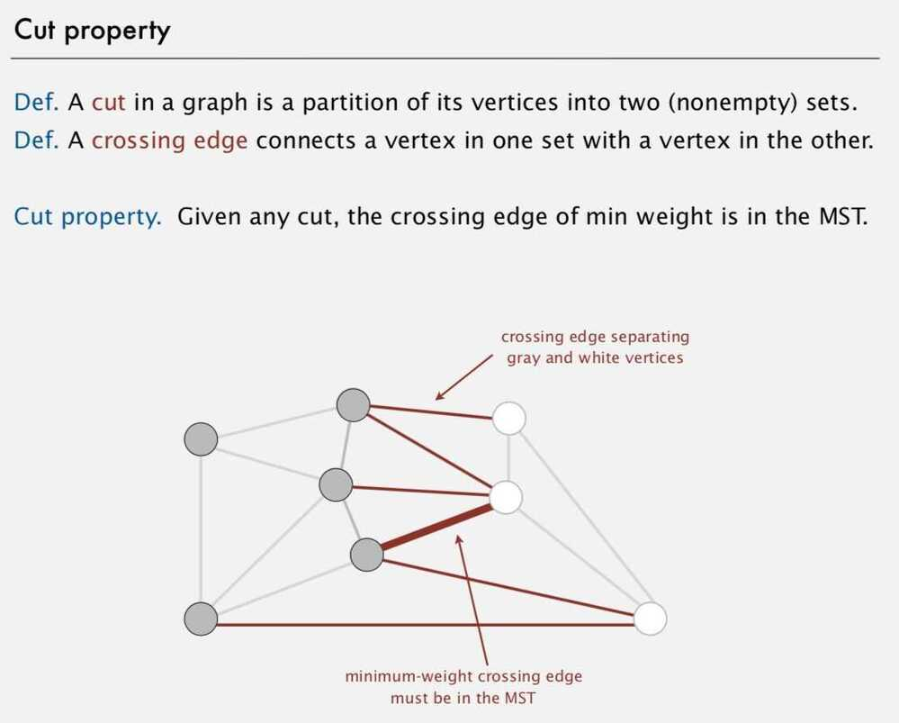
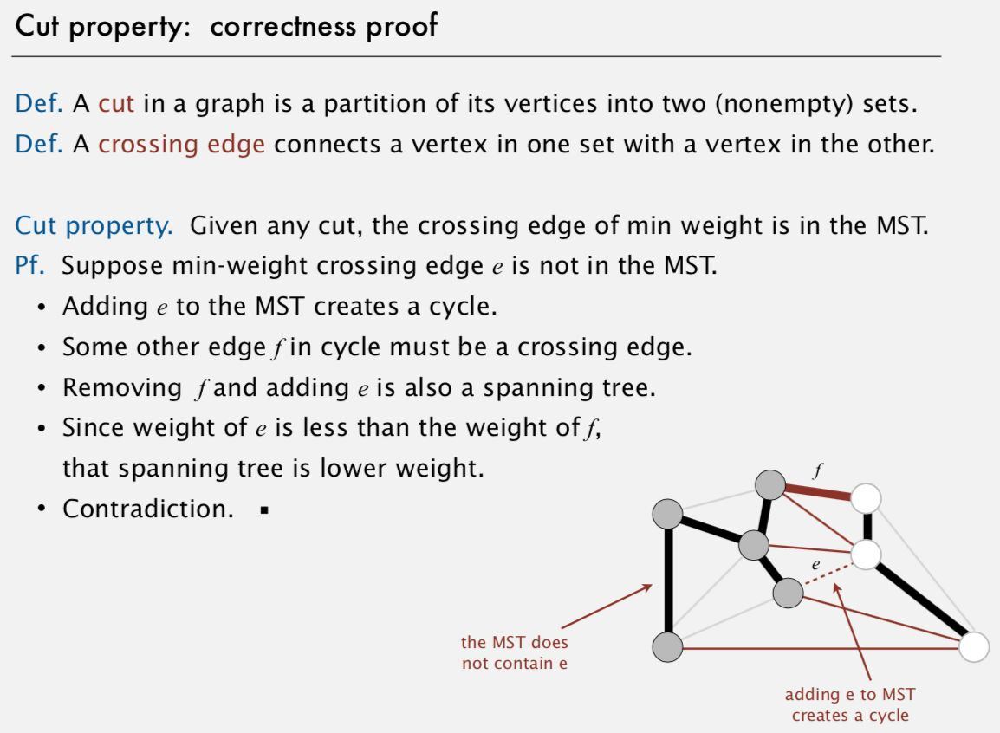
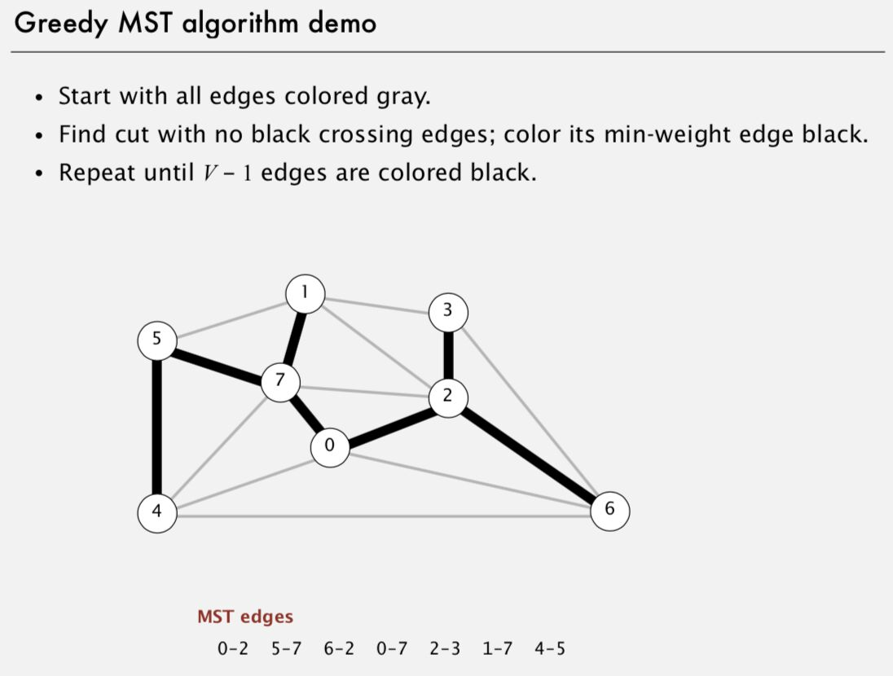

# Minimum Spanning Tree

## Properties of MST

- Always have V-1 edges for a graph of V vertices

## Applications

・Dithering.

・Cluster analysis.

・Max bottleneck paths.

・Real-time face verification.

・LDPC (Low Density Parity Check) codes for error correction.

・Image registration with Renyi entropy.

・Find road networks in satellite and aerial imagery.

・Reducing data storage in sequencing amino acids in a protein.

・Model locality of particle interactions in turbulent fluid flows.

・Autoconfig protocol for Ethernet bridging to avoid cycles in a network.

・Approximation algorithms for NP-hard problems (e.g., TSP, Steiner tree).

・Network design (communication, electrical, hydraulic, computer, road).

## Greedy Algorithm

## Implementations

1. Kruskal's Algorithm

2. Prim's Algorithm

3. Boruvka's Algorithm
