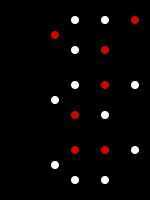

# Other Graph Algorithms

## Dominating Set

In [graph theory](https://en.wikipedia.org/wiki/Graph_theory), adominating setfor a [graph](https://en.wikipedia.org/wiki/Graph_(discrete_mathematics)) G=(V, E) is a [subset](https://en.wikipedia.org/wiki/Subset) DofVsuch that every vertex not inDis adjacent to at least one member ofD. Thedomination numberγ(G) is the number of vertices in a smallest dominating set forG.

Thedominating set problemconcerns testing whether γ(G)≤Kfor a given graphGand inputK; it is a classical [NP-complete](https://en.wikipedia.org/wiki/NP-complete)[decision problem](https://en.wikipedia.org/wiki/Decision_problem) in [computational complexity theory](https://en.wikipedia.org/wiki/Computational_complexity_theory). Therefore it is believed that there may be no [efficient algorithm](https://en.wikipedia.org/wiki/Polynomial-time_algorithm) that finds a smallest dominating set for all graphs, although there are efficient approximation algorithms, as well as both efficient and exact algorithms for certain graph classes.

Dominating sets (redvertices).

Figures (a)--(c) above shows three examples of dominating sets for a graph. In each example, each white vertex is adjacent to at least one red vertex, and it is said that the white vertex isdominatedby the red vertex. The domination number of this graph is 2: the examples (b) and (c) show that there is a dominating set with 2 vertices, and it can be checked that there is no dominating set with only 1 vertex for this graph.

https://en.wikipedia.org/wiki/Dominating_set

https://networkx.github.io/documentation/stable/reference/algorithms/generated/networkx.algorithms.dominating.dominating_set.html#networkx.algorithms.dominating.dominating_set

## Triadic closure

Triadic closureis a concept in [social network](https://en.wikipedia.org/wiki/Social_network) theory, first suggested by [German](https://en.wikipedia.org/wiki/Germany) [sociologist](https://en.wikipedia.org/wiki/Sociology) [Georg Simmel](https://en.wikipedia.org/wiki/Georg_Simmel) in his 1908 bookSoziologie.Triadic closure is the property among three nodes A, B, and C (representing people, for instance), that if the connections A-B and B-C exist, there is a tendency for the new connection A-C to be formed.Triadic closure can be used to understand and predict the growth of networks, although it is only one of many mechanisms by which new connections are formed in complex networks.

https://en.wikipedia.org/wiki/Triadic_closure
