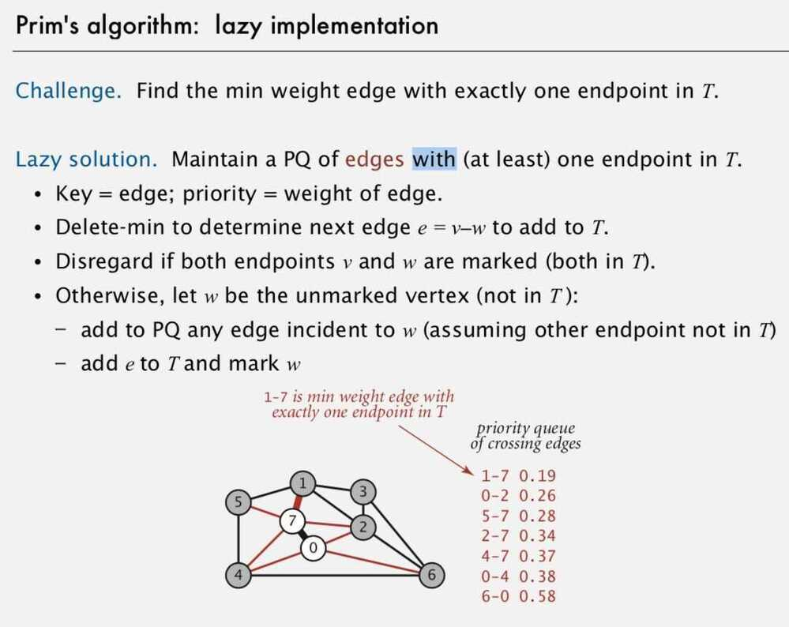
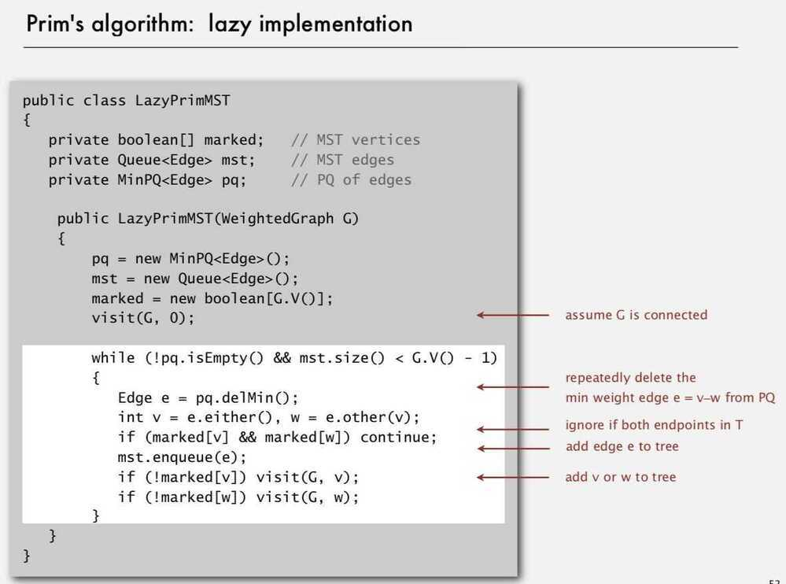
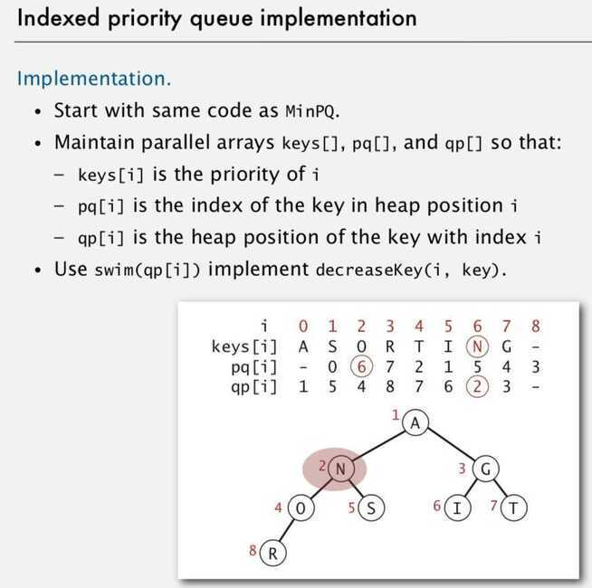

# Prim's Algorithm for MST

## Properties

- For Undirected graph

## Implementation

1. Lazy Implementation -

An edge that is absolute (i.e. cannot be added because it will create a cycle in the MST) is left in the priority queue.

2. Eager Implementation -

Only min weight edge with exactly one endpoint is added

Data Structure Used - Indexed Priority Queue, with decreaseKey API to decrease priority

## Applications

1. Euclidean MST

2. Clustering (single-link clustering algorithm)

3. Dendograms of cancers in humans
