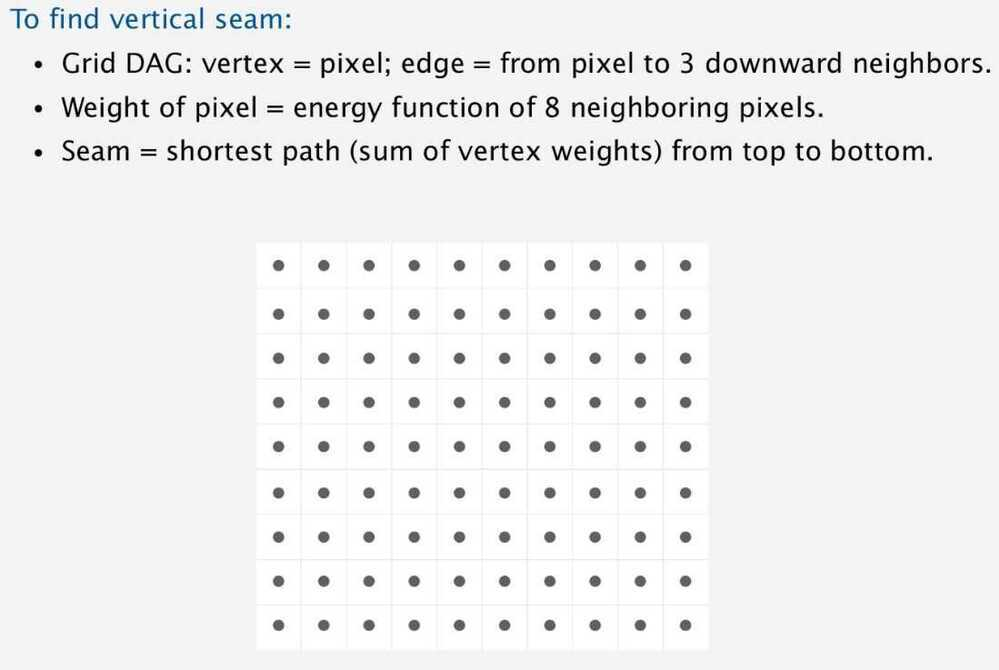
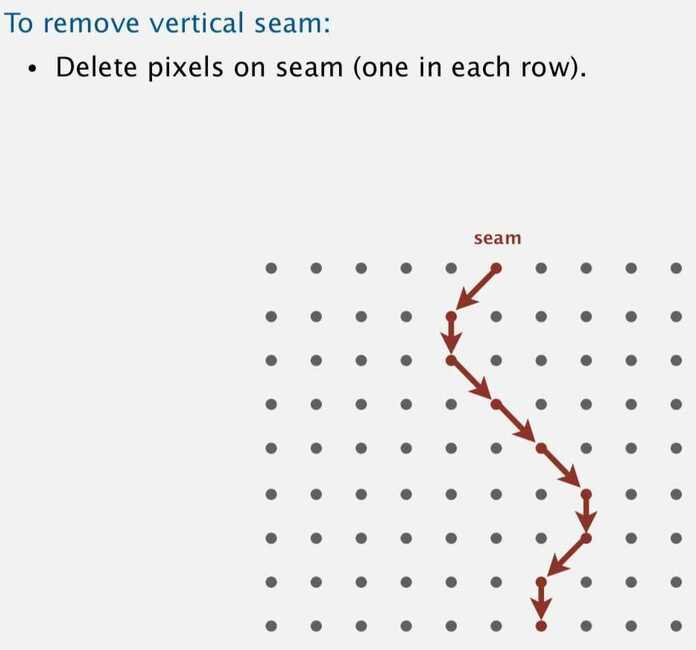
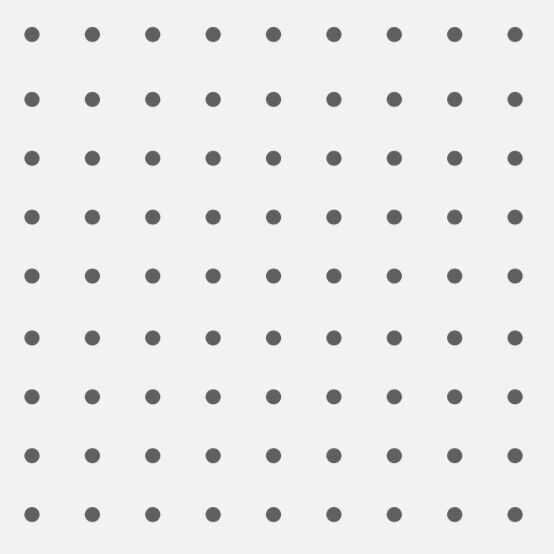

# Seam Carving

## Seam Carving for Content-Aware Image Resizing

- Also known as liquid rescaling
- It functions by establishing a number of *seams*(paths of least importance) in an image and automatically removes seams to reduce image size or inserts seams to extend it. Seam carving also allows manually defining areas in which pixels may not be modified, and features the ability to remove whole objects from photographs.
- The purpose of the algorithm is image retargeting, which is the problem of displaying images without distortion on media of various sizes (cell phones, projection screens) using document standards, like HTML, that already support dynamic changes in page layout and text but not images.

## Seams

- Vertical Seam

A vertical seam is a path of pixels connected from top to bottom in an image with one pixel in each row.

- Horizontal Seam

A horizontal seam is similar with the exception of the connection being from left to right.

## Working

Find energy function in an image (gradient magnitude)

Find connected path of pixels or seams from one side of the image to other that contain the least energy

Find the least amount of information and remove them

The importance/energy function values a pixel by measuring its contrast with its neighbor pixels.

## Computing Seams

Computing the seam consists of finding the path of minimum energy cost from one end of the image to another. This can be done via [Dijkstra's algorithm](https://en.wikipedia.org/wiki/Dijkstra%27s_algorithm), dynamic programming, [greedy algorithm](https://en.wikipedia.org/wiki/Greedy_algorithm) or [graph cuts](https://en.wikipedia.org/wiki/Cut_(graph_theory)) among others.

## To find the energy function to represent least amount of information

1. Gradient (acts like an edge detector in an image)

2. Entropy

3. Histogram of Oriented Gradients (HoG)

## Advanced

1. Use forward energy instead of backward energy (remove the seams that insert least amount of energy inserted to the picture after their removal)

2. Use negative energy for object deletion

3. Use motion detection (motion saliency) and face detection to preserve the context

4. Can be used to stabilize shaky camera videos.

Move the pixels left to merge the picture

