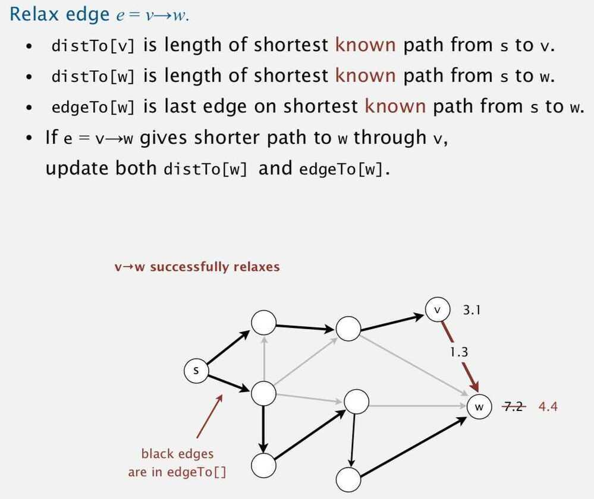
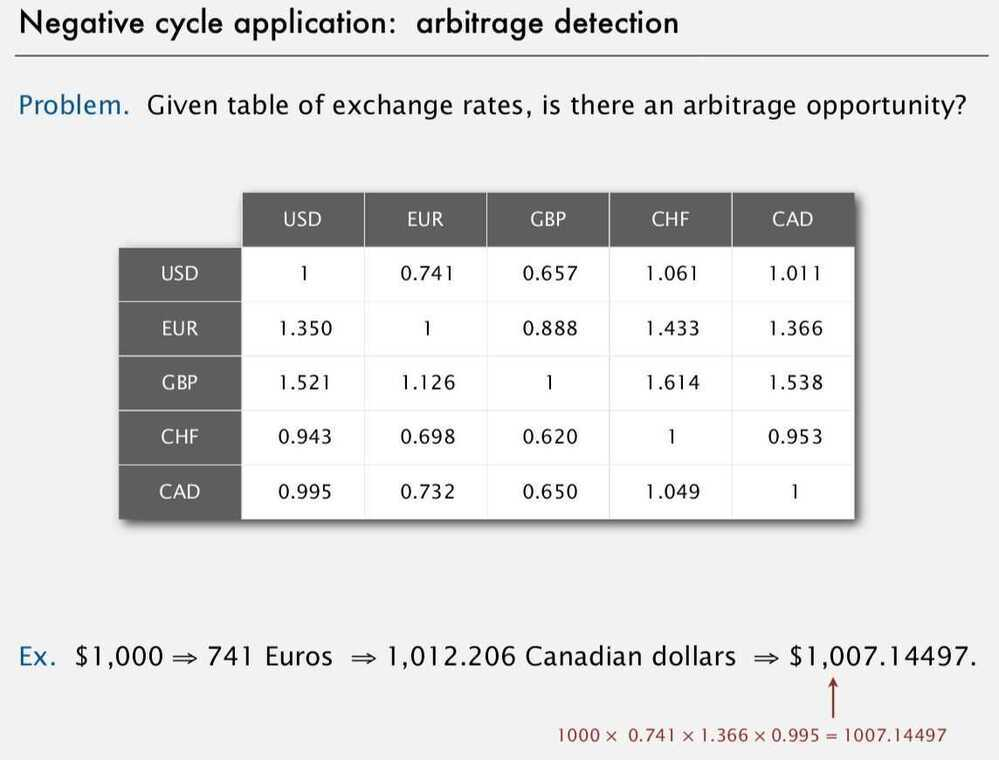
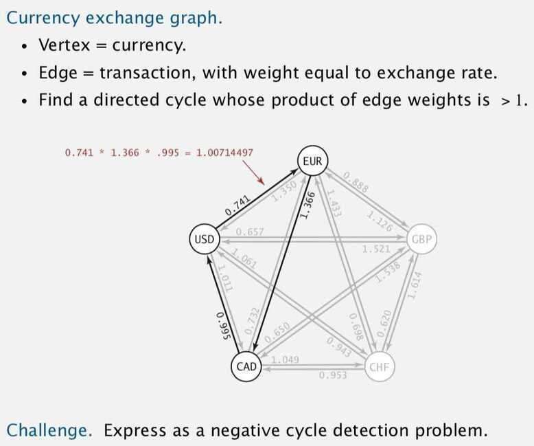

# Shortest Path Algorithms

## Shortest path variants

### Which vertices?

- Single Source : from one vertex s to every other vertex.
- Source-sink : from one vertex s to another vertex t
- All pairs : between all pairs of vertices

### Restrictions on edge weights?

- Non negative weights
- Euclidean weights
- Arbitrary weighs

### Cycles?

- No directed cycles
- No "negative cycles"

## Concept

### Edge Relaxation

Create SPT (Shortest Path Tree)

Optimality Condition (there is no edge we missed)

## Efficient implementations. How to choose which edge to relax?

1. Topological sort algorithm (no directed cycles)
2. Dijkstra's algorithm (non-negative weights)
3. Bellman-Ford algorithm (no negative cycles)
4. Ford - Fulkerson Algorithm (for maximum flow in a graph)
5. Floyd-Warshall Algorithm (All pairs shortest path algorithm)

## Applications

- PERT / CPM (Program Evaluation and Review Technique / Critical Path Method)
- Map routing
- **Seam carving**
- Robot navigation
- Texture mapping
- Typesetting in TeX
- Urban traffic planning
- Optimal pipelining of VLSI chip
- Telemarketer operator scheduling
- Routing of telecommunication messages
- Network routing protocol (OSPF, BGP, RIP)
- Exploiting arbitrage opportunities in currency exchange.
- Optimal truck routing through given traffic congestion pattern.

## Advanced - Used in maps (precomputed)

1. Highway-node routing
2. Contraction hierarchies

## Applications - Arbitrage Detection

Arbitrage - the simultaneous buying and selling of securities, currency, or commodities in different markets or in derivative forms in order to take advantage of differing prices for the same asset. (Making money of the System)

