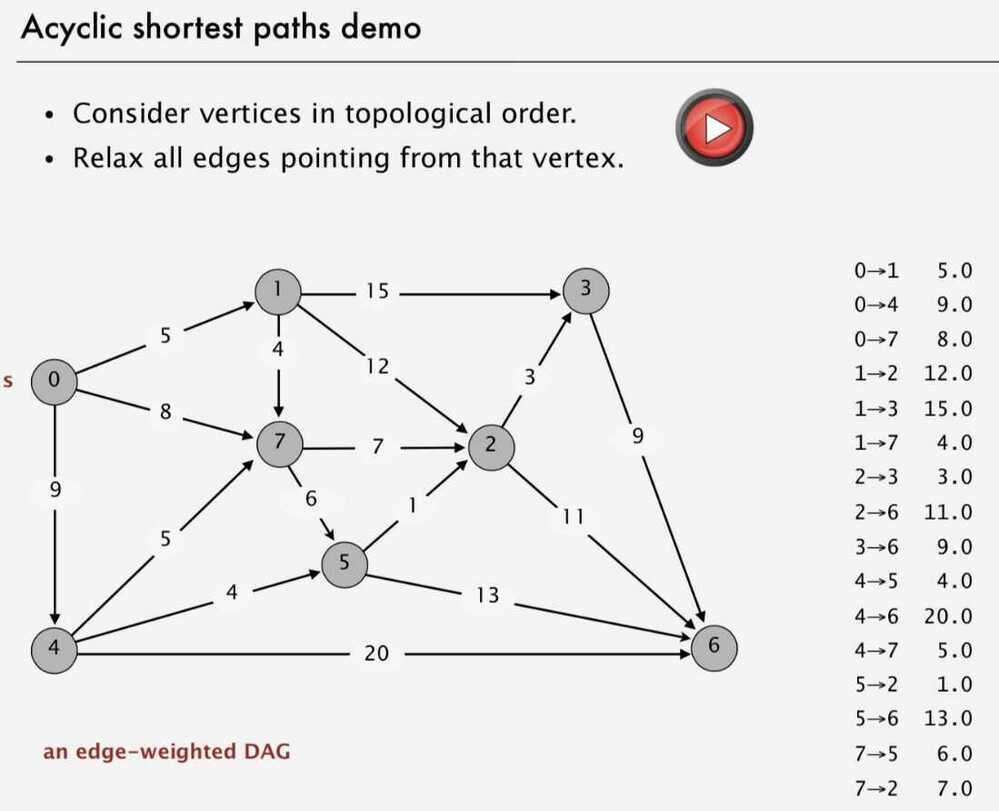
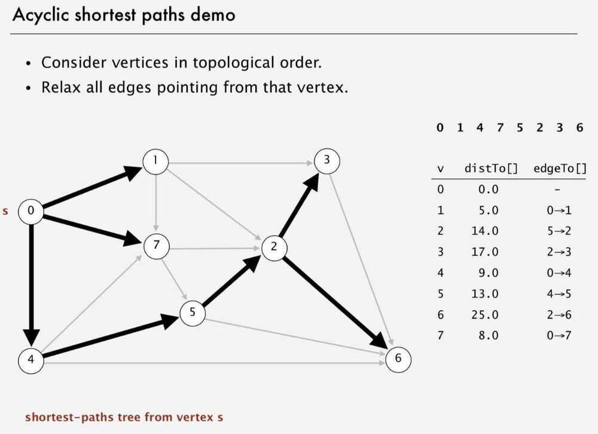
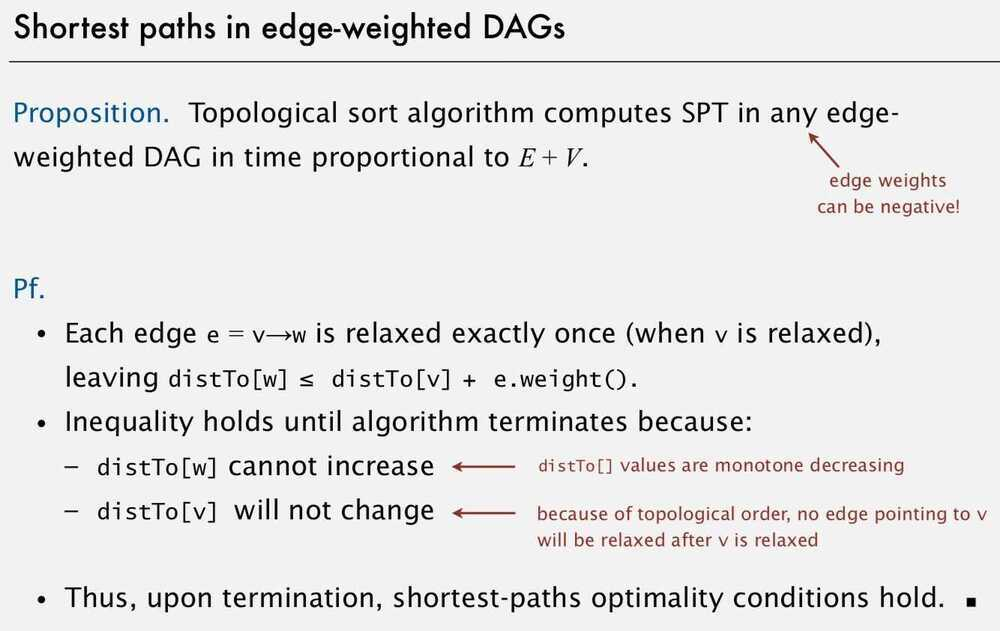
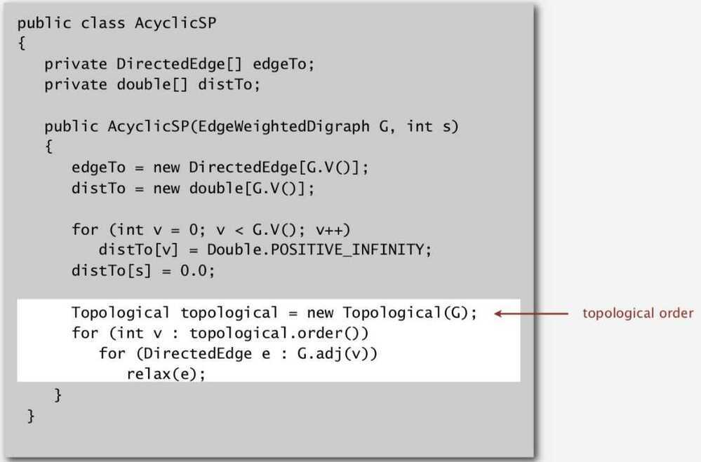
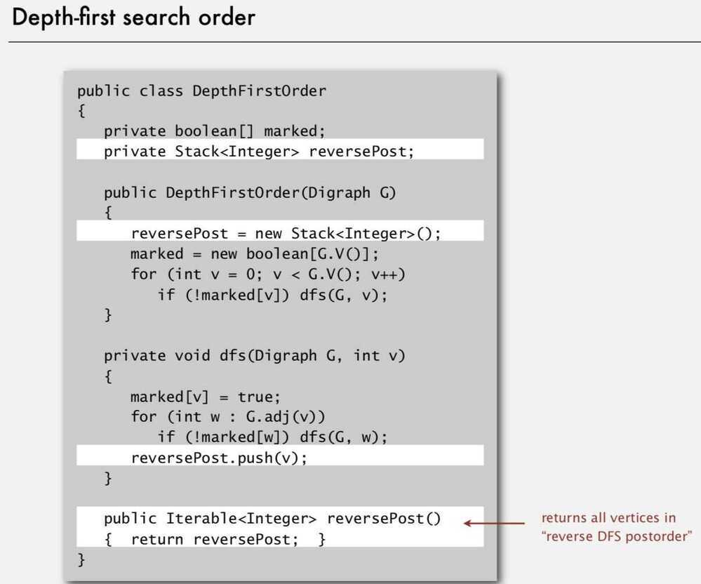
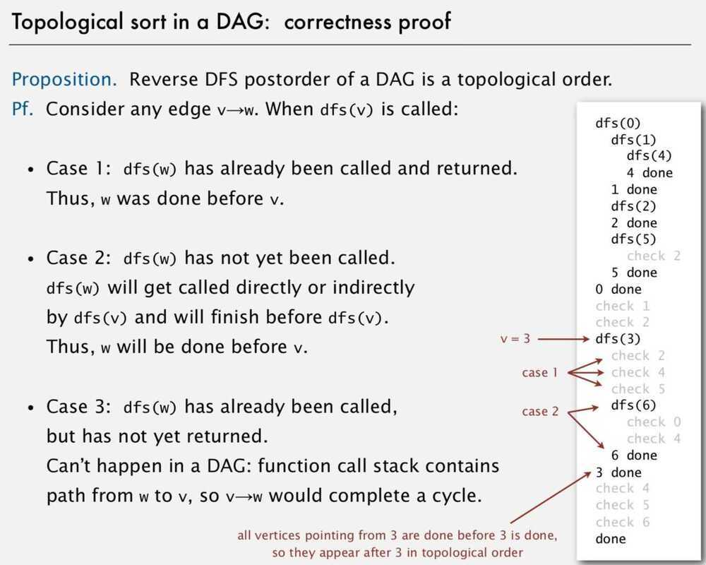
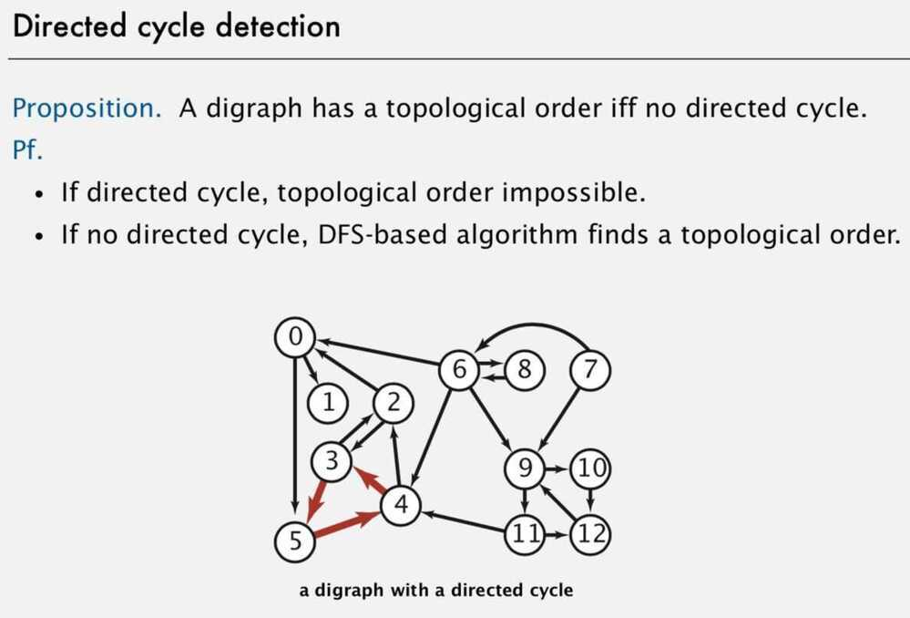

# Topological Sort Algorithm

## Acyclic Edge Weighted Digraphs

It is easier to find shortest paths in an edge-weighted digraph that has no directed cycles than general digraph.

The topological sort algorithm compute the shortest-paths tree in an edge-weighted DAG in time proportional to O(E+V). It process the V vertices in topological order and relaxes each of the E edges exactly once.

## Precedence Scheduling

Goal: Given a set of tasks to be completed with precedence constraints, in which order should we schedule the tasks?

Digraph model: vertex = task; edge = precedence constraint

Topological Sort can only work with DAG (Directed Acyclic Graph)

Topological sort: Redraw DAG so all edges point upwards.

Using DFS we can solve topological sort easily

- Run depth-first search
- Return vertices in reverse postorder
- 

