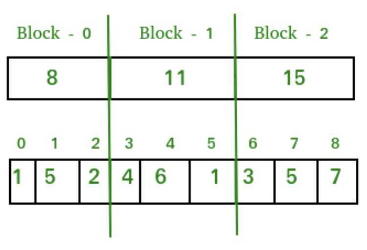

# MO's Algorithm

## Query Square Root Decomposition

- **Range Query**
- **Point Update**

- Divide the array in sqrt(n) blocks, maintain sum or prefix-sum of each block
  - Any range query can be efficiently calculated by summing all sqrt(n) blocks or part of some blocks
  - Any point update can be done by altering only the sum of that block only

## Problem - We are given an array and a set of query ranges, we are required to find sum of every query range

Naive - A**Naive Solution** is to run a loop from L to R and calculate sum of elements in given range for every query [L, R]

Time Complexity - O(m*n)

The idea of**MO's algorithm**is to pre-process all queries so that result of one query can be used in next query. Below are steps.

Let**a[0...n-1]**be input array and**q[0..m-1]**be array of queries.

1. Sort all queries in a way that queries with L values from **0** to **√n -- 1** are put together, then all queries from **√n** to **2*√n -- 1**, and so on. All queries within a block are sorted in increasing order of R values.

2. Process all queries one by one in a way that every query uses sum computed in previous query.
    - Let 'sum' be sum of previous query.
    - Remove extra elements of previous query. For example if previous query is [0, 8] and current query is [3, 9], then we subtract a[0] and a[1] from sum
    - Add new elements of current query. In the same example as above, we add a[9] to sum.

The great thing about this algorithm is, in step 2, index variable for R change at most**O(n * √n)**times throughout the run and same for L changes its value at most**O(m * √n)**times (See below, after the code, for details). All these bounds are possible only because sorted queries first in blocks of**√n**size.

The preprocessing part takes O(m Log m) time.

Processing all queries takes**O(n * √n)**+**O(m * √n)**=**O((m+n) * √n)**time.

## More

<https://www.geeksforgeeks.org/range-minimum-query-for-static-array>

<https://www.geeksforgeeks.org/segment-tree-set-1-range-minimum-query>

<https://www.geeksforgeeks.org/mos-algorithm-query-square-root-decomposition-set-1-introduction>

<https://cp-algorithms.com/data_structures/sqrt_decomposition.html>

<https://www.geeksforgeeks.org/sqrt-square-root-decomposition-technique-set-1-introduction>
