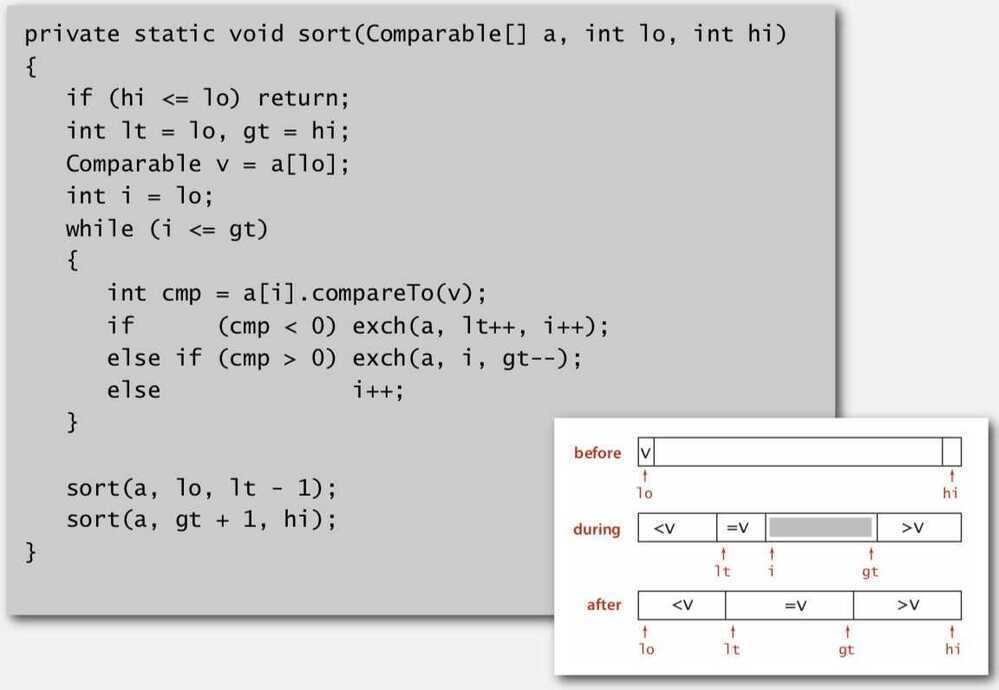

# 3-Way Quick Sort

Properties -

- Efficient for duplicate keys

Goal: Partition array into 3 parts so that -

- Entries between lt and gt equal to partition item v
- No larger entries to left of lt.
- No smaller entries to right of gt.

Dutch National flag problem

Randomized quicksort with 3-way partitioning reduces running time from linearithmic to linear in broad class of applications.

