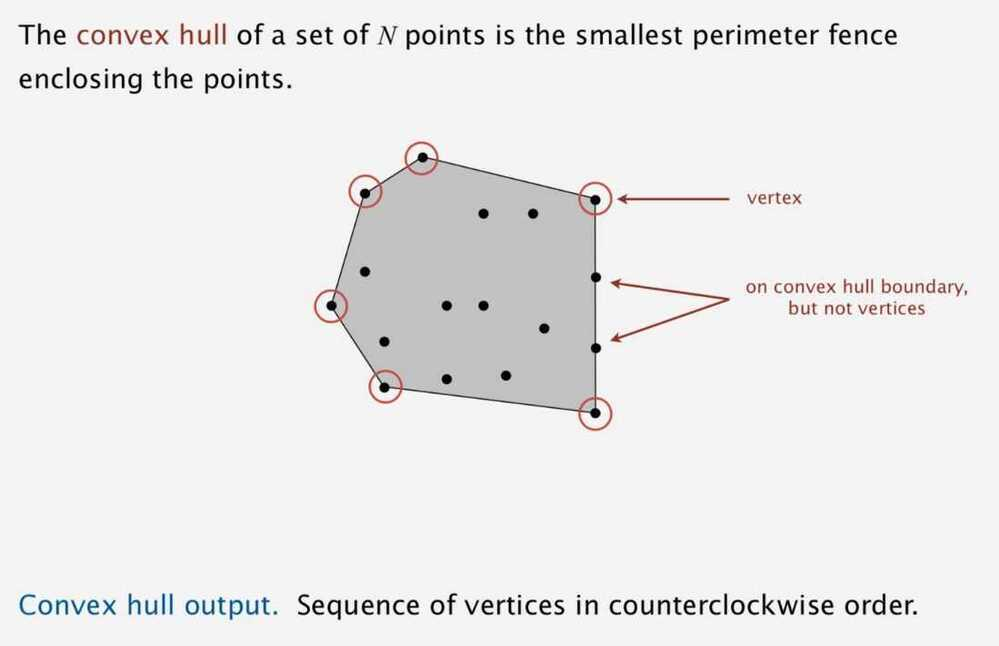

# Convex Hull

- Smallest polygon that encloses all the points
- The convex hull of a set of N points is the smallest perimeter fence enclosing the points.

## Applications

- Motion planning
- Farthest pair

## Properties

- Can traverse the convex hull by making only counterclockwise turns.
- The vertices of convex hull appear in increasing order of polar angle with respect to point p with lowest y-coordinate.

## Graham Scan

- Choose point p with smallest y-coordinate
- Sort points by polar angle with p
- Consider points in order; discard unless it create a counterclockwise (ccw) turn.
