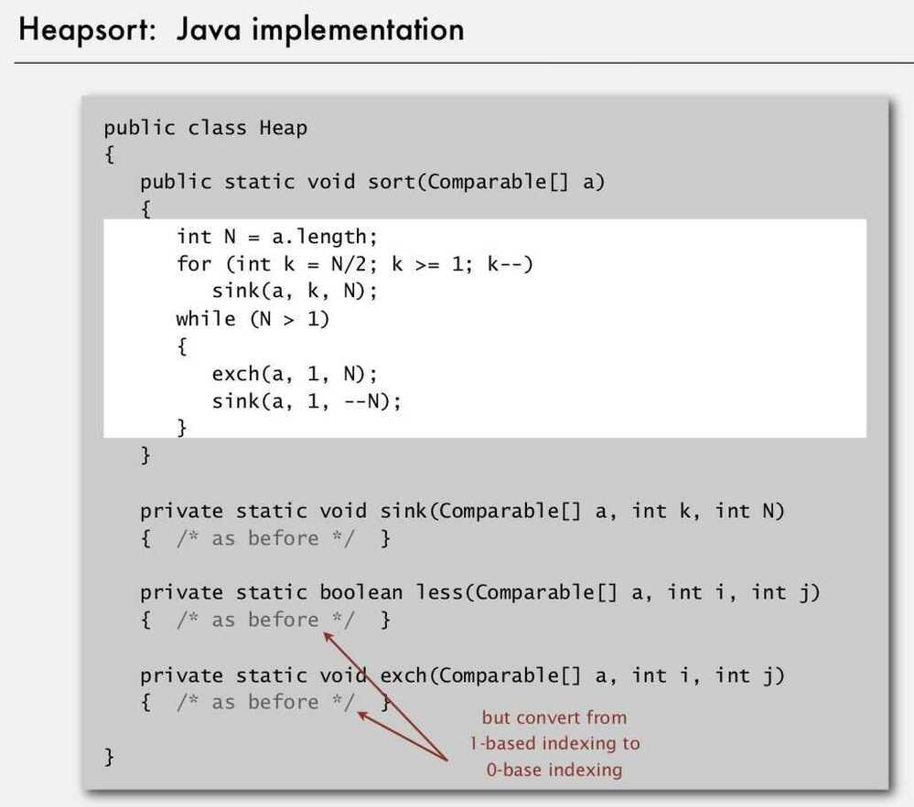

# Heapsort

Heapsortstarts by building a max heap. A binary max heap is a nearly complete binary tree in which each parent node is larger or equal to its children. The heap is stored in the same memory in which the original array elements are. Once the heap is formed, it completely replaces the array. After that, we take and remove the first element, restore the heap property, thus reducing the heap size by 1, after which we place the max element at the end of that memory. This is repeated until we empty out the heap, resulting in the smallest element being in the first place, and the following elements being sequentially larger.

- Create max-heap with all N keys
- Repeatedly remove the maximum key
- Heap construction uses <= 2 N compares and exchanges
- Heapsort uses <= 2 N lg N compares and exchanges

Significance - In-place sorting algorithm with N log N wost-case

- Mergesort: no, linear extra space
- Quicksort: no, quadratic time in worst case
- Heapsort: Yes

- Heapsort is optimal for both time and space, but:
  - Inner loop longer than quicksort's
  - Makes poor use of cache memory (since array item can be fetched far since parent's child can be far from parent)
  - Not stable

