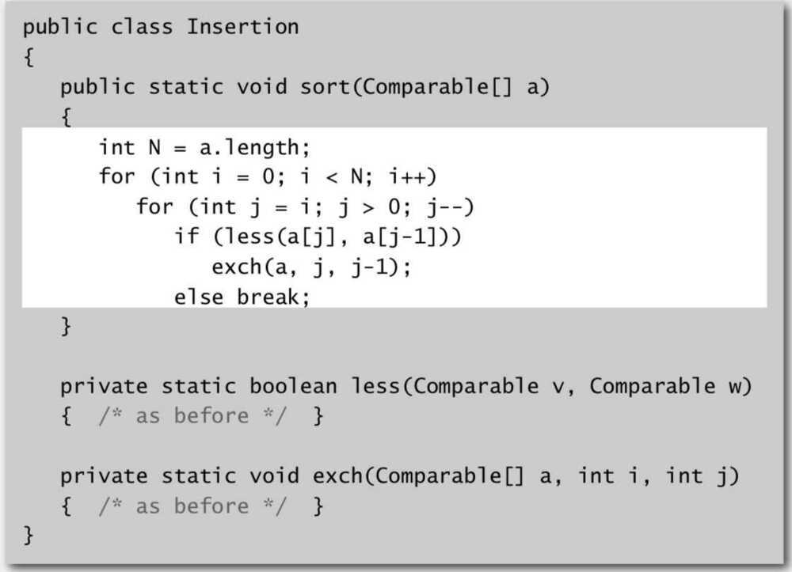
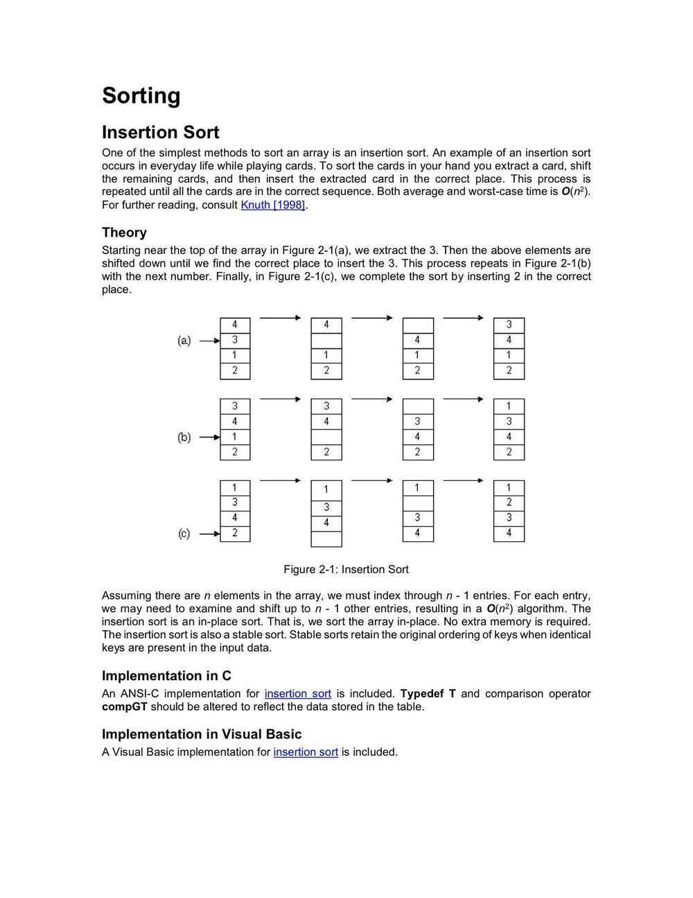

# Insertion Sort

Insertion sorttakes elements of the array sequentially, and maintains a sorted subarray to the left of the current point. It does this by taking an element, finding its correct position in the sorted array, and shifting all following elements by 1, leaving a space for the element to be inserted.

Stability - Yes

- In iteration i, swap a[i] with each element to its left

Proposition - To sort a randomly ordered array with distinct keys, insertion sort uses ~ 1/4 N^2^ compares and ~1/4 N^2^ exchanges on average

Best Case - if the array is in ascending order, insertion sort makes N-1 compares and 0 exchanges

Worst case - If the array is in descending order (and no duplicates), insertion sort makes ~ 1/2 N^2^ compares and ~1/2 N^2^ exchanges

## Inversion - An inversion is a pair of keys that are out of order

Def. An array is partially sorted if the number of inversions is <= c N.

- Ex 1. A subarray of size 10 appended to a sorted subarray of size N
- Ex 2. An array of size N with only 10 entries out of place

Proposition. For partially-sorted arrays, insertion sort runs in linear time.

Pf. Number of exchanges equals the number of inversions.

