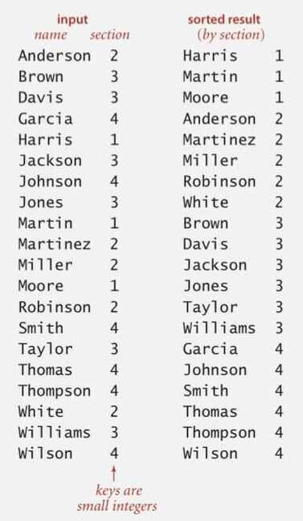
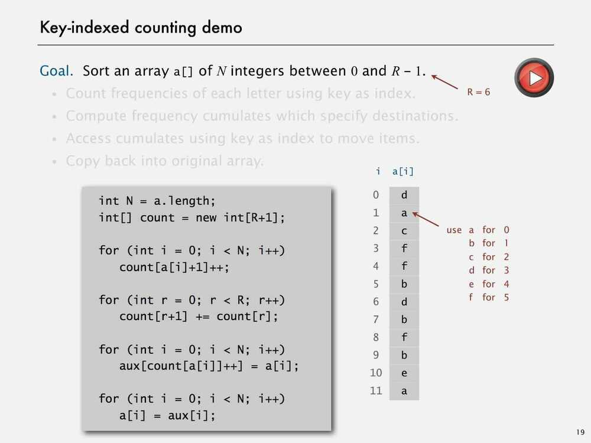
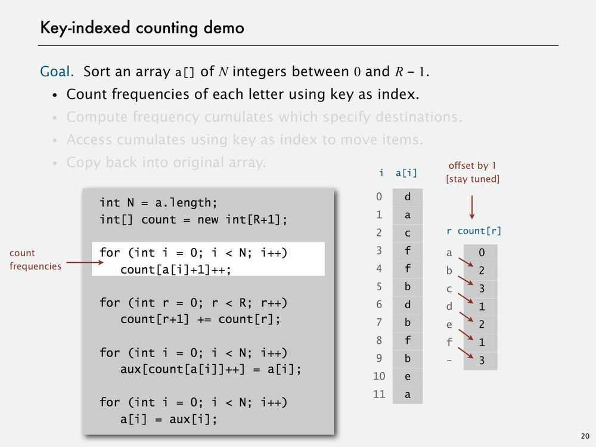
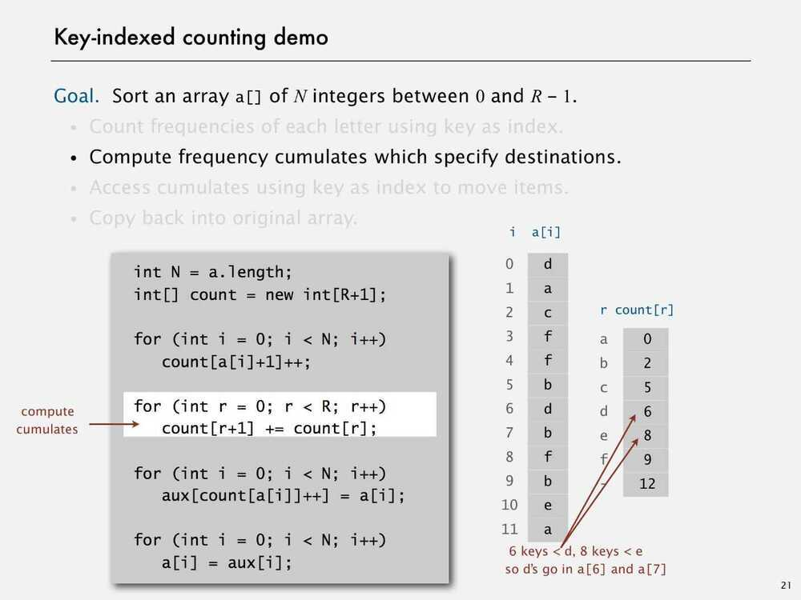
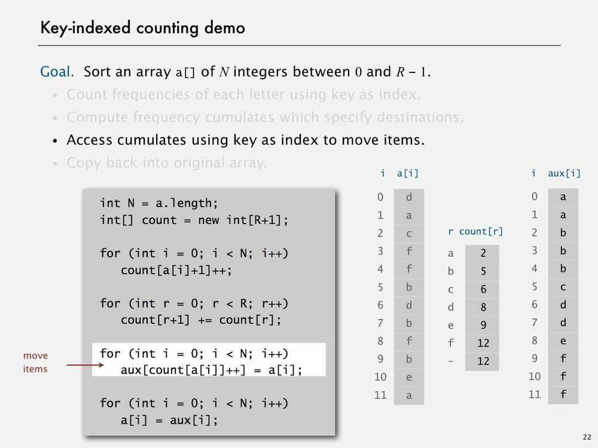
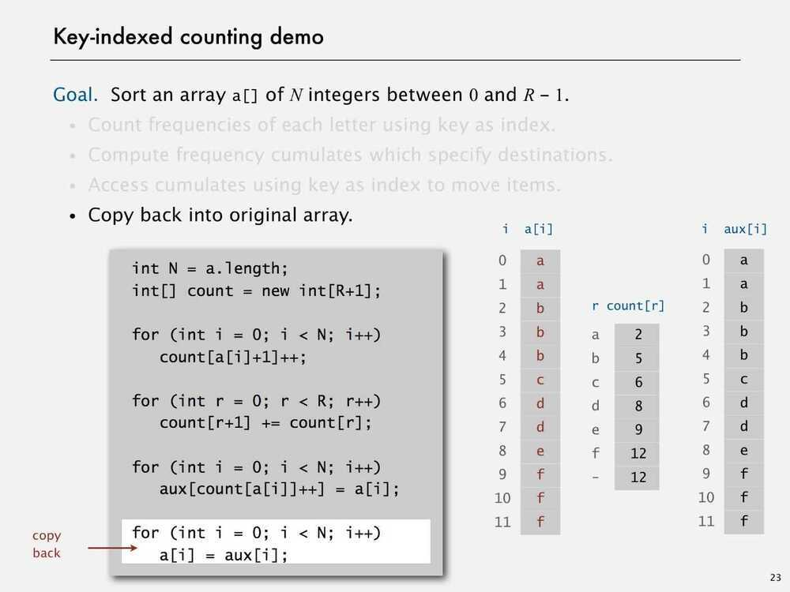
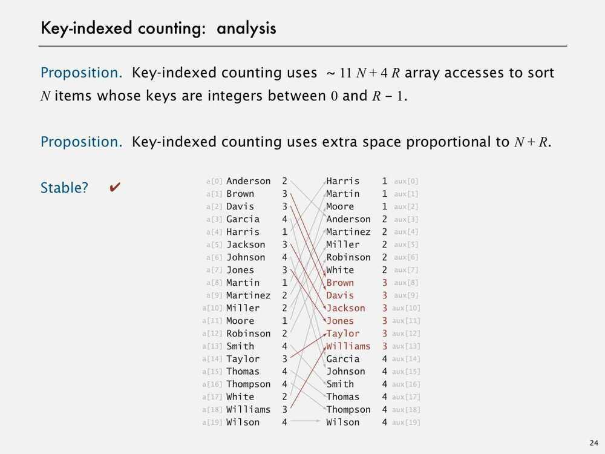
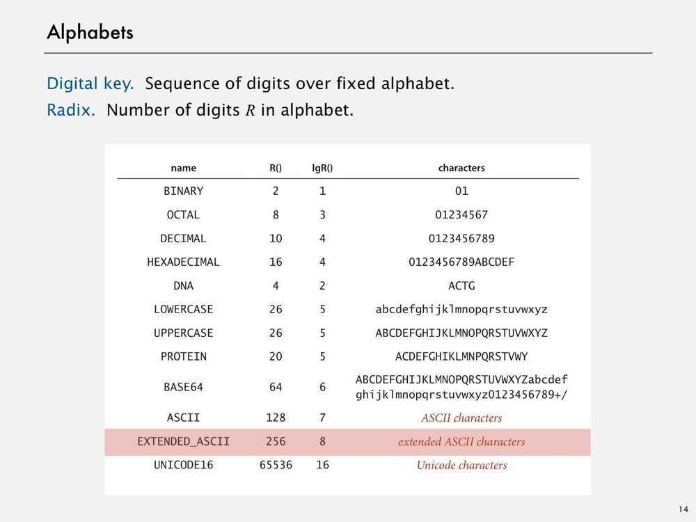

# Key-indexed Counting

## Proporties

- Linear time algorithm for sorting
- Stable

## Key-Indexed Counting

Assumption - Keys are integers between 0 and R-1

Implication - Can use key as an array index

Applications

- Sort string by first letter.
- Sort class roster by section.
- Sort phone numbers by area code.
- Subroutine in a sorting algorithm.

Remarks - Keys may have associated data => can't just count up number of keys of each value (because we have to transfer the data as well)

