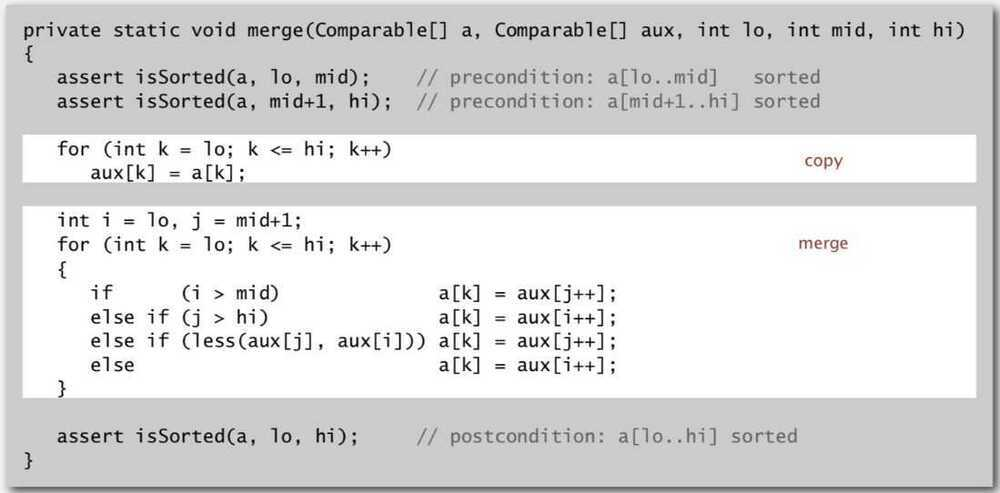
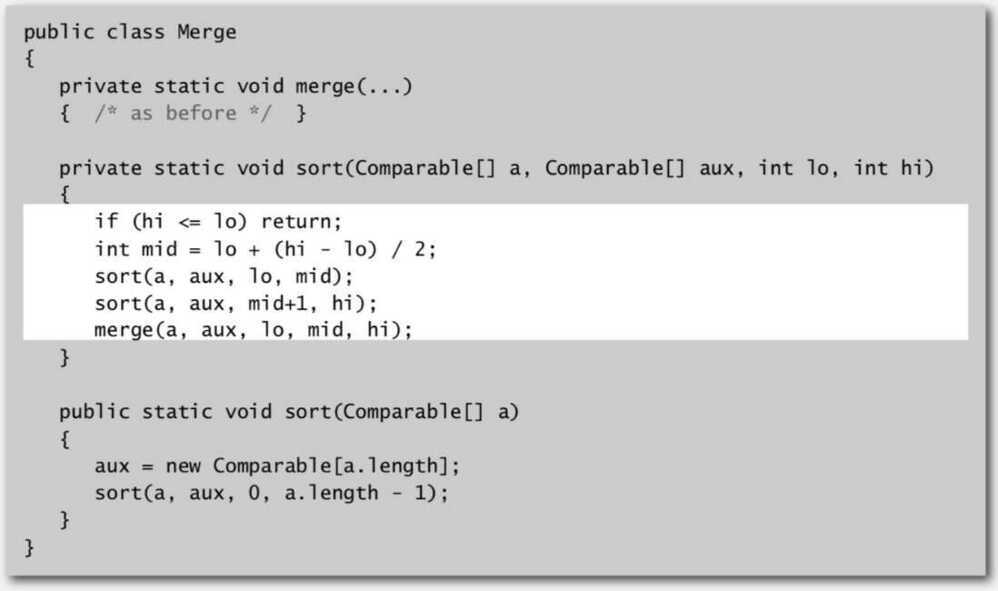
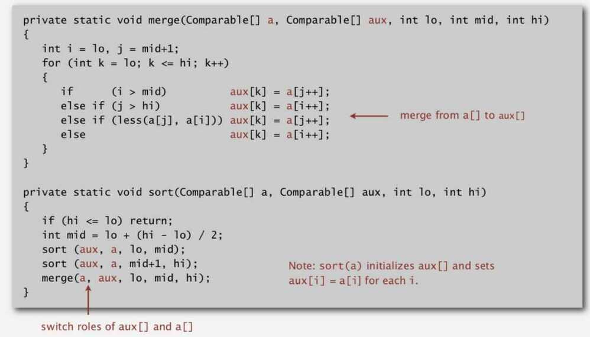

# Merge Sort

Merge sort recursively halves the given array. Once the subarrays reach trivial length, merging begins. Merging takes the smallest element between two adjacent subarrays and repeats that step until all elements are taken, resulting in a sorted subarray. The process is repeated on pairs of adjacent subarrays until we arrive at the starting array, but sorted.

## Properties

- Stable
- General algorithm uses auxillary array

## Basic Plan (Divide and Conquer Algorithm)

- Divide array into two halves
- Recursively sort each half
- Merge two halves.

## Abstract in-place Merging

## Sort

## Complexity

- Time complexity - O(N lg N)
- Space complexity - O( N ) for auxiliary array
- It guarantees to sort any array ofnitems with at mostnlgncompares.

## Improvements

- Use insertion sort for small subarrays
    - Mergesort has too much overhead for tiny subarrays
    - Cutoff to insertion sort for ~ 7 items
- Stop if already sorted
    - Is biggest item in first half `<=` smallest item in second half
    - Helps for partially-ordered arrays
    - 
- Eliminate the copy to the auxiliary array
    - Save time (but not space by switching the role of the input and auxiliary array in each recursive call)

## Non-recursive Bottom-up mergesort

Basic Plan -

- Pass through array, merging subarrays of size 1.
- Repeat for subarrays of size 2, 4, 8, 16, ...

Also, We prove that any compare-based sorting algorithm must make at least∼nlgncompares in the worst case.
