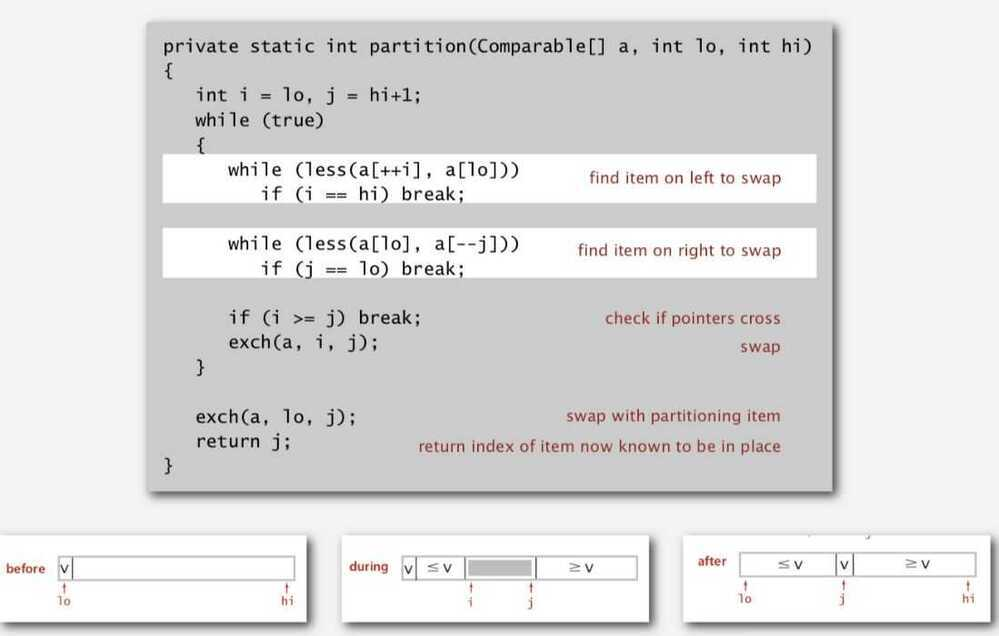
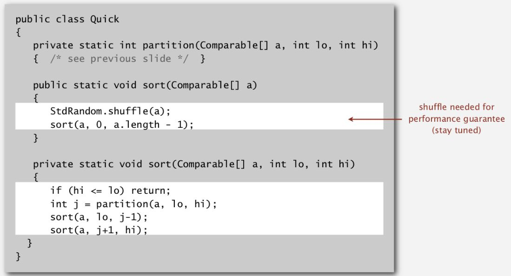

# Quick Sort

Quicksortis performed by taking the first (leftmost) element of the array as a pivot point. We then compare it to each following element. When we find one that is smaller, we move it to the left. The moving is performed quickly by swapping that element with the first element after the pivot point, and then swapping the pivot point with the element after it. After going through the whole array, we take all points on the left of the pivot and call quicksort on that subarray, and we do the same to all points on the right of the pivot. The recursion is performed until we reach subarrays of 0-1 elements in length.

## Properties

- In-place
- Not stable
- Best Case - N lg N ( N lg N compares)
- Worst Case - Quadratic - N^2 (1/2 N^2 compares)
- Average Case ~ 1.39 N lg N
    - 39% more compares than mergesort
    - But faster than mergesort in practice because less data movement

## Basic Plan

- Shuffle the array
- Partition so that, for some j
    - Entry a[j] is in place
    - No larger entry to the left of j
    - No smaller entry to the right of j
- Sort each piece recursively

## Pivot element

Code -

1. Partitioning

    

2. Sort

    

Improvements

- Insertion sort small subarrays
    - Too much overhead for tiny subarrays
    - Cutoff to insertion sort for ~ 10 items
    - Note: delay insertion sort until one pass at end
- Median of sample
    - Best choice of pivot item = median
    - Estimate true median by taking median of sample
    - Median-of-3 (random) items

Why QuickSort is faster than MergeSort -

Because QuickSort doesn't do a lot of data movements (MergeSort moves data in and out of the auxiliary array)

## When does the worst case of Quicksort occur?

The answer depends on strategy for choosing pivot. In early versions of Quick Sort where leftmost (or rightmost) element is chosen as pivot, the worst occurs in following cases.

1. Array is already sorted in same order.

2. Array is already sorted in reverse order.

3. All elements are same (special case of case 1 and 2)

Since these cases are very common use cases, the problem was easily solved by choosing either a random index for the pivot, choosing the middle index of the partition or (especially for longer partitions) choosing the median of the first, middle and last element of the partition for the pivot. With these modifications, the worst case of Quick sort has less chances to occur, but worst case can still occur if the input array is such that the maximum (or minimum) element is always chosen as pivot.

## Further Readings

1. Quick Select - A quicksort variant which finds the kth smallest item in linear time

[Quicksort Algorithm in Five Lines of Code! - Computerphile - YouTube](https://youtu.be/OKc2hAmMOY4)
