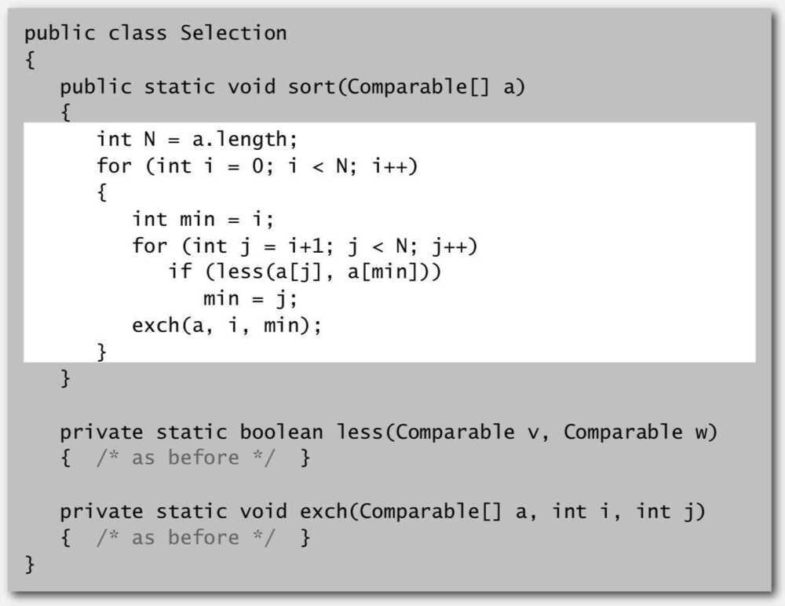

# Selection Sort

Not stable

For all elements -

- In iteration i, find index min of smallest remaining element
- Swap a[i] and a[min]

Proposition - Selection sort uses ~ N^2^ / 2 compares (Quadratic) and N exchanges (Linear)

Running time - Quadratic time, even if input is sorted

Number of exchanges - Linear, at max n exchanges
