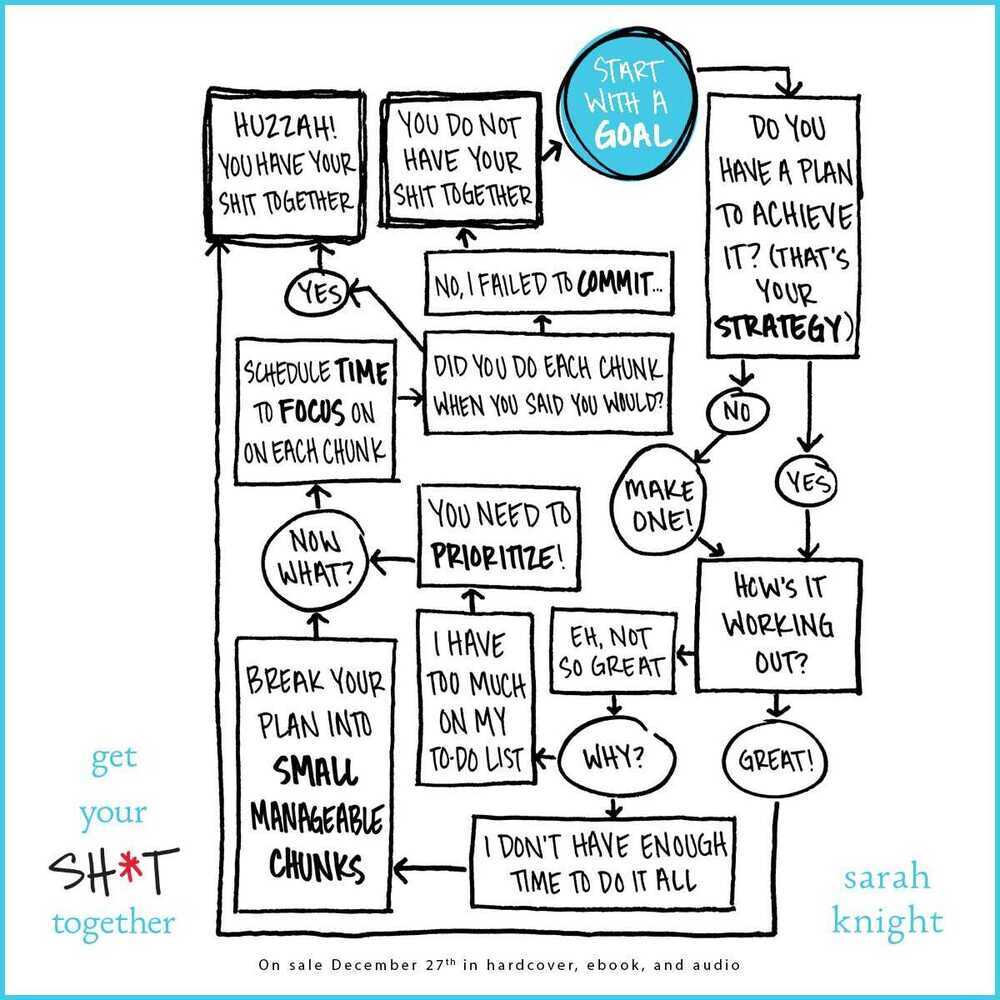

# Books / Blinkist - Productivity

## Blinkist - Get your shit together by Sarah Knight (2 Jan 2019)

## Blinkist - 5 Gears: How to Be Present and Productive When There is Never Enough Time by Jeremie Kubicek, Steve Cockram (7 Jan 2019)

- **First gear -** when you fully rest and recharge (Learning to recharge)
- **Second gear -** when you connect with family or friends without the involvement of work (Connecting deeply)
- **Third gear -** when you are socializing (Why being social matters)
- **Fourth gear -** when you are working and multitasking (Leading in the task world)
- **Fifth gear -** when you are fully focused and 'in the zone,' working without interruption (In the Zone)
- **Reverse -** Being responsive in a resistant world

## Blinkist - Great at Work by Morten T. Hansen

How top performers do less, work better, and achieve more

- Mastering your own work
    - Do less, then obsess
        - Choosing a few priorities
        - Dedicating your efforts toward excelling at them
    - Redesign your work
        - Start with a value not with a goal
    - Don't just learn, loop
        - Micro-behavior is a small, concrete action you take on a daily basis to improve a skill. The action shouldn't take more than fifteen minutes to perform and review, and it should have a clear impact on skill development.
    - P-squared (Passion and Purpose)
- Mastering working with others
    - Forceful champions
    - Fight and unite
        - Fight - On a meeting, maximize a team debate
        - Unite - Commit to decision at the end of meeting, because best idea wins
    - The two sins of collaboration
- Master your work-life

## 168 Hours By Laura Vanderkam

You Have More Time Than You Think

- You're not too busy -- you're just not in control of your time.
    - Instead of thinking, "I'm too busy," you should ask, "Is that a priority?" If it isn't, simply let it go.
- To live a fulfilling life, focus on your core competencies.
- Choosing a job that uses your core competencies energizes your entire life.
    - "Any 'work' that is not advancing you towards the professional life you want should not count as work. It is wasted time."
- To become time-rich you must control your work calendar.
    - Create habit of excusing yourself from meetings. If you realize a meeting isn't relevant to you, and it's a waste of your time, you should leave. And that time would be better spent pursuing activities that advance your career.
- To achieve a career breakthrough, combine strategy with story.
    - "There's a lot of randomness in the universe, but truly lucky people recognize that fairy godmothers are lazy."
- You can improve your relationships with your children by focusing on your core competencies.
    - If you both love swimming, schedule regular trips to the local pool. A love of music might mean singing together.
- Outsource housework that doesn't align with your core competencies.
- Plan your leisure time to increase its value.
- Actionable advice: Win family time by creating a mini night shift.
    - Working parents often find it difficult to spend time with their children during the week. Overcome this by blocking out 5:00 p.m. to 8:00 p.m. in your calendar every weeknight -- and view this as sacred family time. Counter your shorter day at the office by working from 8:00 p.m. to 10:00 p.m. a few nights a week. By doing this, you'll maximize your time together while the kids are still awake. Otherwise, you're more likely to waste your evening leisure time in front of the TV.

## The Lazy Genius Way by Kendra Adachi

Embrace what matters, ditch what doesn't, and get stuff done

- What's in it for me? Learn how to focus on the things that actually matter
- Being a perfectionist is exhausting and lonely -- but there is another way
- Real transformation happens in small steps
- Making fixed decisions can bring calm and focus
- You can defuse stressful situations with a little planning
- Introducing a few simple rules can transform your home
- In order to discover what's important to you, you'll need to take some time out
- We can't escape difficult situations, but we can change how we respond to them
- We need to become our own best friends -- and then allow other people in

## Blinkist - The 12 Week Year by Brian P. Moran

Get more done in 12 weeks than others do in 12 months

Plan around a 12-week period, execute tasks and radically improve results
