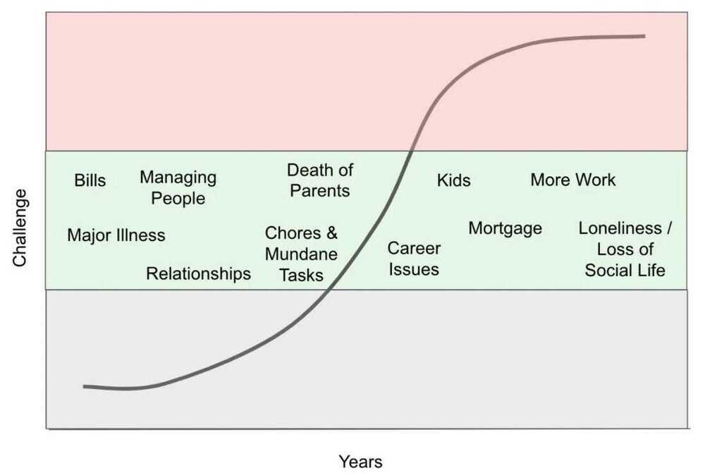

# Didn't see it coming

Overcoming the Seven Greatest Challenges That No One Expects and Everyone Experiences Book by Carey Nieuwhof

1. Cynicism

    [Jamil Zaki: How to escape the cynicism trap | TED](https://youtu.be/ABHdTi1If0c)

2. Compromise
3. Disconnection
4. Irrelevance
5. Pride
    - You are lucky to be what you are
    - Humility
6. Burnout

    https://www.lennysnewsletter.com/p/how-to-know-when-to-stop

    

7. Emptiness
