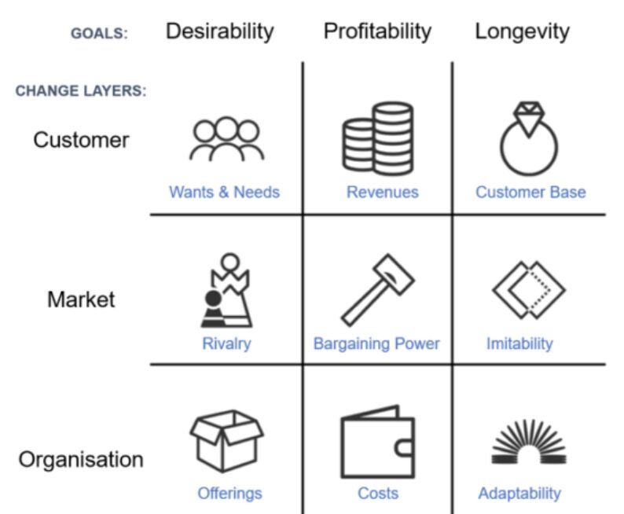

# The Grid

By Matt Watkinson

- Businesses are like human bodies - they thrive when you treat them holistically
- Desirability, profitability, and longevity make for a successful business
- Business is unreliable, and customers, markets, and your organization are always changing
- "People do not build their beliefs on a foundation of reason. They begin with certain beliefs, then find reasons to justify them." -- Hungarian physicist Eugene P. Wigner
- Profitability is achieved by increasing revenue, preserving bargaining power, and cutting costs
- If you're in it for the long haul, protect your customer base, keep your originality, and stay adaptable
- Actionable advice: Don't base your price on your costs
    - Remember, your customers don't care how much you have to pay to create a product - all they care about is how valuable it is to them
