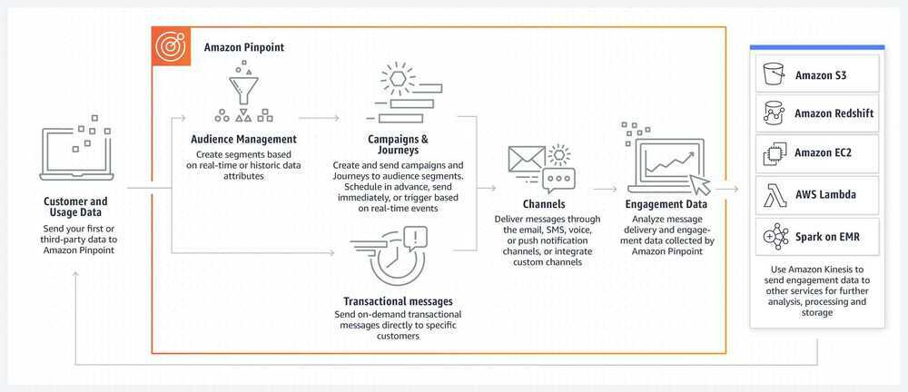

# Amazon Pinpoint

Understand and engage your customers by sending them personalized, timely, and relevant communications through multiple channels.

In today's digitally transformed world, it's more important than ever to have a deep understanding of your customers and to engage them with personalized messages through the channels that they prefer. Amazon Pinpoint enables marketers and developers to deliver customer-centric engagement experiences. Better experiences lead to stronger relationships with your customers and reduces customer churn.



- A/B test campaign
- Analytics
    - Usage
    - Revenue
    - Events
    - Funnels
    - Demographics
    - Campaigns
    - Transactional Messages
- Journeys
    - Create workflows / User journey
    - What happens when user clicked, which next emails to send
- Send all events to Kinesis, where we can send that to elasticsearch and then visualize using kibana

## 3 core components

- User insights and analytics
- Audience targeting
- Direct and targeted messaging

## Key Features and Functionality

- KPIs and Dashboards
- Imported or Derived
- Flexible Filtering
- Multi-channel
- A/B support
- Holdout rates
- Messaging and personalization
- Scheduling

AWS seems to have recognized that 'messaging' is as important a service as any other. They have launched a service called AWS Pinpoint which allows you to send Emails, SMS, and Push Notifications to your customers. Before Pinpoint you had to achieve this by integrating your app with multiple AWS services like SES, SNS, SMS, S3, SQS, CloudWatch, etc.

Sadly, AWS has rolled out Pinpoint with an altogether different set of monsters to deal with. First, Pinpoint can get needlessly expensive as it charges $0.0012 per customer tracked. Second, the Pinpoint Delivery Dashboard (a sort of UI to see things like delivery metrics, bounce notifications, etc.) costs $1,250 per month - SERIOUSLY - a huge charge for something that should have been a basic requirement. This rules out Pinpoint for Small and Medium Businesses (SMB's).

https://www.pinpointjourneys.com/build

## Segments

Asegmentis a group of your customers that share certain attributes. For example, a segment might contain all of your customers who use version 2.0 of your app on an Android device, or all customers who live in the city of Los Angeles.

When you create a campaign, you have to choose a segment to send the campaign to. You can send multiple campaigns to a single segment, and you can send a single campaign to multiple segments.

There are two types of segments that you can create in Amazon Pinpoint:

- **Dynamic segments--** Segments that are based on attributes that you define. Dynamic segments can change over time. For example, if you add new endpoints to Amazon Pinpoint, or if you modify or delete existing endpoints, the number of endpoints in that segment may increase or decrease. For more information about dynamic segments, see [Building segments](https://docs.aws.amazon.com/pinpoint/latest/userguide/segments-building.html).
- **Imported segments--** Segments that are created outside of Amazon Pinpoint and saved in CSV or JSON format. Imported segments are static - that is, they never change. When you create a new segment, you can use an imported segment as a base segment, and then refine it by adding filters. For more information about importing segments, see [Importing segments](https://docs.aws.amazon.com/pinpoint/latest/userguide/segments-importing.html).

## Segment files

You define the endpoints or user IDs that belong to your segment in a comma-separated values (CSV) or JSON file. Then, you import the file into Amazon Pinpoint to create the segment.

When you import a segment, remember the following:

- Amazon Pinpoint can't import compressed files.
- The files that you import must use UTF-8 character encoding.
- If you're importing new endpoints, theAddressandChannelTypeattributes are required.
- If you're updating existing endpoints, theIdattribute is required for each endpoint that you want to update.
- Your endpoint definitions can include only certain attributes. For a list, see [Supported attributes](https://docs.aws.amazon.com/pinpoint/latest/userguide/segments-importing.html#segments-importing-available-attributes). In addition, an attribute name has to be 50 or fewer characters. **An attribute value has to be 100 or fewer characters.**

## Importing a segment

There are two ways to import segments into Amazon Pinpoint: you can upload files directly from your computer, or you can import files that are stored in an Amazon S3 bucket.

Uploading files from your computer is generally the easier method of importing segments, especially if you already have the customer data on your computer. However, you can import only 10 files at a time, and you can only upload files that are smaller than 1 gigabyte (GB).

If you need to import more than 10 files at one time, or if you need to upload files that are larger than 1 GB, then you should import files from Amazon S3. The Amazon S3 import option is also useful if you already have processes that send customer data files to Amazon S3 for storage.

## Campaign

Acampaignis a messaging initiative that engages a specific audience segment. A campaign sends tailored messages on the days and times that you specify. You can use the console to create a campaign that sends messages through the email, push notification, or SMS channels.

## Endpoints

An endpoint is a destination that you can send messages to such as a user's mobile device, email address, or phone number. Before you can send email, you have to add endpoints to your project. You can add endpoints by using the API or an AWS SDK.

## Channels

Achannelrepresents the platform through which you engage your audience segment with messages. For example, to send push notifications to users of your apps, you must have an Amazon Pinpoint project in which thepush notificationschannel is enabled. Amazon Pinpoint supports the following channels:

- [Push notifications](https://docs.aws.amazon.com/pinpoint/latest/userguide/channels-mobile.html)
- [Email](https://docs.aws.amazon.com/pinpoint/latest/userguide/channels-email.html)
- [SMS](https://docs.aws.amazon.com/pinpoint/latest/userguide/channels-sms.html)
- [Voice](https://docs.aws.amazon.com/pinpoint/latest/userguide/channels-voice.html)

In addition to these channels, you can also extend the capabilities to meet your specific use case by creating [custom channels](https://docs.aws.amazon.com/pinpoint/latest/userguide/channels-custom.html).

## Metrics

- **Delivery count metrics--** This section provides information about the delivery of the messages that were sent from your campaign. It includes the following information:
    - **Messages sent--** The number of messages that were sent.
    - **Messages delivered--** The number of messages that were delivered to their recipients.
    - **Links clicked--** The number of times that links in the messages were clicked by recipients. If a single recipient clicks a link more than once, each click is represented in this section.
    - **Endpoint deliveries--** The average number of endpoints that the campaign was sent to, for each day in the chosen date range. The chart shows the number of endpoints that the campaign was delivered to, for each day in the chosen date range.
- **Delivery rate metrics--** This section shows the overall delivery and response rates for the messages that were sent from your campaign. It includes the following information:
    - **Delivery rate--** The percentage of messages that were delivered to recipients, of the total number of endpoints that you targeted in the segment that you sent this campaign to.
    - **Email open rate--** The percentage of messages that were opened by recipients, of the total number of messages that were delivered.
    - **Bounce rate--** The percentage of messages that weren't delivered to recipients because they bounced. This value includes only hard bounces - that is, messages that bounced because of a permanent issue. For example, hard bounces could occur when the recipient's email address doesn't exist, or when the recipient permanently rejects email from your domain.
- **Campaign runs--** This section shows information that's specific to each time the campaign ran. Because you can use Amazon Pinpoint to create recurring campaigns, this section can show information for several campaign runs. However, if you completed the procedures in this tutorial, this section contains information for only one campaign run because you ran the campaign only once. This section contains the following metrics, in addition to the metrics that are defined in the preceding sections:
    - **Endpoints targeted--** The number of endpoints that were targeted by the segment that was associated with the campaign run. This number includes endpoints that were part of the segment, but didn't receive the message.
    - **Total email opened--** The total number of times that messages sent from the campaign run were opened. For example, if a message was opened two times by one recipient, both of those opens are counted.

## Email

Amazon Pinpoint automatically tracks how many of your emails were opened or clicked by their recipients. In order to track the number of opens and clicks, Amazon Pinpoint makes minor changes to the emails that you send.

First, Amazon Pinpoint adds a tiny, transparent image to the end of each email that you send. This image is hosted on an AWS server. The file name of this image is unique for each recipient. When a recipient opens an email, their email client downloads this file from our servers. When an email client downloads a tracking image from our servers, we count it as an open event.

Second, Amazon Pinpoint replaces all links in your emails with links that refer to a domain that is hosted by AWS. This link includes a parameter that is unique for each recipient. When a recipient clicks one of these links, they are first sent to the AWS-hosted domain, and then immediately redirected to their intended destination. When a recipient visits one of these redirect links, we count it as a click event.

If a user opens an email multiple times or clicks the same link in an email multiple times, we count each open or click separately. In other words, if a recipient opens an email three times, we count three separate open events.

## Sending Email

There are several types of email that you can send using Amazon Pinpoint: campaign-based email, journey-based email, and transactional email.Campaign-based emailsare messages that are sent either one time or on a recurring schedule, and that target customers based on their attributes. Journey-based emailsare messages that are sent when participants in a journey arrive at an email activity as part of a larger workflow.Transactional emailsare sent one time only, and are typically sent in response to another action occurring. For example, you can use transactional messages to send an email when a customer chooses the "Forgot my password" link in your app, or to send a confirmation when a customer places an order on your site.

In Amazon Pinpoint, you typically use the web-based management console to send campaign-based emails and journey-based emails, whereas transactional emails are usually sent from applications that use an AWS SDK or call the Amazon Pinpoint API directly.

When you send a campaign-based email, you first create a [segment](https://docs.aws.amazon.com/pinpoint/latest/userguide/segments-building.html). A segment is a group of recipients for the campaign. Next, you create a campaign. In Amazon Pinpoint, a campaign consists of one or more target segments, a message, and a delivery schedule for that message. To learn about creating campaigns, see [Amazon Pinpoint campaigns](https://docs.aws.amazon.com/pinpoint/latest/userguide/campaigns.html).

When you send a journey-based email, you also start by creating a [segment](https://docs.aws.amazon.com/pinpoint/latest/userguide/segments-building.html). A segment is a group of participants in the journey. Next, you create an email template for each message that you want activities in the journey to send. Then, you create the journey. To learn about creating journeys, see [Amazon Pinpoint journeys](https://docs.aws.amazon.com/pinpoint/latest/userguide/journeys.html).

To send a transactional email, you can use theSendMessageoperation of the Amazon Pinpoint API.

## Email tips and best practices

[**https://docs.aws.amazon.com/pinpoint/latest/userguide/channels-email-best-practices.html**](https://docs.aws.amazon.com/pinpoint/latest/userguide/channels-email-best-practices.html)

## SMS

### Character limits

A single SMS message can contain up to 140 bytes of information. The number of characters you can include in a single SMS message depends on the type of characters the message contains.

If your message only uses [characters in the GSM 03.38 character set](https://docs.aws.amazon.com/pinpoint/latest/userguide/channels-sms-limitations.html#channels-sms-limitations-characters-gsm-alphabet), also known as the GSM 7-bit alphabet, it can contain up to 160 characters. If your message contains any characters that are outside the GSM 03.38 character set, it can have up to 70 characters. When you send an SMS message, Amazon Pinpoint automatically determines the most efficient encoding to use.

When a message contains more than the maximum number of characters, the message is split into multiple parts. When messages are split into multiple parts, each part contains additional information about the message part that precedes it. When the recipient's device receives message parts that are separated in this way, it uses this additional information to ensure that all of the message parts are displayed in the correct order. Depending on the recipient's mobile carrier and device, multiple messages might be displayed as a single message, or as a sequence of separate messages. As a result of number of characters in each message part is reduced to 153 (for messages that only contain GSM 03.38 characters) or 67 (for messages that contain other characters). You can estimate how many message parts your message contains before you send it by using SMS length calculator tools.

## Segments

- Json not working with Attributes

## Suppression List

- https://docs.aws.amazon.com/ses/latest/DeveloperGuide/sending-email-global-suppression-list.html
- https://docs.aws.amazon.com/ses/latest/DeveloperGuide/sending-email-suppression-list.html
- https://aws.amazon.com/solutions/implementations/predictive-user-engagement
- https://aws.amazon.com/solutions/implementations/location-based-notifications-using-amazon-pinpoint
- https://docs.aws.amazon.com/pinpoint/latest/developerguide/event-streams-data-sms.html
- [**https://aws.amazon.com/solutions/implementations/digital-user-engagement-events-database/**](https://aws.amazon.com/solutions/implementations/digital-user-engagement-events-database/)
- https://github.com/aws-samples/digital-user-engagement-reference-architecture
- https://awsdue.tv
- https://docs.aws.amazon.com/pinpoint/latest/userguide/channels-sms-limitations-characters.html#channels-sms-limitations-characters-gsm-alphabet
- [An Overview of Bulk Sender Changes at Yahoo/Gmail | AWS Messaging & Targeting Blog](https://aws.amazon.com/blogs/messaging-and-targeting/an-overview-of-bulk-sender-changes-at-yahoo-gmail/)

### Commands

```bash
aws sesv2 list-suppressed-destinations
```
