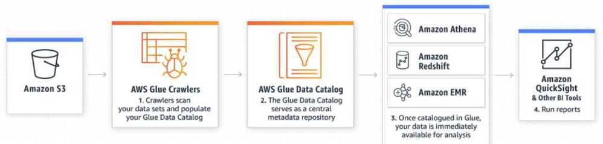
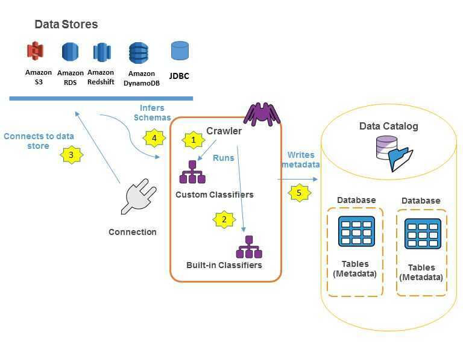

# AWS Glue

Simple, flexible, and cost-effective ETL

AWS Glue is a fully managed extract, transform, and load (ETL) service that makes it easy for customers to prepare and load their data for analytics. You can create and run an ETL job with a few clicks in the AWS Management Console. You simply point AWS Glue to your data stored on AWS, and AWS Glue discovers your data and stores the associated metadata (e.g. table definition and schema) in the AWS Glue Data Catalog. Once cataloged, your data is immediately searchable, queryable, and available for ETL.

AWS Glue is designed to work with **semi-structured data**. It introduces a component called a**dynamic frame**, which you can use in your ETL scripts. A dynamic frame is similar to an Apache Spark dataframe, except that each record is self-describing, so no schema is required initially. With dynamic frames, you get schema flexibility and a set of advanced transformations specifically designed for dynamic frames. You can convert between dynamic frames and Spark dataframes, so that you can take advantage of both AWS Glue and Spark transformations to do the kinds of analysis that you want.

You can use the AWS Glue console to discover data, transform it, and make it available for search and querying. The console calls the underlying services to orchestrate the work required to transform your data. You can also use the AWS Glue API operations to interface with AWS Glue services. Edit, debug, and test your Python or Scala Apache Spark ETL code using a familiar development environment.



https://aws.amazon.com/glue

https://docs.aws.amazon.com/glue/latest/dg/what-is-glue.html

https://docs.aws.amazon.com/glue/latest/dg/how-it-works.html

## Processing only new data (AWS Glue Bookmarks)

In our architecture, we have our applications streaming data to Firehose which writes to S3 (once per minute). We then take this raw data, and transform it using a Glue job, every 30 minutes. But how should we mark the data we've already processed?

First option: move current batch of files to an intermediary folder in S3 ("in-process"). After processing, move to an archive directory in order to avoid re-processing of same data.

Second option: we chose to use an AWS Glue feature called bookmarks. Once a job completes successfully, it sets an invisible bookmark. Any change you make to that bucket after the bookmark has been set, will be worked on by the next execution of the job (behind the scenes, modification dates are examined by the bookmark)

Note: you may only add new files, or append to existing files. Overwriting data in existing files is not supported (nor should you want to do it. In fact, in the new world of event sourcing, overwriting means hiding a crime)

## AWS Glue Concepts


You definejobsin AWS Glue to accomplish the work that's required to extract, transform, and load (ETL) data from a data source to a data target. You typically perform the following actions:

- You define acrawlerto populate your AWS Glue Data Catalog with metadata table definitions. You point your crawler at a data store, and the crawler creates table definitions in the Data Catalog.
    In addition to table definitions, the AWS Glue Data Catalog contains other metadata that is required to define ETL jobs. You use this metadata when you define a job to transform your data.
- AWS Glue can generate a script to transform your data. Or, you can provide the script in the AWS Glue console or API.
- You can run your job on demand, or you can set it up to start when a specifiedtriggeroccurs. The trigger can be a time-based schedule or an event.
    When your job runs, a script extracts data from your data source, transforms the data, and loads it to your data target. The script runs in an Apache Spark environment in AWS Glue.

Tables and databases in AWS Glue are objects in the AWS Glue Data Catalog. They contain metadata; they don't contain data from a data store.

Text-based data, such as CSVs, must be encoded inUTF-8for AWS Glue to process it successfully.

## AWS Glue Terminology

## AWS Glue Data Catalog

The persistent metadata store in AWS Glue. Each AWS account has one AWS Glue Data Catalog. It contains table definitions, job definitions, and other control information to manage your AWS Glue environment.

## Classifier

Determines the schema of your data. AWS Glue provides classifiers for common file types, such as CSV, JSON, AVRO, XML, and others. It also provides classifiers for common relational database management systems using a JDBC connection. You can write your own classifier by using a grok pattern or by specifying a row tag in an XML document.

## Connection

Contains the properties that are required to connect to your data store.

## Crawler

A program that connects to a data store (source or target), progresses through a prioritized list of classifiers to determine the schema for your data, and then creates metadata in the AWS Glue Data Catalog.

## Database

A set of associated table definitions organized into a logical group in AWS Glue.

## Data store, data source, data target

Adata storeis a repository for persistently storing your data. Examples include Amazon S3 buckets and relational databases. Adata sourceis a data store that is used as input to a process or transform. Adata targetis a data store that a process or transform writes to.

## Development endpoint

An environment that you can use to develop and test your AWS Glue scripts.

## Dynamic Frame

A distributed table that supports nested data such as structures and arrays. Each record is self-describing, designed for schema flexibility with semi-structured data. Each record contains both data and the schema that describes that data. You can use both dynamic frames and Apache Spark dataframes in your ETL scripts, and convert between them. Dynamic frames provide a set of advanced transformations for data cleaning and ETL.

## Job

The business logic that is required to perform ETL work. It is composed of a transformation script, data sources, and data targets. Job runs are initiated by triggers that can be scheduled or triggered by events.

## Notebook server

A web-based environment that you can use to run your PySpark statements. For more information, see [Apache Zeppelin](http://zeppelin.apache.org/). You can set up a notebook server on a development endpoint to run PySpark statements with AWS Glue extensions.

## Script

Code that extracts data from sources, transforms it, and loads it into targets. AWS Glue generates PySpark or Scala scripts. PySpark is a Python dialect for ETL programming.

## Table

The metadata definition that represents your data. Whether your data is in an Amazon Simple Storage Service (Amazon S3) file, an Amazon Relational Database Service (Amazon RDS) table, or another set of data, a table defines the schema of your data. A table in the AWS Glue Data Catalog consists of the names of columns, data type definitions, and other metadata about a base dataset. The schema of your data is represented in your AWS Glue table definition. The actual data remains in its original data store, whether it be in a file or a relational database table. AWS Glue catalogs your files and relational database tables in the AWS Glue Data Catalog. They are used as sources and targets when you create an ETL job.

## Transform

The code logic that is used to manipulate your data into a different format.

## Trigger

Initiates an ETL job. Triggers can be defined based on a scheduled time or an event.

https://docs.aws.amazon.com/glue/latest/dg/components-key-concepts.html

## Populating the AWS Glue Data Catalog

The AWS Glue Data Catalog contains references to data that is used as sources and targets of your extract, transform, and load (ETL) jobs in AWS Glue. To create your data warehouse, you must catalog this data. The AWS Glue Data Catalog is an index to the location, schema, and runtime metrics of your data. You use the information in the Data Catalog to create and monitor your ETL jobs. Information in the Data Catalog is stored as metadata tables, where each table specifies a single data store. Typically, you run a crawler to take inventory of the data in your data stores, but there are other ways to add metadata tables into your Data Catalog. For more information, see [Defining Tables in the AWS Glue Data Catalog](https://docs.aws.amazon.com/glue/latest/dg/tables-described.html).

The following workflow diagram shows how AWS Glue crawlers interact with data stores and other elements to populate the Data Catalog.



The following is the general workflow for how a crawler populates the AWS Glue Data Catalog:

- A crawler runs any customclassifiersthat you choose to infer the format and schema of your data. You provide the code for custom classifiers, and they run in the order that you specify.
    The first custom classifier to successfully recognize the structure of your data is used to create a schema. Custom classifiers lower in the list are skipped. If no custom classifier matches your data's schema, built-in classifiers try to recognize your data's schema. An example of a built-in classifier is one that recognizes JSON.

- The crawler connects to the data store. Some data stores require connection properties for crawler access.

- The inferred schema is created for your data.

- The crawler writes metadata to the Data Catalog. A table definition contains metadata about the data in your data store. The table is written to a database, which is a container of tables in the Data Catalog. Attributes of a table include classification, which is a label created by the classifier that inferred the table schema.

https://docs.aws.amazon.com/glue/latest/dg/populate-data-catalog.html

## Crawlers

You can use a crawler to populate the AWS Glue Data Catalog with tables. This is the primary method used by most AWS Glue users. A crawler can crawl multiple data stores in a single run. Upon completion, the crawler creates or updates one or more tables in your Data Catalog. Extract, transform, and load (ETL) jobs that you define in AWS Glue use these Data Catalog tables as sources and targets. The ETL job reads from and writes to the data stores that are specified in the source and target Data Catalog tables.

https://docs.aws.amazon.com/glue/latest/dg/add-crawler.html

## What Happens When a Crawler Runs?

When a crawler runs, it takes the following actions to interrogate a data store:

- Classifies data to determine the format, schema, and associated properties of the raw data-- You can configure the results of classification by creating a custom classifier.
- Groups data into tables or partitions-- Data is grouped based on crawler heuristics.
- Writes metadata to the Data Catalog-- You can configure how the crawler adds, updates, and deletes tables and partitions.

The metadata tables that a crawler creates are contained in a database when you define a crawler. If your crawler does not define a database, your tables are placed in the default database. In addition, each table has a classification column that is filled in by the classifier that first successfully recognized the data store.

If the file that is crawled is compressed, the crawler must download it to process it. When a crawler runs, it interrogates files to determine their format and compression type and writes these properties into the Data Catalog. Some file formats (for example, Apache Parquet) enable you to compress parts of the file as it is written. For these files, the compressed data is an internal component of the file, and AWS Glue does not populate thecompressionTypeproperty when it writes tables into the Data Catalog. In contrast, if anentire fileis compressed by a compression algorithm (for example, gzip), then thecompressionTypeproperty is populated when tables are written into the Data Catalog.

The crawler generates the names for the tables that it creates.

If your crawler runs more than once, perhaps on a schedule, it looks for new or changed files or tables in your data store. The output of the crawler includes new tables and partitions found since a previous run.

## Glue ETL

AWS Glue runs your ETL jobs in an Apache Spark serverless environment. AWS Glue runs these jobs on virtual resources that it provisions and manages in its own service account.

Using the metadata in the Data Catalog, AWS Glue can autogenerate Scala or PySpark (the Python API for Apache Spark) scripts with AWS Glue extensions that you can use and modify to perform various ETL operations. For example, you can extract, clean, and transform raw data, and then store the result in a different repository, where it can be queried and analyzed. Such a script might convert a CSV file into a relational form and save it in Amazon Redshift.

## The AWS Glue Jobs System

The AWS Glue Jobs system provides managed infrastructure to orchestrate your ETL workflow. You can create jobs in AWS Glue that automate the scripts you use to extract, transform, and transfer data to different locations. Jobs can be scheduled and chained, or they can be triggered by events such as the arrival of new data.

https://docs.aws.amazon.com/glue/latest/dg/add-job.html

https://docs.aws.amazon.com/glue/latest/dg/aws-glue-api-jobs-job.html

## Worker type

- **Standard--** When you choose this type, you also provide a value forMaximum capacity. Maximum capacity is the number of AWS Glue data processing units (DPUs) that can be allocated when this job runs. A DPU is a relative measure of processing power that consists of 4 vCPUs of compute capacity and 16 GB of memory. TheStandardworker type has a 50 GB disk and 2 executors.
- **G.1X--** When you choose this type, you also provide a value forNumber of workers. Each worker maps to 1 DPU (4 vCPU, 16 GB of memory, 64 GB disk), and provides 1 executor per worker. We recommend this worker type for memory-intensive jobs.
- **G.2X--** When you choose this type, you also provide a value forNumber of workers. Each worker maps to 2 DPU (8 vCPU, 32 GB of memory, 128 GB disk), and provides 1 executor per worker. We recommend this worker type for memory-intensive jobs and jobs that run ML transforms.

## ETL Jobs Pricing

With AWS Glue, you only pay for the time your ETL job takes to run. There are no resources to manage, no upfront costs, and you are not charged for startup or shutdown time. You are charged an hourly rate based on the number of Data Processing Units (or DPUs) used to run your ETL job. A single Data Processing Unit (DPU) provides 4 vCPU and 16 GB of memory.

There are two types of jobs in AWS Glue: Apache Spark and Python shell.

An AWS Glue job of type Apache Spark requires a minimum of 2 DPUs. By default, AWS Glue allocates 10 DPUs to each Apache Spark job. You are billed$0.44per DPU-Hour in increments of 1 second, rounded up to the nearest second, with a 10-minute minimum duration for each job of type Apache Spark.

An AWS Glue job of type Python shell can be allocated either 1 DPU or 0.0625 DPU. By default, AWS Glue allocates 0.0625 DPU to each Python shell job. You are billed$0.44per DPU-Hour in increments of 1 second, rounded up to the nearest second, with a 1-minute minimum duration for each job of type Python shell.

Development endpoints are optional, and billing applies only if you choose to interactively develop your ETL code. Development endpoints are charged based on the Data Processing Unit hours used for the time your development endpoints are provisioned. An AWS Glue development endpoint requires a minimum of 2 DPUs. By default, AWS Glue allocates 5 DPUs to each development endpoint. You are billed$0.44per DPU-Hour in increments of 1 second, rounded up to the nearest second, with a 10-minute minimum duration for each provisioned development endpoint.

## Job Bookmarks

AWS Glue tracks data that has already been processed during a previous run of an ETL job by persisting state information from the job run. This persisted state information is called ajob bookmark. Job bookmarks help AWS Glue maintain state information and prevent the reprocessing of old data. With job bookmarks, you can process new data when rerunning on a scheduled interval. A job bookmark is composed of the states for various elements of jobs, such as sources, transformations, and targets. For example, your ETL job might read new partitions in an Amazon S3 file. AWS Glue tracks which partitions the job has processed successfully to prevent duplicate processing and duplicate data in the job's target data store.

For JDBC sources, the following rules apply:

- For each table, AWS Glue uses one or more columns as bookmark keys to determine new and processed data. The bookmark keys combine to form a single compound key.
- You can specify the columns to use as bookmark keys. If you don't specify bookmark keys, AWS Glue by default uses the primary key as the bookmark key, provided that it is sequentially increasing or decreasing (with no gaps).
- If user-defined bookmarks keys are used, they must be strictly monotonically increasing or decreasing. Gaps are permitted.

https://docs.aws.amazon.com/glue/latest/dg/monitor-continuations.html

https://docs.aws.amazon.com/glue/latest/dg/monitoring-awsglue-with-cloudwatch-metrics.html

## Reading from JDBC Tables in Parallel

https://docs.aws.amazon.com/glue/latest/dg/run-jdbc-parallel-read-job.html

https://aws.amazon.com/premiumsupport/knowledge-center/glue-lost-nodes-rds-s3-migration

## Tutorial

https://medium.com/p/7ad88053fd0e/edit

https://github.com/aws-samples/aws-glue-samples/tree/master/utilities/Spark_UI

## Examples

https://aws.amazon.com/blogs/database/how-to-extract-transform-and-load-data-for-analytic-processing-using-aws-glue-part-2

https://aws.amazon.com/blogs/big-data/load-data-incrementally-and-optimized-parquet-writer-with-aws-glue

## SparkUI using docker

```bash
docker run -it -e SPARK_HISTORY_OPTS="$SPARK_HISTORY_OPTS -Dspark.history.fs.logDirectory=s3a://stashfin-migration-data/sparkui -Dspark.hadoop.fs.s3a.access.key=XXX -Dspark.hadoop.fs.s3a.secret.key=XXX
" -p 18080:18080 glue/sparkui:latest "/opt/spark/bin/spark-class org.apache.spark.deploy.history.HistoryServer"
```

## Timeline

1. **Tried adding hashexpression, hashpartitions with G2, G1 and standard but didn't worked**

    `additional_options={"hashexpression":"customer_id","hashpartitions":"10"}`

2. **Tried raw script with G2 but didn't worked (failed after 4 hours 30 mins)**

    `datasource0 = glueContext.create_dynamic_frame.from_catalog(database = "aurora-etl", table_name = "etl_sttash_website_live_userdevicesms", transformation_ctx = "datasource0")`

3. **Added hashexpression limiting number of rows (failed in 6 minutes)**

    `additional_options={"hashexpression":"id > 0 AND column_name < 1000000","hashpartitions":"10"}`

## Optimization

https://docs.aws.amazon.com/glue/latest/dg/aws-glue-programming-etl-partitions.html#aws-glue-programming-etl-partitions-writing

https://github.com/aws-samples/aws-glue-samples/blob/master/examples/join_and_relationalize

https://thedataguy.in/aws-glue-custom-output-file-size-and-fixed-number-of-files

- Option 1: groupFiles
- Option 2: groupFiles while reading from S3
- Option 3: Repartition

## Links

- [New AWS Glue 4.0 - New and Updated Engines, More Data Formats, and More | AWS News Blog](https://aws.amazon.com/blogs/aws/new-aws-glue-4-0-new-and-updated-engines-more-data-formats-and-more/)
- [Getting started with AWS Glue Data Quality from the AWS Glue Data Catalog | AWS Big Data Blog](https://aws.amazon.com/blogs/big-data/getting-started-with-aws-glue-data-quality-from-the-aws-glue-data-catalog/)
