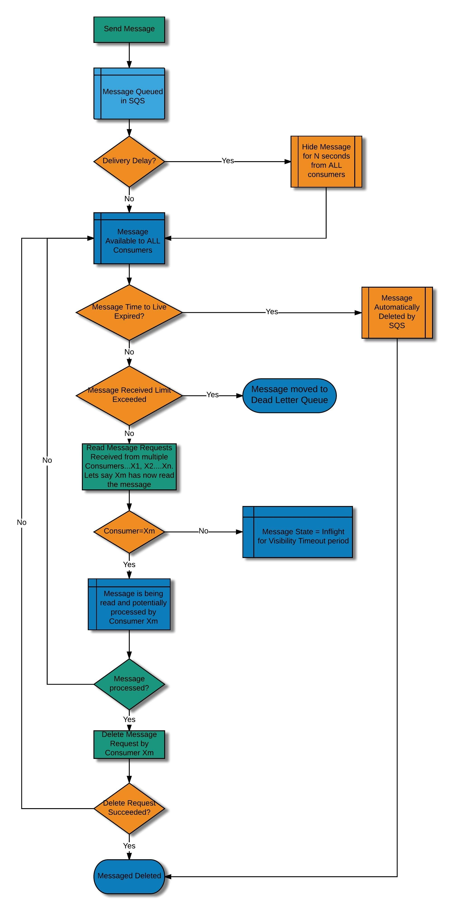
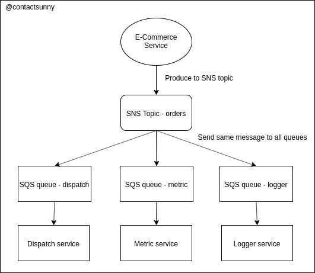

# AWS SQS

Managed Message Queues

Amazon Simple Queue Service (SQS) is a fully managed message queuing service that enables you to decouple and scale microservices, distributed systems, and serverless applications. SQS eliminates the complexity and overhead associated with managing and operating message oriented middleware, and empowers developers to focus on differentiating work. Using SQS, you can send, store, and receive messages between software components at any volume, without losing messages or requiring other services to be available. Get started with SQS in minutes using the AWS console, Command Line Interface or SDK of your choice, and three simple commands.

SQS offers two types of message queues. **Standard queues** offer maximum throughput, best-effort ordering, and at-least-once delivery. **SQS FIFO queues** are designed to guarantee that messages are processed exactly once, in the exact order that they are seen

- Dead letter queue support
- Visibility timeout
- Long pooling

## Advantages

- **Durability--** To ensure the safety of your messages, Amazon SQS stores them on multiple servers. Standard queues support [at-least-once message delivery](https://docs.aws.amazon.com/AWSSimpleQueueService/latest/SQSDeveloperGuide/standard-queues.html#standard-queues-at-least-once-delivery), and FIFO queues support [exactly-once message processing](https://docs.aws.amazon.com/AWSSimpleQueueService/latest/SQSDeveloperGuide/FIFO-queues.html#FIFO-queues-exactly-once-processing).
- **Availability--** Amazon SQS uses [redundant infrastructure](https://docs.aws.amazon.com/AWSSimpleQueueService/latest/SQSDeveloperGuide/sqs-basic-architecture.html) to provide highly-concurrent access to messages and high availability for producing and consuming messages.
- **Scalability--** Amazon SQS can process each [buffered request](https://docs.aws.amazon.com/AWSSimpleQueueService/latest/SQSDeveloperGuide/sqs-client-side-buffering-request-batching.html) independently, scaling transparently to handle any load increases or spikes without any provisioning instructions.
- **Reliability--** Amazon SQS locks your messages during processing, so that multiple producers can send and multiple consumers can receive messages at the same time.
- **Customization--** Your queues don't have to be exactly alike - for example, you can [set a default delay on a queue](https://docs.aws.amazon.com/AWSSimpleQueueService/latest/SQSDeveloperGuide/sqs-delay-queues.html). You can store the contents of messages larger than 256 KB [using Amazon Simple Storage Service (Amazon S3)](https://docs.aws.amazon.com/AWSSimpleQueueService/latest/SQSDeveloperGuide/sqs-s3-messages.html) or Amazon DynamoDB, with Amazon SQS holding a pointer to the Amazon S3 object, or you can split a large message into smaller messages.

Max Payload Size - 256 KB

Can be increased using s3 - https://github.com/awslabs/amazon-sqs-java-extended-client-lib

https://github.com/timothymugayi/boto3-sqs-extended-client-lib

## Batching

Send, receive, or delete messages in batches of up to 10 messages or 256KB to save costs.

All customers can make 1 million Amazon SQS requests for free each month.

| Pricing per 1 million Requests after Free tier (Monthly) |                                 |
|---------------------------------------------|---------------------------|
| Standard Queue                                           | $0.40($0.0000004per request) |
| FIFO Queue                                               | $0.50($0.0000005per request) |

| API Actions                | Every Amazon SQS action counts as a request.                                                                                                                                                                                                                                        |
|---------------|---------------------------------------------------------|
| FIFO Requests              | API actions for sending, receiving, deleting, and changing visibility of messages from FIFO queues are charged at FIFO rates. All other API requests are charged at standard rates.                                                                                                |
| Contents of Requests       | A single request can have from 1 to 10 messages, up to a maximum total payload of 256 KB.                                                                                                                                                                                           |
| Size of Payloads           | Each 64 KB chunk of a payload is billed as 1 request (for example, an API action with a 256 KB payload is billed as 4 requests).                                                                                                                                                    |
| Interaction with Amazon S3 | When using the [Amazon SQS Extended Client Library](https://github.com/awslabs/amazon-sqs-java-extended-client-lib) to send payloads using Amazon S3, you incur [Amazon S3 charges](https://aws.amazon.com/s3/pricing/) for any Amazon S3 storage you use to send message payloads. |

https://aws.amazon.com/sqs

## How is Amazon SQS different from Amazon SNS?

Amazon SNS allows applications to send time-critical messages to multiple subscribers through a "push" mechanism, eliminating the need to periodically check or "poll" for updates. Amazon SQS is a message queue service used by distributed applications to exchange messages through a polling model, and can be used to decouple sending and receiving components.

## How does Amazon SQS handle messages that can't be processed?

In Amazon SQS, you can use the API or the console to configure dead letter queues, which are queues that receive messages from other source queues.

If you make a queue into a dead letter queue, it receives messages after a maximum number of processing attempts cannot be completed. You can use dead letter queues to isolate messages that can't be processed for later analysis.

For more information, see "Can I use a dead letter queue with FIFO queues?" on this page and [Using Amazon SQS Dead Letter Queues](https://docs.aws.amazon.com/AWSSimpleQueueService/latest/SQSDeveloperGuide/sqs-dead-letter-queues.html) in the Amazon SQS Developer Guide.

## What is a visibility timeout?

The visibility timeout is a period of time during which Amazon SQS prevents other consuming components from receiving and processing a message. For more information, see [Visibility Timeout](http://docs.aws.amazon.com/AWSSimpleQueueService/latest/SQSDeveloperGuide/AboutVT.html) in theAmazon SQS Developer Guide.

## Does Amazon SQS support message metadata?

Yes. An Amazon SQS message can contain up to 10 metadata attributes. You can use message attributes to separate the body of a message from the metadata that describes it. This helps process and store information with greater speed and efficiency because your applications don't have to inspect an entire message before understanding how to process it.

Amazon SQS message attributes take the form of name-type-value triples. The supported types include string, binary, and number (including integer, floating-point, and double). For more information, see [Using Amazon SQS Message Attributes](http://docs.aws.amazon.com/AWSSimpleQueueService/latest/SQSDeveloperGuide/SQSMessageAttributes.html) in theAmazon SQS Developer Guide.

## How can I determine the time-in-queue value?

To determine the time-in-queue value, you can request the SentTimestamp attribute when receiving a message. Subtracting that value from the current time results in the time-in-queue value.

## What is the typical latency for Amazon SQS?

Typical latencies for SendMessage, ReceiveMessage, and DeleteMessage API requests are in the tens or low hundreds of milliseconds.

## What is Amazon SQS long polling?

Amazon SQS long polling is a way to retrieve messages from your Amazon SQS queues. While the regular short polling returns immediately, even if the message queue being polled is empty, long polling doesn't return a response until a message arrives in the message queue, or the long poll times out.

Long polling makes it inexpensive to retrieve messages from your Amazon SQS queue as soon as the messages are available. Using long polling might reduce the cost of using SQS, because you can reduce the number of empty receives. For more information, see [Amazon SQS Long Polling](http://docs.aws.amazon.com/AWSSimpleQueueService/latest/SQSDeveloperGuide/sqs-long-polling.html) in theAmazon SQS Developer Guide.

## When should I use Amazon SQS long polling, and when should I use Amazon SQS short polling?

In almost all cases, Amazon SQS long polling is preferable to short polling. Long-polling requests let your queue consumers receive messages as soon as they arrive in your queue while reducing the number of empty ReceiveMessageResponse instances returned.

Amazon SQS long polling results in higher performance at reduced cost in the majority of use cases. However, if your application expects an immediate response from a ReceiveMessage call, you might not be able to take advantage of long polling without some modifications to your application.

For example, if your application uses a single thread to poll multiple queues, switching from short polling to long polling will probably not work, because the single thread will wait for the long-poll timeout on any empty queues, delaying the processing of any queues that might contain messages.

In such an application, it is a good practice to use a single thread to process only one queue, allowing the application to take advantage of the benefits that Amazon SQS long polling provides.

## What value should I use for my long-poll timeout?

In general, you should use maximum 20 seconds for a long-poll timeout. Because higher long-poll timeout values reduce the number of empty ReceiveMessageResponse instances returned, try to set your long-poll timeout as high as possible.

If the 20-second maximum doesn't work for your application (see the example in the previous question), set a shorter long-poll timeout, as low as 1 second.

All AWS SDKs work with 20-second long polls by default. If you don't use an AWS SDK to access Amazon SQS, or if you configured your AWS SDK to specifically have a shorter timeout, you might need to modify your Amazon SQS client to allow longer requests or to use a shorter long-poll timeout.

## Can I delete all messages in a message queue without deleting the message queue itself?

Yes. You can delete all messages in an Amazon SQS message queue using the PurgeQueue action.

When you purge a message queue, all the messages previously sent to the message queue are deleted. Because your message queue and its attributes remain, there is no need to reconfigure the message queue; you can continue using it.

To delete only specific messages, use the DeleteMessage or DeleteMessageBatch actions.

## Which AWS CloudWatch metrics do Amazon SQS FIFO queues support?

FIFO queues support all metrics that standard queues support. For FIFO queues, all approximate metrics return accurate counts. For example, the following AWS CloudWatch metrics are supported:

- ApproximateNumberOfMessagesDelayed - The number of messages in the queue that are delayed and not available for reading immediately.
- ApproximateNumberOfMessagesVisible - The number of messages available for retrieval from the queue.
- ApproximateNumberOfMessagesNotVisible - The number of messages that are in flight (sent to a client but have not yet been deleted or have not yet reached the end of their visibility window).

## What are message groups?

Messages are grouped into distinct, ordered "bundles" within a FIFO queue. For each message group ID, all messages are sent and received in strict order. However, messages with different message group ID values might be sent and received out of order. You must associate a message group ID with a message. If you don't provide a message group ID, the action fails.

If multiple hosts (or different threads on the same host) send messages with the same message group ID are sent to a FIFO queue, Amazon SQS delivers the messages in the order in which they arrive for processing. To ensure that Amazon SQS preserves the order in which messages are sent and received, ensure that multiple senders send each message with a unique message group ID.

## Do Amazon SQS FIFO queues support multiple producers?

Yes. One or more producers can send messages to a FIFO queue. Messages are stored in the order that they were successfully received by Amazon SQS.

If multiple producers send messages in parallel, without waiting for the success response from SendMessage or SendMessageBatch actions, the order between producers might not be preserved. The response of SendMessage or SendMessageBatch actions contains the final ordering sequence that FIFO queues use to place messages in the queue, so your multiple-parallel-producer code can determine the final order of messages in the queue.

## Do Amazon SQS FIFO queues support multiple consumers?

By design, Amazon SQS FIFO queues don't serve messages from the same message group to more than one consumer at a time. However, if your FIFO queue has multiple message groups, you can take advantage of parallel consumers, allowing Amazon SQS to serve messages from different message groups to different consumers.

## Can I use a dead letter queue with FIFO queues?

Yes. However, you must use a FIFO dead letter queue with a FIFO queue. (Similarly, you can use only a standard dead letter queue with a standard queue.)

## Why are there separate ReceiveMessage and DeleteMessage operations?

When Amazon SQS returns a message to you, the message stays in the message queue whether or not you actually receive the message. You're responsible for deleting the message and the deletion request acknowledges that you're done processing the message.

If you don't delete the message, Amazon SQS will deliver it again on when it receives another receive request. For more information, see [Visibility Timeout](http://docs.aws.amazon.com/AWSSimpleQueueService/latest/SQSDeveloperGuide/AboutVT.html) in theAmazon SQS Developer Guide.

## Can a deleted message be received again?

No. FIFO queues never introduce duplicate messages.

For standard queues, under rare circumstances, you might receive a previously-deleted message a second time.

## What happens if I issue a DeleteMessage request on a previously-deleted message?

When you issue a DeleteMessage request on a previously-deleted message, Amazon SQS returns asuccessresponse.

## How long can I keep my messages in Amazon SQS message queues?

Longer message retention provides greater flexibility to allow for longer intervals between message production and consumption.

You can configure the Amazon SQS message retention period to a value from 1 minute to 14 days. The default is 4 days. Once the message retention quota is reached, your messages are automatically deleted.

https://aws.amazon.com/sqs/faqs

## Boto3

## import boto3

client **=** boto3**.**client('sqs')

- [**add_permission()**](https://boto3.amazonaws.com/v1/documentation/api/latest/reference/services/sqs.html#SQS.Client.add_permission)
- [**can_paginate()**](https://boto3.amazonaws.com/v1/documentation/api/latest/reference/services/sqs.html#SQS.Client.can_paginate)
- [**change_message_visibility()**](https://boto3.amazonaws.com/v1/documentation/api/latest/reference/services/sqs.html#SQS.Client.change_message_visibility)
- [**change_message_visibility_batch()**](https://boto3.amazonaws.com/v1/documentation/api/latest/reference/services/sqs.html#SQS.Client.change_message_visibility_batch)
- [**create_queue()**](https://boto3.amazonaws.com/v1/documentation/api/latest/reference/services/sqs.html#SQS.Client.create_queue)
- [**delete_message()**](https://boto3.amazonaws.com/v1/documentation/api/latest/reference/services/sqs.html#SQS.Client.delete_message)
- [**delete_message_batch()**](https://boto3.amazonaws.com/v1/documentation/api/latest/reference/services/sqs.html#SQS.Client.delete_message_batch)
- [**delete_queue()**](https://boto3.amazonaws.com/v1/documentation/api/latest/reference/services/sqs.html#SQS.Client.delete_queue)
- [**generate_presigned_url()**](https://boto3.amazonaws.com/v1/documentation/api/latest/reference/services/sqs.html#SQS.Client.generate_presigned_url)
- [**get_paginator()**](https://boto3.amazonaws.com/v1/documentation/api/latest/reference/services/sqs.html#SQS.Client.get_paginator)
- [**get_queue_attributes()**](https://boto3.amazonaws.com/v1/documentation/api/latest/reference/services/sqs.html#SQS.Client.get_queue_attributes)
- [**get_queue_url()**](https://boto3.amazonaws.com/v1/documentation/api/latest/reference/services/sqs.html#SQS.Client.get_queue_url)
- [**get_waiter()**](https://boto3.amazonaws.com/v1/documentation/api/latest/reference/services/sqs.html#SQS.Client.get_waiter)
- [**list_dead_letter_source_queues()**](https://boto3.amazonaws.com/v1/documentation/api/latest/reference/services/sqs.html#SQS.Client.list_dead_letter_source_queues)
- [**list_queue_tags()**](https://boto3.amazonaws.com/v1/documentation/api/latest/reference/services/sqs.html#SQS.Client.list_queue_tags)
- [**list_queues()**](https://boto3.amazonaws.com/v1/documentation/api/latest/reference/services/sqs.html#SQS.Client.list_queues)
- [**purge_queue()**](https://boto3.amazonaws.com/v1/documentation/api/latest/reference/services/sqs.html#SQS.Client.purge_queue)
- [**receive_message()**](https://boto3.amazonaws.com/v1/documentation/api/latest/reference/services/sqs.html#SQS.Client.receive_message)
- [**remove_permission()**](https://boto3.amazonaws.com/v1/documentation/api/latest/reference/services/sqs.html#SQS.Client.remove_permission)
- [**send_message()**](https://boto3.amazonaws.com/v1/documentation/api/latest/reference/services/sqs.html#SQS.Client.send_message)
- [**send_message_batch()**](https://boto3.amazonaws.com/v1/documentation/api/latest/reference/services/sqs.html#SQS.Client.send_message_batch)
- [**set_queue_attributes()**](https://boto3.amazonaws.com/v1/documentation/api/latest/reference/services/sqs.html#SQS.Client.set_queue_attributes)
- [**tag_queue()**](https://boto3.amazonaws.com/v1/documentation/api/latest/reference/services/sqs.html#SQS.Client.tag_queue)
- [**untag_queue()**](https://boto3.amazonaws.com/v1/documentation/api/latest/reference/services/sqs.html#SQS.Client.untag_queue)

### sqs_consumer.py

```python
import boto3
import time
from datetime import datetime

client = boto3.client('sqs')

while True:
    response = client.receive_message(
    QueueUrl='https://sqs.ap-south-1.amazonaws.com/331916247734/TestQueue',
    AttributeNames=["SentTimestamp"],
    MaxNumberOfMessages=10,
    VisibilityTimeout=5)

    try:
        # print(response, type(response))
        # print(f'{response["ResponseMetadata"]["HTTPStatusCode"]}, {response["ResponseMetadata"]["RetryAttempts"]}')
        for i in response.get('Messages', ''):
            print(f'{str(datetime.now())} {i["Body"]} {datetime.fromtimestamp(int(i["Attributes"]["SentTimestamp"])/1000)}')

            client.delete_message(QueueUrl='https://sqs.ap-south-1.amazonaws.com/331916247734/TestQueue', ReceiptHandle=i["ReceiptHandle"])


    except Exception as e:
        print(e)
        print(response, type(response))
```

### sqs_producer.py

```python
import boto3
import time
from datetime import datetime

client = boto3.client('sqs')

i = 0
while True:
    body = f"{i}_{str(datetime.now())}"
    print(body)
    client.send_message(QueueUrl='https://sqs.ap-south-1.amazonaws.com/331916247734/TestQueue',
    MessageBody=body)

    # time.sleep(0.5)
    i += 1
```

https://boto3.amazonaws.com/v1/documentation/api/latest/reference/services/sqs.html



[**http://pragmaticnotes.com/2017/12/19/lifecycle-of-a-message-in-amazon-sqs-a-detailed-coverage/**](http://pragmaticnotes.com/2017/12/19/lifecycle-of-a-message-in-amazon-sqs-a-detailed-coverage/)

https://blog.contactsunny.com/tech/emulating-apache-kafka-with-amazon-sns-and-sqs


