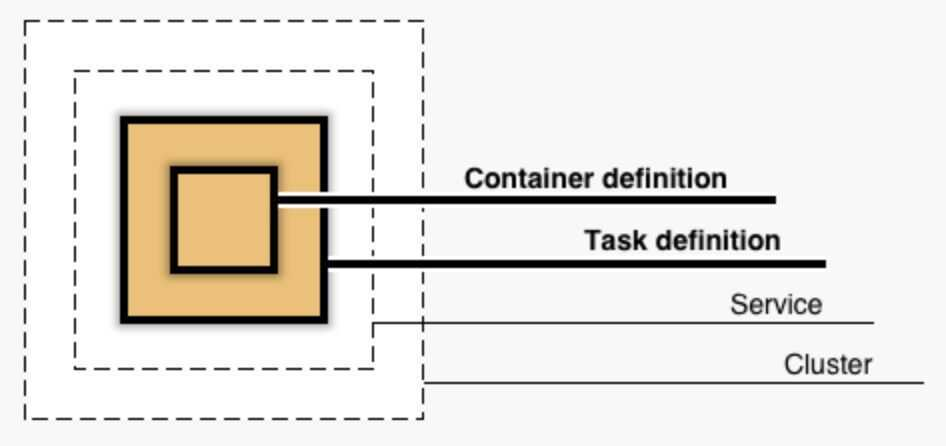

# Amazon ECS (Elastic Container Service)

[Cost Optimization Checklist for Amazon ECS and AWS Fargate | Containers](https://aws.amazon.com/blogs/containers/cost-optimization-checklist-for-ecs-fargate/)

[Monitor Amazon ECS using CloudWatch - Amazon Elastic Container Service](https://docs.aws.amazon.com/AmazonECS/latest/developerguide/cloudwatch-metrics.html)

[What is CW:MetricMonitorUsage and how can I get rid of it? : r/aws](https://www.reddit.com/r/aws/comments/10fbkc9/what_is_cwmetricmonitorusage_and_how_can_i_get/?rdt=44843)

## Task Placement

For tasks that use the EC2 launch type, Amazon ECS must determine where to place the task based on the requirements specified in the task definition, such as CPU and memory. Similarly, when you scale down the task count, Amazon ECS must determine which tasks to terminate. You can apply task placement strategies and constraints to customize how Amazon ECS places and terminates tasks.

- [Use strategies to define Amazon ECS task placement - Amazon Elastic Container Service](https://docs.aws.amazon.com/AmazonECS/latest/developerguide/task-placement-strategies.html)
- [How Amazon ECS places tasks on container instances - Amazon Elastic Container Service](https://docs.aws.amazon.com/AmazonECS/latest/developerguide/task-placement.html)
- [ECS Task Placement Strategies - Tutorials Dojo](https://tutorialsdojo.com/ecs-task-placement-strategies/)
- [AWS ECS Placement Strategy. When I took a look at our AWS ECS… | by Dale Frohman | Medium](https://dalefro.medium.com/aws-ecs-placement-strategy-d7e2d5c8e2ef)

## Links

[Amazon ECS: Well Architected Amazon ECS lens Overview | Amazon Web Services - YouTube](https://www.youtube.com/watch?v=SjrQGvjkisg&ab_channel=AmazonWebServices)

[Figma Moves from ECS to Kubernetes to Benefit from the CNCF Ecosystem and Reduce Costs - InfoQ](https://www.infoq.com/news/2024/09/figma-ecs-kubernetes-eks/)
