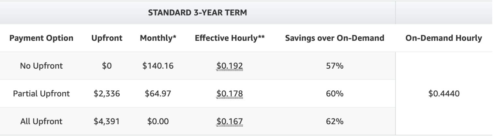

# EC2 Instance types

[It just got easier to discover and compare EC2 instance types | AWS Compute Blog](https://aws.amazon.com/blogs/compute/it-just-got-easier-to-discover-and-compare-ec2-instance-types)

[GitHub - aws/amazon-ec2-instance-selector: A CLI tool and go library which recommends instance types based on resource criteria like vcpus and memory](https://github.com/aws/amazon-ec2-instance-selector)

[Amazon EC2 Instance Comparison](https://instances.vantage.sh/)

[Amazon EC2 R8g Instances | Now Generally Available | Amazon Web Services - YouTube](https://www.youtube.com/watch?v=AlP51fFHdS0&ab_channel=AmazonWebServices)

## Price Comparison

| Instance Types | On Demand | Spot    | 1 Yr Reserved | 3 Yr Reserved |
| -------------- | --------- | ------- | ------------- | ------------- |
| m7g.large      | $59.568   | $27.375 | $39.420       | $27.010       |
| m7i-flex.large | $69.905   | $33.215 | $46.238       | $31.711       |
| m7i.large      | $73.584   | $33.069 | $48.676       | $33.376       |
| m7a.large      | $84.622   | $35.405 | $55.976       | $38.383       |

### Price comparison between graviton, amd and intel

**Region - Mumbai** -

| Instance Types | On Demand | Spot    | 1 Yr Reserved | 3 Yr Reserved | Cheaper than below on-demand | Costlier than above on-demand |
| -------------- | --------- | ------- | ------------- | ------------- | ---------------------------- | ----------------------------- |
| m6g.large      | $36.938   | $14.965 | $23.287       | $15.987       | 9%                           |                               |
| m6a.large      | $40.552   | $18.688 | $26.784       | $18.440       | 45%                          | 10%                           |
| m6i.large      | $73.730   | $28.835 | $48.691       | $33.529       |                              | 82%                           |

- Graviton is 9% cheaper than AMD and **50% cheaper than Intel**
- AMD Instances are 45% cheaper than Intel and 10% costlier than graviton

### Price comparison between spot, reserved and on-demand

| m6g.large     |        | Cheaper than on-demand | Costiler than Spot |
| ------------- | ------ | ---------------------- | ------------------ |
| Spot          | $12.78 | 65%                    |                    |
| 3 Yr Reserved | $15.99 | 57%                    | 25%                |
| 1 Yr Reserved | $23.29 | 37%                    | 82%                |
| On Demand     | $36.94 |                        | 189%               |

- Spot is 65% cheaper than on-demand
- 1 year reserved is 37% cheaper than on-demand

[m6g.large pricing and specs - Vantage](https://instances.vantage.sh/aws/ec2/m6g.large?region=ap-south-1&os=linux&cost_duration=monthly&reserved_term=Standard.noUpfront)

## EC2 Instance Types

| **General Purpose**       | A1, T3, T3a, T2, M6g, M5, **M5a**, M5n, M4  |
|---------------------------|---------------------------------------------|
| **Compute Optimized**     | C5, C5n, C4                                 |
| **Memory Optimized**      | R5, R5a, R5n, R4, X1e, X1, High Memory, z1d |
| **Accelerated Computing** | P3, P2, Inf1, G4, G3, F1                    |
| **Storage Optimized**     | I3, I3en, D2, H1                            |

The "d" in "m5ad" indicates that these instances come with local NVMe SSD storage, which can provide low-latency, high-speed storage options.

| **Instance Family** | **Example** | **Use Cases** |
|---|---|---|
| Memory optimized | R5 | Memory-intensive applications, High-performance databases, Distributed in-memory caches |
| Storage optimized | I3 | Workloads with high-volume IOPS requiring low-latency, internet-scale nonrelational databases |
| Burstable performance | T2 | Consistent cost for unpredictable workloads, Smaller databases with spiky usage |

| **Scenario** | **Possible Instance Choice with Explanation** |
|---|---|
| Small database in Amazon RDS with moderate activity levels for which cost is more important than latency | db.m5 standard DB instance class offering a balance of compute, memory, and network resources |
| A 12-GB write-heavy workload in Amazon ElastiCache for Redis with 2 shards | cache.r5.xlarge memory-optimized instances with 26 GiB of memory |
| A memory-intensive workload in Amazon RDS using Oracle under an existing license for 2 CPUs | db.m4.xlarge with hyperthreading disabled to remain in compliance with licenses |

| Instance Size | vCPU | Memory (GiB) | Instance Storage (GiB) | Network Bandwidth (Gbps) | EBS Bandwidth (Mbps) | Cost per hour | Cost per month |
|---|---|---|---|---|---|---|---|
| m5.large | 2 | 8 | EBS-Only | Up to 10 | Up to 4,750 | $0.056 | $40.32 |
| m5.xlarge | 4 | 16 | EBS-Only | Up to 10 | Up to 4,750 | $0.111 | $79.92 |
| m5.2xlarge | 8 | 32 | EBS-Only | Up to 10 | Up to 4,750 | $0.222 | $159.84 |
| m5.4xlarge | 16 | 64 | EBS-Only | Up to 10 | 4,750 | $0.444 | $319.68 |
| m5a.8xlarge | 32 | 128 | EBS-Only | | | $0.889 | $640.08 |

- i - intel CPUs
- a - AMD CPUs
- g - Graviton based processors

[Amazon EC2 z1d Instances](https://aws.amazon.com/ec2/instance-types/z1d/) - Delivering a sustained all core frequency of up to 4.0 GHz, and a high memory to vCPU ratio - z1d.xlarge (4,32) - $271.56 monthly

[Amazon EC2 - P2 Instances](https://aws.amazon.com/ec2/instance-types/p2/) - Powerful, Scalable GPU instances for high-performance computing - p2.xlarge (4,61) - $657 monthly

[Amazon EC2’s New I2 Instance Type – Available Now! | AWS News Blog](https://aws.amazon.com/blogs/aws/amazon-ec2-new-i2-instance-type-available-now/) - The I2 instance type was designed to host I/O intensive workloads typically generated by relational databases, NoSQL databases, and transactional systems. The largest I2 instance type can deliver over 365K random reads per second and over 315K random writes per second, both measured with a block size of 4 KB. With four instance sizes, you can start small and scale up as your storage and I/O needs grow. - i2.xlarge (4,30) - $622 monthly

[Now available: D2 instances, the latest generation of Amazon EC2 Dense-storage instances](https://aws.amazon.com/about-aws/whats-new/2015/03/now-available-d2-instances-the-latest-generation-of-amazon-ec2-dense-storage-instances/) - D2 instances are designed for workloads that require high sequential read and write access to very large data sets, such as Hadoop distributed computing, massively parallel processing data warehousing, and log processing applications. - d2.xlarge (4,30) - $503 monthly

### AMI

Ubuntu 16.04 LTS AMI - ami-2757f631

Ubuntu 16.10 AMI - ami-b374d5a5

Ubuntu Server 18.04 LTS (HVM), SSD Volume Type- ami-0620d12a9cf777c87 (64-bit x86) / ami-06b0afcb36d2e27ef (64-bit Arm)

Ubuntu Server 16.04 LTS (HVM), SSD Volume Type- ami-0c28d7c6dd94fb3a7 (64-bit x86) / ami-08f567e9a6f67fbee (64-bit Arm)

### Flex Instances

[C7i-flex](https://aws.amazon.com/ec2/instance-types/c7i/) offers five of the most common sizes from **large** to **8xlarge**, delivering 19 percent better price performance than [Amazon EC2 C6i](https://aws.amazon.com/ec2/instance-types/c6i/) instances.

[New compute-optimized (C7i-flex) Amazon EC2 Flex instances | AWS News Blog](https://aws.amazon.com/blogs/aws/new-compute-optimized-c7i-flex-amazon-ec2-flex-instances/)

[Introducing Amazon EC2 C7i-flex instances](https://aws.amazon.com/about-aws/whats-new/2024/05/amazon-ec2-c7i-flex-instances/)

## Tips

- **M5a instances** offers up to 10% savings for customers who are looking to further cost optimize their Amazon EC2 compute environments.
- [Kernel Live Patching for Amazon Linux 2 is now generally available](https://aws.amazon.com/about-aws/whats-new/2020/06/announcing-general-availability-kernel-live-patching-amazon-linux-2/)
- The M5a is ~10% cheaper.
- vCPUs and Memory are equal.
- The Intel CPU is 20% faster, using [Intel Turbo Boost](https://en.wikipedia.org/wiki/Intel_Turbo_Boost) (hence the "**up to** 3.1 Ghz")
- The Intel instance has 20% more network bandwidth and 40% more EBS bandwidth.

https://aws.amazon.com/ec2/pricing/on-demand

https://aws.amazon.com/ec2/instance-types

- **Spot instances (discount upto 90%)**
    - **No bidding**
    - **Ideal for**
        - Fault tolerant
        - Flexible
        - Lossely coupled
        - Stateless workloads

https://aws.amazon.com/ec2/spot/instance-advisor

https://ec2spotworkshops.com/using_ec2_spot_instances_with_eks.html

https://aws.amazon.com/blogs/compute/cost-optimization-and-resilience-eks-with-spot-instances

https://aws.amazon.com/blogs/containers/amazon-eks-now-supports-provisioning-and-managing-ec2-spot-instances-in-managed-node-groups

https://spot.io

- On-demand instances
- Reserved instances (discount upto 75%)
    - Ex - m5a.4xlarge

https://aws.amazon.com/ec2/pricing/reserved-instances/pricing

- Savings plans (discount upto 66%)
- Dedicated hosts

## Differences Between Intel, AMD, and Graviton

Intel, AMD, and Graviton each come with tradeoffs:

- **CPU Architecture:** Intel and AMD have x86-based architecture, while Graviton has 64-bit Arm Neoverse cores. The architecture affects software compatibility and performance. Arm-based architecture, in particular, has potential compatibility issues with certain software that may not be supported or may require refactoring. A common reason in the past not to use Graviton was vendor lock-in, as Arm is not as widely supported, which is still true, however, [Azure](https://azure.microsoft.com/en-us/blog/azure-virtual-machines-with-ampere-altra-arm-based-processors-generally-available/) and [Google](https://cloud.google.com/blog/products/compute/introducing-googles-new-arm-based-cpu) (as of this month) both now have Arm processors available.

- **Threading:** Intel and AMD support [simultaneous multithreading](https://docs.aws.amazon.com/AWSEC2/latest/UserGuide/instance-optimize-cpu.html), enabling "multiple threads to run concurrently on a single CPU core." Graviton, on the other hand, does not, and [every vCPU is a physical core](https://docs.aws.amazon.com/whitepapers/latest/aws-graviton2-for-isv/optimizing-for-performance.html). Some workloads, like data analytics, are more efficient on a multithreaded workload, whereas others, such as gaming, perform better on single-threaded workloads. Note—you can [disable multithreading](https://docs.aws.amazon.com/AWSEC2/latest/UserGuide/instance-specify-cpu-options.html) by setting one thread per code.

- **Price Performance:** Graviton is advertised by AWS to have [better price performance](https://aws.amazon.com/ec2/graviton/), in some cases up to 40%, than comparable Intel and AMD instances. Independent benchmarks comparing similar instances, such as [this one by Scylla](https://www.scylladb.com/2021/09/16/aws-graviton2-arm-brings-better-price-performance-than-intel/), also find Graviton to be more price-performant. This is due in part to Arm-based processors having lower power consumption and more competitive margins since Graviton is owned by Amazon. Graviton is an excellent choice for those who are prioritizing cost.

- **Performance:** Benchmarks show various results since performance is so specific to use cases. As such, if you’re choosing between instances, consider running your workload on different instances to compare.

[Intel vs AMD vs Graviton: Amazon EC2 Processor Differences and Distribution](https://www.vantage.sh/blog/aws-ec2-processors-intel-vs-amd-vs-graviton-adoption)

[AWS and AMD](https://aws.amazon.com/ec2/amd/)

[AWSPremiumSupport-ChangeInstanceTypeIntelToAMD - AWS Systems Manager Automation runbook reference](https://docs.aws.amazon.com/systems-manager-automation-runbooks/latest/userguide/automation-aws-changeinstancetypeinteltoamd.html)

[AMD vs. Intel: Unveiling the Best EC2 Instance Choice](https://cloudfix.com/blog/boost-aws-performance-and-cost-efficiency-with-amd-instances/)

## EC2

### EC2 Instance metadata and user data

_Instance metadata_ is data about your instance that you can use to configure or manage the running instance. Instance metadata is divided into [categories](https://docs.aws.amazon.com/AWSEC2/latest/UserGuide/instancedata-data-categories.html), for example, host name, events, and security groups.

EC2 instance metadata is a service accessible from within EC2 instances, which allows querying or managing data about a given running instance.

It is possible to retrieve an instance’s IAM access key by accessing the `iam/security-credentials/role-name` metadata category. This returns a temporary set of credentials that the EC2 instance automatically uses for communicating with AWS services.

[Instance metadata and user data - Amazon Elastic Compute Cloud](https://docs.aws.amazon.com/AWSEC2/latest/UserGuide/ec2-instance-metadata.html)

### AWS Systems Manager

[Working with the file system - AWS Systems Manager](https://docs.aws.amazon.com/systems-manager/latest/userguide/fleet-file-management.html)

[Systems Manager Automation runbook reference - AWS Systems Manager Automation runbook reference](https://docs.aws.amazon.com/systems-manager-automation-runbooks/latest/userguide/automation-runbook-reference.html)

[AWS Systems Manager Fleet Manager - AWS Systems Manager](https://docs.aws.amazon.com/systems-manager/latest/userguide/fleet.html)

[AWS Systems Manager Inventory - AWS Systems Manager](https://docs.aws.amazon.com/systems-manager/latest/userguide/systems-manager-inventory.html)

### Instance Scheduler

[Instance Scheduler on AWS](https://aws.amazon.com/solutions/implementations/instance-scheduler-on-aws/)

[Automate starting and stopping AWS instances - Instance Scheduler on AWS](https://docs.aws.amazon.com/solutions/latest/instance-scheduler-on-aws/solution-overview.html)

### AWS AppConfig

- Feature Flags

AWS AppConfig feature flags and dynamic configurations help software builders quickly and securely adjust application behavior in production environments without full code deployments. AWS AppConfig speeds up software release frequency, improves application resiliency, and helps you address emergent issues more quickly. With feature flags, you can gradually release new capabilities to users and measure the impact of those changes before fully deploying the new capabilities to all users. With operational flags and dynamic configurations, you can update block lists, allow lists, throttling limits, logging verbosity, and perform other operational tuning to quickly respond to issues in production environments.

[What is AWS AppConfig? - AWS AppConfig](https://docs.aws.amazon.com/appconfig/latest/userguide/what-is-appconfig.html)

## Bottlerocket

Bottlerocket is a Linux-based open-source operating system that is purpose-built by Amazon Web Services for running containers on virtual machines or bare metal hosts. Most customers today run containerized applications on general-purpose operating systems that are updated package-by-package, which makes OS updates difficult to automate. Updates to Bottlerocket are applied in a single step rather than package-by-package. This single-step update process helps reduce management overhead by making OS updates easy to automate using container orchestration services such as Amazon EKS. The single-step updates also improve uptime for container applications by minimizing update failures and enabling easy update rollbacks. Additionally, Bottlerocket includes only the essential software to run containers, which improves resource usage and reduces the attack surface.

https://aws.amazon.com/bottlerocket

https://github.com/bottlerocket-os/bottlerocket

EC2 Image Builder

## GPU / Accelerated Computing

Accelerated computing instances use hardware accelerators, or co-processors, to perform functions, such as floating point number calculations, graphics processing, or data pattern matching, more efficiently than is possible in software running on CPUs.

https://aws.amazon.com/ec2/instance-types/g4

[Amazon EC2 P4 Instances](https://aws.amazon.com/ec2/instance-types/p4/)

- High performance for ML training and HPC applications in the cloud

### [Amazon EC2 P5 Instances](https://aws.amazon.com/ec2/instance-types/p5/)

Highest performance GPU-based instances for deep learning and HPC applications

[Amazon EC2 P5 instances](https://aws.amazon.com/ec2/instance-types/p5/) are the latest generation of GPU-based instances and provide the highest performance in Amazon EC2 for deep learning and high performance computing (HPC).

#### Features

- Intel Sapphire Rapids CPU and PCIe Gen5 between the CPU and GPU in P5en instances; 3rd Gen AMD EPYC processors (AMD EPYC 7R13) and PCIe Gen4 between the CPU and GPU in P5 and P5e instances.
- Up to 8 NVIDIA H100 (in P5) or H200 (in P5e and P5en) Tensor Core GPUs
- Up to 3,200 Gbps network bandwidth with support for Elastic Fabric Adapter (EFA) and NVIDIA GPUDirect RDMA (remote direct memory access)
- 900 GB/s peer-to-peer GPU communication with NVIDIA NVSwitch

| Instance          | GPUs   | vCPUs | Instance Memory (TiB) | GPU Memory | Network Bandwidth | GPU Direct RDMA | GPU Peer to Peer  | Instance Storage (TB) | EBS Bandwidth (Gbps) |
| ----------------- | ------ | ----- | --------------------- | --------------- | ----------------- | --------------- | ----------------- | --------------------- | -------------------- |
| **p5.48xlarge**   | 8 H100 | 192   | 2                     | 640 GB HBM3     | 3200 Gbps EFAv2   | Yes             | 900 GB/s NVSwitch | 8 x 3.84 NVMe SSD     | 80                   |
| **p5e.48xlarge**  | 8 H200 | 192   | 2                     | 1128 GB HBM3    | 3200 Gbps EFAv2   | Yes             | 900 GB/s NVSwitch | 8x 3.84 NVMe SSD      | 80                   |
| **p5en.48xlarge** | 8 H200 | 192   | 2                     | 1128 GB HBM3    | 3200 Gbps EFAv3   | Yes             | 900 GB/s NVSwitch | 8x 3.84 NVMe SSD      | 100                  |

[Amazon EC2 Instance types](https://aws.amazon.com/ec2/instance-types/)

[Graphics Cards by GeForce \| NVIDIA](https://www.nvidia.com/en-in/geforce/graphics-cards/)

- GeForce RTX 50 Series
	- RTX 5090
	- RTX 5080
	- RTX 5070 Ti
	- RTX 5070
- GeForce RTX 40 Series
	- RTX 4080
	- RTX 4070

## Spot Instances

[Spot Instances - Amazon Elastic Compute Cloud](https://docs.aws.amazon.com/AWSEC2/latest/UserGuide/using-spot-instances.html)

[Best practices for EC2 Spot - Amazon Elastic Compute Cloud](https://docs.aws.amazon.com/AWSEC2/latest/UserGuide/spot-best-practices.html)

## Upgrading instance generation checklist

- [Upgrade EC2 instance | AWS re:Post](https://repost.aws/questions/QUu8o1AEwmSgyZJho1hEfuRw/upgrade-ec2-instance)
- [Resolve boot errors on Linux Nitro-based EC2 instances | AWS re:Post](https://repost.aws/knowledge-center/boot-error-linux-nitro-instance)

## Links

- [Amazon EC2 R8g Instances](https://aws.amazon.com/ec2/instance-types/r8g/)
	- R8g instances offer up to 30% better performance and larger instance sizes with up to 3x more vCPUs and memory than the seventh-generation AWS Graviton3-based R7g instances.
