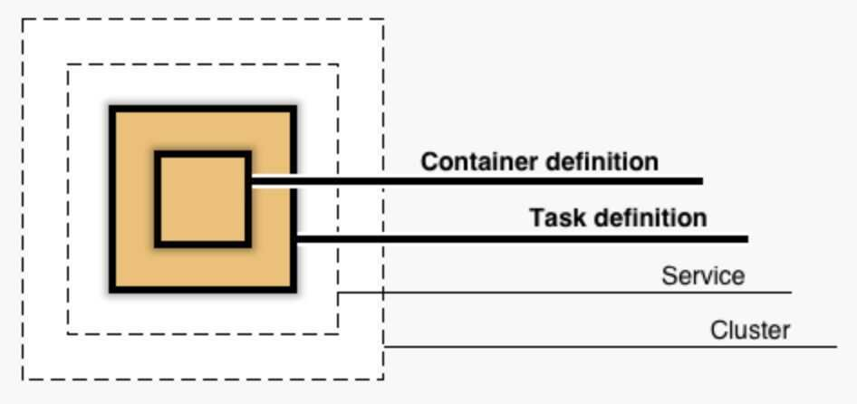

# Compute

## Amazon EC2

Virtual Servers in the Cloud

installing docker in ubuntu ec2 instance

```bash
apt-get update
apt-get install docker
sudo usermod -aG docker ubuntu
# log out of terminal and log back in
sudo systemctl start docker
docker run hello-world
```

[AWS EC2 Instance Types](ec2-instance-types)

## Amazon EC2 Auto Scaling

Scale Compute Capacity to Meet Demand

## Amazon Elagoostic Container Service

Run and Manage Docker Containers

## Amazon Elastic Container Service for Kubernetes

Run Managed Kubernetes on AWS

## Amazon Elastic Container Registry

Store and Retrieve Docker Images

## Amazon Lightsail

Launch and Manage Virtual Private Servers

<https://aws.amazon.com/lightsail/resources>

## AWS Batch

Run Batch Jobs at Any Scale

## AWS Elastic Beanstalk

Run and Manage Web Apps

AWS Elastic Beanstalk is an easy-to-use service for deploying and scaling web applications and services developed with Java, .NET, PHP, Node.js, Python, Ruby, Go, and Docker on familiar servers such as Apache, Nginx, Passenger, and IIS.

You can simply upload your code and Elastic Beanstalk automatically handles the deployment, from capacity provisioning, load balancing, auto-scaling to application health monitoring. At the same time, you retain full control over the AWS resources powering your application and can access the underlying resources at any time.

Deployment modes -

- **All at once:** This is the fastest mode. In this case, Elastic Beanstalk will simply stop all the running instances and then will deploy the new version to these instances.
- **Immutable:** In this mode, Elastic Beanstalk will create a new Auto Scaling Group and deploy the new instances there. Then, if the deployment succeeds, it will replace the old Auto Scaling Group with the newly created one.
- **Rolling:** During the deployment, Elastic Beanstalk will deploy the new application version to some of the currently running instances, and repeat that process until all instances are running the same version. Using this mode, the application will run below capacity, but with zero downtime and no additional costs.
- **Rolling with additional batches:** In this mode, Elastic Beanstalk will make sure there is no capacity reduction. It does so by first starting new instances with the new version of the application, and only then deploying the new version to the old instances.

## AWS Fargate

Run Containers without Managing Servers or Clusters

AWS Fargate is a serverless compute engine for containers that works with both [Amazon Elastic Container Service (ECS)](https://aws.amazon.com/ecs/) and [Amazon Elastic Kubernetes Service (EKS)](https://aws.amazon.com/eks/). Fargate makes it easy for you to focus on building your applications. Fargate removes the need to provision and manage servers, lets you specify and pay for resources per application, and improves security through application isolation by design.

Fargate allocates the right amount of compute, eliminating the need to choose instances and scale cluster capacity. You only pay for the resources required to run your containers, so there is no over-provisioning and paying for additional servers. Fargate runs each task or pod in its own kernel providing the tasks and pods their own isolated compute environment. This enables your application to have workload isolation and improved security by design. This is why customers such as Vanguard, Accenture, Foursquare, and Ancestry have chosen to run their mission critical applications on Fargate.

## AWS Lambda

Run Your Code in Response to Events

```python
# Stock Check Lambda function

# This function is triggered when values are inserted into the Inventory DynamoDB table.
# Inventory counts are checked, and if an item is out of stock, a notification is sent to an SNS topic.

# This handler is executed every time the Lambda function is triggered
def lambda_handler(event, context):

    # Show the incoming event in the debug log
    print("Event received by Lambda function: " + json.dumps(event, indent=2))

    # For each inventory item added, check if the count is zero
    for record in event['Records']:
    newImage = record['dynamodb'].get('NewImage', None)
    if newImage:

        count = int(record['dynamodb']['NewImage']['Count']['N'])

        if count == 0:
        store = record['dynamodb']['NewImage']['Store']['S']
        item  = record['dynamodb']['NewImage']['Item']['S']

        # Construct message to be sent
        message = store + ' is out of stock of ' + item
        print(message)

        # Connect to SNS
        sns = boto3.client('sns')
        alertTopic = 'NoStock'
        snsTopicArn = [t['TopicArn'] for t in sns.list_topics()['Topics']
                        if t['TopicArn'].lower().endswith(':' + alertTopic.lower())][0]

        # Send message to SNS
        sns.publish(
            TopicArn=snsTopicArn,
            Message=message,
            Subject='Inventory Alert!',
            MessageStructure='raw'
        )

    # Finished!
    return 'Successfully processed {} records.'.format(len(event['Records']))
```

## AWS Serverless Application Repository

Discover, Deploy, and Publish Serverless Applications

## VMware Cloud on AWS

Build a Hybrid Cloud without Custom Hardware

## AWS ECS (Elastic Container Service)



## [AWS Elastic Kubernetes Service (EKS)](amazon-eks)

## EC2 > Networking > Elastic IP Addresses

AnElastic IP addressis a static IPv4 address designed for dynamic cloud computing. An Elastic IP address is associated with your AWS account. With an Elastic IP address, you can mask the failure of an instance or software by rapidly remapping the address to another instance in your account.

An Elastic IP address is a public IPv4 address, which is reachable from the internet. If your instance does not have a public IPv4 address, you can associate an Elastic IP address with your instance to enable communication with the internet; for example, to connect to your instance from your local computer.

<https://docs.aws.amazon.com/AWSEC2/latest/UserGuide/elastic-ip-addresses-eip.html>

## EC2 > Networking > ENI

An elastic network interface (referred to as a*network interface*in this documentation) is a logical networking component in a VPC that represents a virtual network card.

<https://docs.aws.amazon.com/AWSEC2/latest/UserGuide/using-eni.html>

## Others

- VirtualBox
- AWS EC2
- VMWare player
- Vagrant Environment
- Paralles in mac
