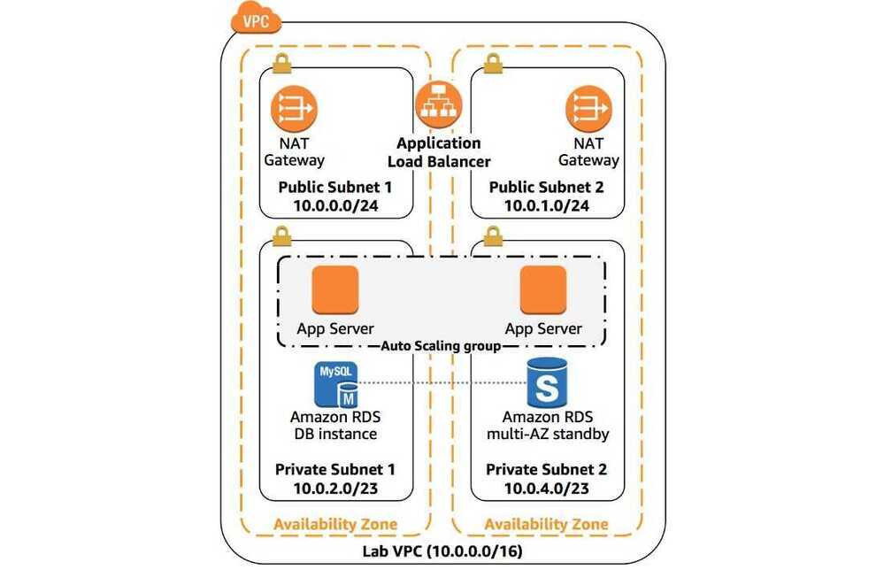

# Architecting on AWS

12th August to 14th August 2020

http://online.vitalsource.com

https://infrastructure.aws

https://calculator.aws

http://checkip.amazonaws.com

https://www.wellarchitectedlabs.com

https://www.linkedin.com/in/puneet-sharma-6b202910

## Course description

This course focuses on the fundamentals of building IT infrastructure on the AWS platform. You will learn how to optimize the AWS Cloud by understanding AWS services and how they fit into cloud-based solutions. Best practices and design patterns are covered to help you architect optimal IT solutions on the AWS Cloud. Build and explore a variety of infrastructures through guided discussions and hands-on activity.

## Course objectives

### This course is designed to teach you how to

- Make architectural decisions based on AWS architectural principles and best practices
- Leverage AWS services to make your infrastructure scalable, reliable, and highly available
- Leverage AWS Managed Services to enable greater flexibility and resiliency in an infrastructure
- Make an infrastructure based on AWS more efficient to increase performance and reduce costs
- Use the **Well-Architected Framework** to improve architectures with AWS solutions

### Intended audience

This course is intended for:

- Solutions Architects
- Solution Design Engineers
- Anyone who needs to understand the scope of cloud architectures

### Prerequisites

We recommend that attendees of this course have:

- Taken theAWS Cloud Practitioner Essentialsclassroom or digital training
- Working knowledge of distributed systems and multi-tier architectures
- Familiarity with general networking and cloud computing concepts

## Course outline

## Day One

### Module 1: Introduction

- The Well-Architected Framework
- AWS Global Infrastructure

### Module 2: The simplest architectures

- Amazon Simple Storage Service (Amazon S3)
- Amazon S3 Glacier
- Choosing AWS Regions for your architectures
- Hands-on lab: Hosting a Static Website

### Module 3: Adding a compute layer

- Amazon Elastic Compute Cloud (Amazon EC2)
- Amazon Machine Images (AMIs)
- Amazon Elastic Block Storage (Amazon EBS)
- Amazon Elastic File System (Amazon EFS)
- Amazon FSx

### Module 4: Adding a database layer

- Database layer considerations
- Amazon Relational Database Service (Amazon RDS)
- Amazon DynamoDB
- AWS Database Migration Service (AWS DMS)

https://aws.amazon.com/premiumsupport/knowledge-center/transformations-aws-dms

- Hands-on lab: Deploying a Web Application on AWS

### Module 5: Networking in AWS -- Part 1

- Amazon Virtual Private Cloud (Amazon VPC)
- Network security in the cloud
- Hands-on lab: Creating a VPC

## Day Two

### Module 6: Networking in AWS -- Part 2

- AWS VPN connections
- AWS Direct Connect (DX)
- VPC peering
- AWS Transit Gateway
- Load balancing on AWS
- Amazon Route 53

### Module 7: AWS Identity and Access Management (IAM)

- Account users and AWS IAM
- Federating users
- Amazon Cognito
- AWS Organizations
    - [Best Practices for AWS Organizations](https://www.densify.com/finops/aws-organizations-best-practices/)

### Module 8: Elasticity, high availability, and monitoring

- Amazon CloudWatch
- AWS CloudTrail
- Amazon EC2 Auto Scaling
- Scaling your databases
- Hands-on lab: Creating a highly available environment

### Module 9: Automation

- AWS CloudFormation
- **AWS Systems Manager**

Gain operational insights and take action on AWS resources

- AWS OpsWorks
- AWS Elastic Beanstalk
- Hands-on lab: Automating infrastructure deployment with AWS CloudFormation

## Day Three

### Module 10: Caching

- Caching on AWS with Amazon CloudFront
- Session management
- Amazon DynamoDB Accelerator (DAX)
- Amazon ElastiCache

### Module 11: Building decoupled architectures

- Amazon Simple Queue Service (Amazon SQS)
- Amazon Simple Notification Service (Amazon SNS)

### Module 12: Microservices and serverless architectures

- Amazon Elastic Container Service (Amazon ECS)
- AWS Fargate
- AWS Lambda
- Amazon API Gateway
- AWS Step Functions
- Hands-on lab: Implementing a serverless architecture with AWS Managed Services

### Module 13: RTO/RPO and backup recovery setup

- Disaster planning
- Data replication
- Recovery strategies
- AWS Storage Gateway

### Module 14: Optimization and review

- Best practices for optimization
- Review questions

## Questions

- How to encrypt and work with PII data - Athena and S3
- **Data Governance? Moving data from RDS to S3 to S3 Glacier**
- Aurora Parallel Queries
    - Cost
    - Performance
- Modeling in DynamoDB

## Well-Architected Framework (Five Pillars)

### 1. Security

- Identity foundation
- Enabling traceability
- Security at all layers
- Risk assessment and mitigation strategies

### 2. Reliability

- Dynamically acquire computing resources to meet demand
- Recover quickly from infrastructure or service failures
- Mitigate disruptions such as:
    - Misconfigurations
    - Transient network issues

### 3. Cost Optimization

- Measure efficiency
- Eliminate unneeded expense
- Consider using managed services

[Overview - Komiser](https://docs.komiser.io/welcome/overview)

### 4. Performance Efficiency

- Choose efficient resources and maintain their efficiency as demand changes
- Democratize advanced technologies
- Mechanical sympathy

### 5. Operation Excellence

- The ability to run and monitor systems
- To continually impove supporting process and procedures

## Edge Location - Point of Presence

1. Cloudfront - CDN (Content Delivery Network)
2. Route53
    1. [Choosing a routing policy - Amazon Route 53](https://docs.aws.amazon.com/Route53/latest/DeveloperGuide/routing-policy.html)
    2. [Weighted routing - Amazon Route 53](https://docs.aws.amazon.com/Route53/latest/DeveloperGuide/routing-policy-weighted.html)
    3. [Values specific for weighted records - Amazon Route 53](https://docs.aws.amazon.com/Route53/latest/DeveloperGuide/resource-record-sets-values-weighted.html)
    4. [How to implement the perfect failover strategy using Amazon Route53 | by Simon Tabor | DAZN Engineering | Medium](https://medium.com/dazn-tech/how-to-implement-the-perfect-failover-strategy-using-amazon-route53-1cc4b19fa9c7)
    5. [Choosing between alias and non-alias records - Amazon Route 53](https://docs.aws.amazon.com/Route53/latest/DeveloperGuide/resource-record-sets-choosing-alias-non-alias.html)
3. WAF (Web Application Framework)
4. SHIELD
5. Lambda@Edge

## Data Analytics Lens

### Scenarios

- [Data discovery](https://docs.aws.amazon.com/wellarchitected/latest/analytics-lens/data-discovery.html)
- [Modern data architecture](https://docs.aws.amazon.com/wellarchitected/latest/analytics-lens/modern-data-architecture.html)

- [Batch data processing](https://docs.aws.amazon.com/wellarchitected/latest/analytics-lens/batch-data-processing.html)

- [Streaming ingest and stream processing](https://docs.aws.amazon.com/wellarchitected/latest/analytics-lens/streaming-ingest-and-stream-processing.html)

- [Operational analytics](https://docs.aws.amazon.com/wellarchitected/latest/analytics-lens/operational-analytics.html)

- [Data visualization](https://docs.aws.amazon.com/wellarchitected/latest/analytics-lens/data-visualization.html)

[Data Analytics Lens - Data Analytics Lens](https://docs.aws.amazon.com/wellarchitected/latest/analytics-lens/analytics-lens.html)

## Others

[Migration Lens - AWS Well-Architected Framework - Migration Lens](https://docs.aws.amazon.com/wellarchitected/latest/migration-lens/migration-lens.html)
