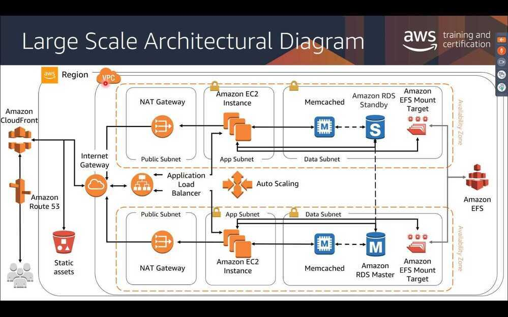

# Intro

## AWS services to avoid

1. Cognito
2. CloudFormation
3. ElastiCache
4. Kinesis
5. Lambda

[5 AWS Services You Should Avoid!. Get ready for some personal and… | by David Lin | TeamZeroLabs | Medium](https://medium.com/teamzerolabs/5-aws-services-you-should-avoid-f45111cc10cd)

[14 Essential AWS Interview Questions and Answers [2024] | Toptal](https://www.toptal.com/aws/interview-questions)

[AWS Solutions Library](https://aws.amazon.com/solutions)

## Regions, Availability Zones, and Local Zones

Each **Region** is a separate geographic area. Each Region has multiple, isolated locations known as **Availability Zones**. Local Zones provide you the ability to place resources, such as compute and storage, in multiple locations closer to your end users. Resources aren't replicated across Regions unless you specifically choose to do so.

Each Region is completely independent. Each Availability Zone is isolated, but the Availability Zones in a Region are connected through low-latency links. A Local Zone is an AWS infrastructure deployment that places select services closer to your end users. A Local Zone is an extension of a Region that is in a different location from your Region. It provides a high-bandwidth backbone to the AWS infrastructure and is ideal for latency-sensitive applications, for example machine learning.

https://docs.aws.amazon.com/AWSEC2/latest/UserGuide/using-regions-availability-zones.html

## Amazon Machine Images (AMI)

It is used as a provisioning system, to provision a new instance with an image of the instance.

An Amazon Machine Image (AMI) provides the information required to launch an instance, which is a virtual server in the cloud. You must specify a source AMI when you launch an instance. You can launch multiple instances from a single AMI when you need multiple instances with the same configuration. You can use different AMIs to launch instances when you need instances with different configurations.

An AMI includes the following:

- A template for the root volume for the instance (for example, an operating system, an application server, and applications)
- Launch permissions that control which AWS accounts can use the AMI to launch instances
- A block device mapping that specifies the volumes to attach to the instance when it's launched

Structure101 - Architecture Development Environment

## Resources

https://dev.to/helenanders26/aws-series-aws-from-a-to-z-45b1

https://www.toptal.com/aws/interview-questions

https://www.youtube.com/watch?v=3hLmDS179YE

## Whitepapers

- https://d1.awsstatic.com/whitepapers/architecture/AWS-Performance-Efficiency-Pillar.pdf
- https://d1.awsstatic.com/whitepapers/architecture/AWS-Reliability-Pillar.pdf
- https://d1.awsstatic.com/whitepapers/architecture/AWS-Cost-Optimization-Pillar.pdf
- https://d1.awsstatic.com/whitepapers/architecture/AWS-Operational-Excellence-Pillar.pdf

## AWS ReInvent 2024 Highlights

- [Top announcements of AWS re:Invent 2024 | AWS News Blog](https://aws.amazon.com/blogs/aws/top-announcements-of-aws-reinvent-2024/)
- [AWS cuts database prices almost 50% and adds distributed scaling capabilities | VentureBeat](https://venturebeat.com/data-infrastructure/aws-cuts-database-prices-almost-50-and-adds-distributed-scaling-capabilities/)
- [AWS re:Invent 2024 announcements and keynote updates](https://www.aboutamazon.com/news/aws/aws-reinvent-2024-keynote-live-news-updates)
- [AWS re:Invent 2024 Highlights - reInvent Keynote & New Features Summarized - YouTube](https://www.youtube.com/watch?v=VVGcp_Wypuo)
- [The AWS re:Invent CEO Keynote with Matt Garman in 10 Minutes - YouTube](https://www.youtube.com/watch?v=rQiziOkJFSg)
