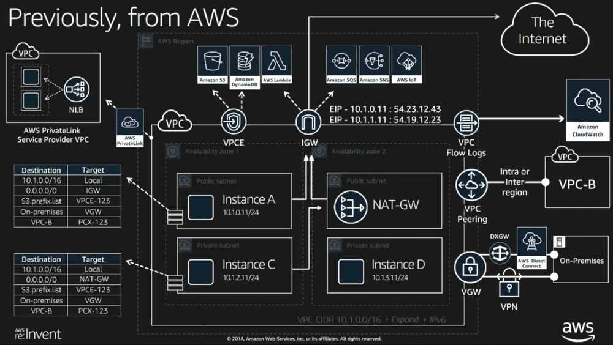

# Amazon VPC

Amazon Virtual Private Cloud (Amazon VPC) lets you provision a logically isolated section of the AWS Cloud where you can launch AWS resources in a virtual network that you define. You have complete control over your virtual networking environment, including selection of your own IP address range, creation of subnets, and configuration of route tables and network gateways. You can use both IPv4 and IPv6 in your VPC for secure and easy access to resources and applications.

You can easily customize the network configuration of your Amazon VPC. For example, you can create a public-facing subnet for your web servers that have access to the internet. You can also place your backend systems, such as databases or application servers, in a private-facing subnet with no internet access. You can use multiple layers of security, including security groups and network access control lists, to help control access to Amazon EC2 instances in each subnet.

The following are the key concepts for VPCs:

- A **virtual private cloud(VPC)** is a virtual network dedicated to your AWS account.
- A **subnet** is a range of IP addresses in your VPC.
- A **route table** contains a set of rules, calledroutes, that are used to determine where network traffic from your subnet or gateway is directed.
- An **internet gateway** is a horizontally scaled, redundant, and highly available VPC component that allows communication between instances in your VPC and the internet. It therefore imposes no availability risks or bandwidth constraints on your network traffic.
- A **VPC endpoint** enables you to privately connect your VPC to supported AWS services and VPC endpoint services powered by PrivateLink without requiring an internet gateway, NAT device, VPN connection, or AWS Direct Connect connection. Instances in your VPC do not require public IP addresses to communicate with resources in the service. Traffic between your VPC and the other service does not leave the Amazon network.

https://docs.aws.amazon.com/vpc/latest/userguide/what-is-amazon-vpc.html

[Amazon VPC design - IPv6 on AWS](https://docs.aws.amazon.com/whitepapers/latest/ipv6-on-aws/amazon-vpc-design.html)

## Route Tables

- **Main route table** The route table that automatically comes with your VPC. It controls the routing for all subnets that are not explicitly associated with any other route table.
- **Custom route table** A route table that you create for your VPC.
- **Edge association** A route table that you use to route inbound VPC traffic to an appliance. You associate a route table with the internet gateway or virtual private gateway, and specify the network interface of your appliance as the target for VPC traffic.
- **Route table association** The association between a route table and a subnet, internet gateway, or virtual private gateway.
- **Subnet route table** A route table that's associated with a subnet.
- **Gateway route table** A route table that's associated with an internet gateway or virtual private gateway.
- **Local gateway route table** A route table that's associated with an Outposts local gateway. For information about local gateways, see [Local Gateways](https://docs.aws.amazon.com/outposts/latest/userguide/outposts-local-gateways.html) in the AWS Outposts User Guide.
- **Destination** The destination CIDR where you want traffic to go. For example, an external corporate network with a 172.16.0.0/12 CIDR.
- **Propagation** Route propagation allows a virtual private gateway to automatically propagate routes to the route tables. This means that you don't need to manually enter VPN routes to your route tables. For more information about VPN routing options, see [Site-to-Site VPN Routing Options](https://docs.aws.amazon.com/vpn/latest/s2svpn/VPNRoutingTypes.html) in the Site-to-Site VPN User Guide.
- **Target** The target through which to send the destination traffic; for example, an internet gateway.
- **Local route** A default route for communication within the VPC.

https://docs.aws.amazon.com/vpc/latest/userguide/VPC_Route_Tables.html

## Internet Gateways (IGW)

An internet gateway is a horizontally scaled, redundant, and highly available VPC component that allows communication between instances in your VPC and the internet. It therefore imposes no availability risks or bandwidth constraints on your network traffic.

An internet gateway serves two purposes: to provide a target in your VPC route tables for internet-routable traffic, and to perform network address translation (NAT) for instances that have been assigned public IPv4 addresses.

An internet gateway supports IPv4 and IPv6 traffic.

https://docs.aws.amazon.com/vpc/latest/userguide/VPC_Internet_Gateway.html

## Security Groups

A security group acts as a virtual firewall for your instance to control inbound and outbound traffic. When you launch an instance in a VPC, you can assign up to five security groups to the instance. Security groups act at the instance level, not the subnet level. Therefore, each instance in a subnet in your VPC can be assigned to a different set of security groups.

If you launch an instance using the Amazon EC2 API or a command line tool and you don't specify a security group, the instance is automatically assigned to the default security group for the VPC. If you launch an instance using the Amazon EC2 console, you have an option to create a new security group for the instance.

For each security group, you add rules that control the inbound traffic to instances, and a separate set of rules that control the outbound traffic.

## Security > Data Protection > Internetwork Traffic Privacy in Amazon VPC

Amazon Virtual Private Cloud provides features that you can use to increase and monitor the security for your virtual private cloud (VPC):

- **Security groups:** Security groups act as a firewall for associated Amazon EC2 instances, controlling both inbound and outbound traffic at the instance level. When you launch an instance, you can associate it with one or more security groups that you've created. Each instance in your VPC could belong to a different set of security groups. If you don't specify a security group when you launch an instance, the instance is automatically associated with the default security group for the VPC. For more information, see [Security Groups for Your VPC](https://docs.aws.amazon.com/vpc/latest/userguide/VPC_SecurityGroups.html).
- **Network access control lists (NACLs):** Network ACLs act as a firewall for associated subnets, controlling both inbound and outbound traffic at the subnet level. For more information, see [Network ACLs](https://docs.aws.amazon.com/vpc/latest/userguide/vpc-network-acls.html).
- **Flow logs:** Flow logs capture information about the IP traffic going to and from network interfaces in your VPC. You can create a flow log for a VPC, subnet, or individual network interface. Flow log data is published to CloudWatch Logs or Amazon S3, and it can help you diagnose overly restrictive or overly permissive security group and network ACL rules. For more information, see [VPC Flow Logs](https://docs.aws.amazon.com/vpc/latest/userguide/flow-logs.html).
- **Traffic mirroring:** You can copy network traffic from an elastic network interface of an Amazon EC2 instance. You can then send the traffic to out-of-band security and monitoring appliances. For more information, see the [Traffic Mirroring Guide](https://docs.aws.amazon.com/vpc/latest/mirroring/).

| **Security group** | **Network ACL (NACL)** |
|---|---|
| Operates at the instance level | Operates at the subnet level |
| Supports allow rules only | Supports allow rules and deny rules |
| Is stateful: Return traffic is automatically allowed, regardless of any rules | Is stateless: Return traffic must be explicitly allowed by rules |
| We evaluate all rules before deciding whether to allow traffic | We process rules in number order when deciding whether to allow traffic |
| Applies to an instance only if someone specifies the security group when launching the instance, or associates the security group with the instance later on | Automatically applies to all instances in the subnets that it's associated with (therefore, it provides an additional layer of defense if the security group rules are too permissive) |

https://docs.aws.amazon.com/vpc/latest/userguide/VPC_Security.html#VPC_Security_Comparison

## VPC Endpoints

A VPC endpoint enables you to privately connect your VPC to supported AWS services and VPC endpoint services powered by AWS PrivateLink without requiring an internet gateway, NAT device, VPN connection, or AWS Direct Connect connection. Instances in your VPC do not require public IP addresses to communicate with resources in the service. Traffic between your VPC and the other service does not leave the Amazon network.

Endpoints are virtual devices. They are horizontally scaled, redundant, and highly available VPC components. They allow communication between instances in your VPC and services without imposing availability risks or bandwidth constraints on your network traffic.

There are two types of VPC endpoints: **interface endpoints** and **gateway endpoints**. Create the type of VPC endpoint required by the supported service.

### VPC Endpoint vs VPC Peering

#### VPC Endpoint

- **Purpose:** VPC endpoints allow you to privately connect your VPC to supported AWS services without traversing the public internet. This enhances security and can improve data transfer performance.
- **Use Case:** Commonly used for accessing AWS services like Amazon S3, DynamoDB, and other AWS services that support VPC endpoints.
- **Traffic Path:** Traffic between your VPC and the AWS service does not leave the Amazon network. It stays within the AWS network.

#### VPC Peering

- **Purpose:** VPC peering allows you to connect two VPCs privately, enabling communication between instances in different VPCs as if they were on the same network.
- **Use Case:** Useful for scenarios where you have resources in separate VPCs that need to communicate with each other, such as connecting resources in a production VPC with those in a development VPC.
- **Traffic Path:** Traffic between instances in different VPCs travels across the AWS network, and there is no need to go over the public internet.

In summary, VPC endpoints are primarily used for connecting your VPC to AWS services, ensuring a private and direct connection. On the other hand, VPC peering is used to establish private connections between instances in different VPCs, allowing them to communicate with each other over the AWS network.

## AWS PrivateLink

Establish connectivity between VPCs and AWS services without exposing data to the internet

- Secure your traffic by using private IP addresses when exchanging data with your software as a service (SaaS) applications.
- Connect with simplified network and firewall management rules and reduced data output and NAT costs.
- Accelerate cloud migrations by combining PrivateLink with AWS Direct Connect or a VPN.

AWS PrivateLink provides private connectivity between virtual private clouds (VPCs), supported AWS services, and your on-premises networks without exposing your traffic to the public internet. Interface VPC endpoints, powered by PrivateLink, connect you to services hosted by AWS Partners and supported solutions available in AWS Marketplace.

### AWS Private link vs AWS VPC Endpoints

#### Scope

- VPC endpoints are specific to certain AWS services and can be Interface or Gateway endpoints.
- AWS PrivateLink is a broader service that allows you to connect to multiple AWS services securely.

#### Traffic Isolation

- VPC endpoints keep the traffic within the AWS network but may involve traversing the public internet to reach certain services.
- AWS PrivateLink ensures that traffic does not leave the AWS network at any point.

#### Service Types

- VPC endpoints are specific to certain AWS services that support them.
- AWS PrivateLink is a framework for accessing various AWS and third-party services.

In summary, VPC endpoints are specific to certain AWS services, while AWS PrivateLink is a broader solution that provides a consistent and private way to access various services over the AWS network. You might use VPC endpoints for specific services and AWS PrivateLink for a more comprehensive approach to secure, private connectivity.

## Interface Endpoint

An [interface endpoint](https://docs.aws.amazon.com/vpc/latest/userguide/vpce-interface.html) is an elastic network interface with a private IP address from the IP address range of your subnet that serves as an entry point for traffic destined to a supported service.

## Gateway Endpoints

A [gateway endpoint](https://docs.aws.amazon.com/vpc/latest/userguide/vpce-gateway.html) is a gateway that you specify as a target for a route in your route table for traffic destined to a supported AWS service. The following AWS services are supported:

- Amazon S3
    - S3 Endpoint is almost always better than NAT Gateway.
    - [Gateway endpoints for Amazon S3 - Amazon Virtual Private Cloud](https://docs.aws.amazon.com/vpc/latest/privatelink/vpc-endpoints-s3.html)
- DynamoDB

https://docs.aws.amazon.com/vpc/latest/userguide/vpc-endpoints.html

NACL - Network Access Control List - [Control traffic to subnets using network ACLs - Amazon Virtual Private Cloud](https://docs.aws.amazon.com/vpc/latest/userguide/vpc-network-acls.html)

SG - Security Groups

### VPC NAT Gateway Costs

Using a single natgateway that exists in only mumbai-1a az. Due to this other applications which are in other 2 az’s of mumbai region server through the mumbai-1a az. This architecture may be the cause of regional data transfer costs. We can save this cost by creating az specific natgateway.

- [Monitor NAT gateways with Amazon CloudWatch - Amazon Virtual Private Cloud](https://docs.aws.amazon.com/vpc/latest/userguide/vpc-nat-gateway-cloudwatch.html)
- [High cost in NatGateway bytes | AWS re:Post](https://repost.aws/questions/QUTdLrXmoISSerSzHivJ8yAA/high-cost-in-natgateway-bytes)
- [Find the top contributors to traffic through a NAT gateway in a VPC | AWS re:Post](https://repost.aws/knowledge-center/vpc-find-traffic-sources-nat-gateway)
- [Reduce data transfer charges for a NAT gateway | AWS re:Post](https://repost.aws/knowledge-center/vpc-reduce-nat-gateway-transfer-costs)
- [Understand AWS Data transfer details in depth from cost and usage report using Athena query and QuickSight | Networking & Content Delivery](https://aws.amazon.com/blogs/networking-and-content-delivery/understand-aws-data-transfer-details-in-depth-from-cost-and-usage-report-using-athena-query-and-quicksight/)
- [AWS NAT Gateway Pricing: How To Reduce Your Costs](https://www.cloudzero.com/blog/reduce-nat-gateway-costs/)

## Interface Endpoint vs Gateway Endpoint

| Interface Endpoint                                                                                                                                | Gateway Endpoint                                                             |
| ------------------------------------------------------------------------------------------------------------------------------------------------- | ---------------------------------------------------------------------------- |
| Supports many AWS Managed services, endpoint services hosted by other AWS customers and partners, and supported AWS Marketplace partner services. | It only supports connectivity to Amazon S3 and Amazon DynamoDB               |
| Acts as an entry point for traffic to reach supported services through AWS PrivateLink.                                                           |                                                                              |
| Use a private IP address                                                                                                                          | Does not require an elastic network interface.                               |
| Allow access from on-premise                                                                                                                      | Requests must only originate from a VPC                                      |
| Allow cross-region access through VPC peering via Transit Gateway                                                                                 | Cross-region access is not allowed                                           |
| Additional charges                                                                                                                                | No Cost                                                                      |
| Associated on a subnet level                                                                                                                      | Associated on a VPC Level                                                    |
| Traffic flows directly to the specific service through the interface endpoint.                                                                    | Traffic is routed through the gateway endpoint to the specified AWS service. |

[VPC Interface Endpoint vs. Gateway Endpoint in AWS - Tutorials Dojo](https://tutorialsdojo.com/vpc-interface-endpoint-vs-gateway-endpoint-in-aws/)

## Elastic IP Addesses

- Limited to five Elastic IP addresses per account

https://docs.aws.amazon.com/vpc/latest/userguide/vpc-eips.html

[AWS supports dynamically removing and adding auto assigned public IPv4 address](https://aws.amazon.com/about-aws/whats-new/2024/04/removing-adding-auto-assigned-public-ipv4-address/)

### Changes (Migrate from ipv4 to ipv6)

Effective February 1, 2024 there will be a charge of $0.005 per IP per hour for all public IPv4 addresses, whether attached to a service or not (there is already a charge for public IPv4 addresses you allocate in your account but don’t attach to an EC2 instance).

This will cost around $4 month per IP per month

[New - AWS Public IPv4 Address Charge + Public IP Insights | AWS News Blog](https://aws.amazon.com/blogs/aws/new-aws-public-ipv4-address-charge-public-ip-insights/)

[Identify and optimize public IPv4 address usage on AWS | Networking & Content Delivery](https://aws.amazon.com/blogs/networking-and-content-delivery/identify-and-optimize-public-ipv4-address-usage-on-aws/)

[Amazon IPv6](https://aws.amazon.com/vpc/ipv6/)

[Migrate your VPC from IPv4 to IPv6 - Amazon Virtual Private Cloud](https://docs.aws.amazon.com/vpc/latest/userguide/vpc-migrate-ipv6.html)

|Step|Notes|
|---|---|
|[Step 1: Associate an IPv6 CIDR block with your VPC and subnets](https://docs.aws.amazon.com/vpc/latest/userguide/vpc-migrate-ipv6.html#vpc-migrate-ipv6-cidr)|Associate an Amazon-provided or BYOIP IPv6 CIDR block with your VPC and with your subnets.|
|[Step 2: Update your route tables](https://docs.aws.amazon.com/vpc/latest/userguide/vpc-migrate-ipv6.html#vpc-migrate-ipv6-routes)|Update your route tables to route your IPv6 traffic. For a public subnet, create a route that routes all IPv6 traffic from the subnet to the internet gateway. For a private subnet, create a route that routes all internet-bound IPv6 traffic from the subnet to an egress-only internet gateway.|
|[Step 3: Update your security group rules](https://docs.aws.amazon.com/vpc/latest/userguide/vpc-migrate-ipv6.html#vpc-migrate-ipv6-sg-rules)|Update your security group rules to include rules for IPv6 addresses. This enables IPv6 traffic to flow to and from your instances. If you've created custom network ACL rules to control the flow of traffic to and from your subnet, you must include rules for IPv6 traffic.|
|[Step 4: Assign IPv6 addresses to your instances](https://docs.aws.amazon.com/vpc/latest/userguide/vpc-migrate-ipv6.html#vpc-migrate-assign-ipv6-address)|Assign IPv6 addresses to your instances from the IPv6 address range of your subnet.|

[Is the Public Cloud Ready for IPv6? | by Eyal Estrin ☁️ | AWS in Plain English](https://aws.plainenglish.io/is-the-public-cloud-ready-for-ipv6-ec450974fe38)

[Brace yourself, IPv6 is coming](https://supabase.com/blog/ipv6)

[Amazon EC2 instance IP addressing - Amazon Elastic Compute Cloud](https://docs.aws.amazon.com/AWSEC2/latest/UserGuide/using-instance-addressing.html)

## Others

[What is AWS Direct Connect? - AWS Direct Connect](https://docs.aws.amazon.com/directconnect/latest/UserGuide/Welcome.html)

[AWS Transit Gateway](https://aws.amazon.com/transit-gateway/)

[What is VPC peering? - Amazon Virtual Private Cloud](https://docs.aws.amazon.com/vpc/latest/peering/what-is-vpc-peering.html)

[Overview of Data Transfer Costs for Common Architectures | AWS Architecture Blog](https://aws.amazon.com/blogs/architecture/overview-of-data-transfer-costs-for-common-architectures/)
