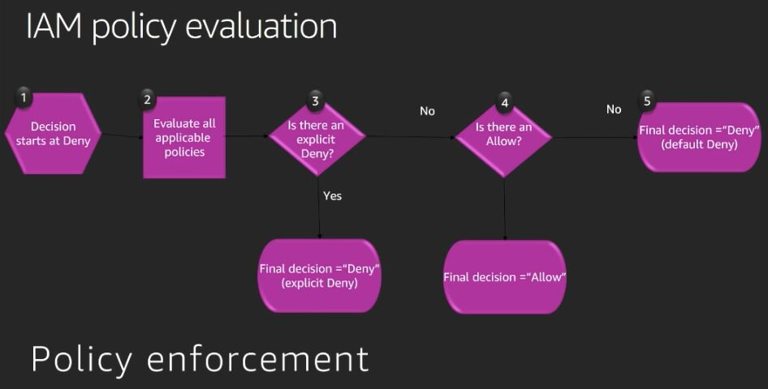
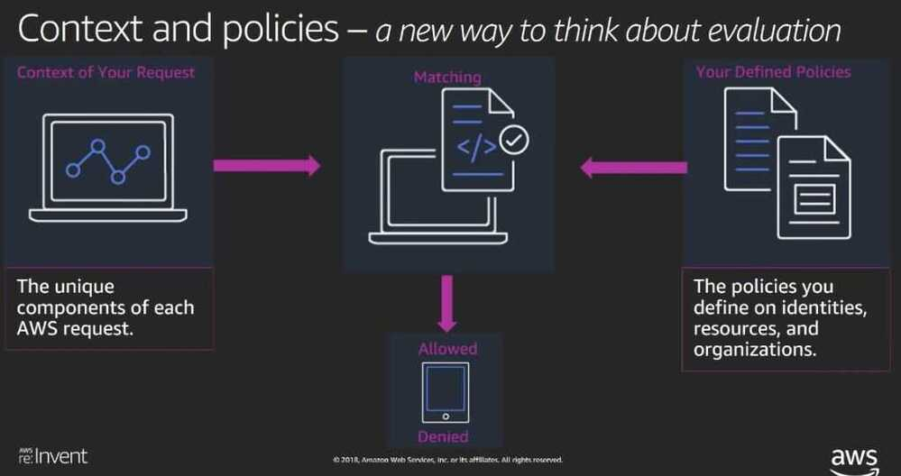
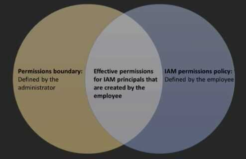
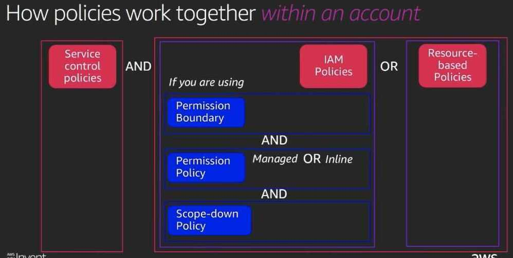

# IAM

- permission guardrails
- enforcing least privilege at scale
- aligning identity with management and governance frameworks
- Non people identities

https://pages.awscloud.com/awsmp-h2-sec-digital-workspace-iam-ty.html

## Gotchas

- Make sure to give access like /* for any object that needs access for inside too

AWS Identity and Access Management (IAM) enables you to manage access to AWS services and resources securely. Using IAM, you can create and manage AWS users and groups, and use permissions to allow and deny their access to AWS resources.

## Best practices

- [Users](https://aws.amazon.com/iam/features/manage-users/)-- Create individual users
- [Groups](https://aws.amazon.com/iam/features/manage-users/)-- Manage permissions with groups
- [Permissions](https://aws.amazon.com/iam/features/manage-permissions/)-- Grant least privilege
- **[Auditing](https://aws.amazon.com/cloudtrail/)-- Turn on AWS CloudTrail**
- [Password](https://aws.amazon.com/iam/features/managing-user-credentials/)-- Configure a strong password policy
- [MFA](https://aws.amazon.com/iam/features/mfa/)-- Enable MFA for privileged users
- [Roles](https://aws.amazon.com/iam/features/manage-roles/)-- Use IAM roles for Amazon EC2 instances
- [Sharing](https://aws.amazon.com/identity/federation/)-- Use IAM roles to share access
- [Rotate](http://docs.aws.amazon.com/AWSEC2/latest/UserGuide/iam-roles-for-amazon-ec2.html)-- Rotate security credentials regularly
- [Conditions](http://docs.aws.amazon.com/IAM/latest/UserGuide/PermissionsAndPolicies.html)-- Restrict privileged access further with conditions
- [Root](https://aws.amazon.com/iam/features/manage-users/)-- Reduce or remove use of root

[AWS re:Invent 2018: [REPEAT 1] Become an IAM Policy Master in 60 Minutes or Less (SEC316-R1)](https://www.youtube.com/watch?v=YQsK4MtsELU)

## IAM policy language

- IAM policies
    - Two parts:
        - Specification: Defining access policies
        - Enforcement: Evaluating policies

- When you define access policies, you specify which IAM principals are allowed to perform which actions on specific AWS resources and under which conditions
- IAM enforces this access by evaluating the AWS request and the policies you defined and returns either yes or no answer

- IAM policy structure (PARC model)
    - **Principal**
        - The entity that is allowed or denied access
    - **Action**
        - Type of access that is allowed or denied access
        - Action: s3.GetObject
    - **Resource**
        - The amazon resource(s) the action will act on (arn - amazon resource number)
    - **Condition**
        - The conditions under the access defined is valid
- IAM policy evaluation rules





## Policy types and how they work together

- Policy types
    - AWS Organizations

Guardrails to disable service access on the principals in the account

### Service Control Policies (SCPs)

Service control policies (SCPs) are a type of organization policy that you can use to manage permissions in your organization. SCPs offer central control over the maximum available permissions for all accounts in your organization. SCPs help you to ensure your accounts stay within your organization’s access control guidelines.

### AWS Identity and Access Management (IAM)

Grant granular permissions on IAM principals (users and roles) and control the maximum permission they can set

- As Permission Policies and Permission Boundaries

### Permission Boundaries

Scale and delegate permission management to developers safely. Contol the maximum permissions employees can grant



- AWS Security Token Service (AWS STS)

Reduce general shared permissions further

- Scoped-down policies
- Specific AWS services

Cross-account access and to control access from the resource

- Resource-based policies
- VPC Endpoints

Controls access to the service with a VPC endpoint

- Endpoint Policies



## Policies

### [AWS Managed Policies](https://docs.aws.amazon.com/IAM/latest/UserGuide/access_policies_managed-vs-inline.html#aws-managed-policies)

- FullAccess
- PowerUser
- WriteOnly
- ReadOnly

One particularly useful category of AWS managed policies are those designed for job functions. These policies align closely to commonly used job functions in the IT industry. The intent is to make granting permissions for these common job functions easy. One key advantage of using job function policies is that they are maintained and updated by AWS as new services and API operations are introduced. For example, the [AdministratorAccess](https://console.aws.amazon.com/iam/home#policies/arn:aws:iam::aws:policy/AdministratorAccess) job function provides full access and permissions delegation to every service and resource in AWS. We recommend that this policy is used only for the account administrator. For power users that require full access to every service except limited access to IAM and Organizations, use the [PowerUserAccess](https://console.aws.amazon.com/iam/home#policies/arn:aws:iam::aws:policy/PowerUserAccess) job function.

### [Customer Managed Policies](https://docs.aws.amazon.com/IAM/latest/UserGuide/access_policies_managed-vs-inline.html#customer-managed-policies)

You can create standalone policies that you administer in your own AWS account, which we refer to as *customer managed policies*. You can then attach the policies to multiple principal entities in your AWS account. When you attach a policy to a principal entity, you give the entity the permissions that are defined in the policy.

A great way to create a customer managed policy is to start by copying an existing AWS managed policy. That way you know that the policy is correct at the beginning and all you need to do is customize it to your environment.

### [Inline Policies](https://docs.aws.amazon.com/IAM/latest/UserGuide/access_policies_managed-vs-inline.html#inline-policies)

An inline policy is a policy that's embedded in an IAM identity (a user, group, or role). That is, the policy is an inherent part of the identity. You can create a policy and embed it in a identity, either when you create the identity or later.

https://docs.aws.amazon.com/IAM/latest/UserGuide/access_policies_managed-vs-inline.html

### Example Policies

All certain users to access specific bucket path only

```json
{
    "Version": "2012-10-17",
    "Id": "allowAccessToBucketPath",
    "Statement": [
        {
            "Sid": "",
            "Effect": "Allow",
            "Principal": {
                "AWS": [
                    "arn:aws:iam::123456789012:user/user1",
                    "arn:aws:iam::123456789012:user/user2"
                ]
            },
            "Action": [
                "s3:PutObject",
                "s3:List*",
                "s3:Get*"
            ],
            "Resource": [
                "arn:aws:s3:::my-bucket-name/path/*",
                "arn:aws:s3:::my-bucket-name/path"
            ]
        },
        {
            "Sid": "",
            "Effect": "Allow",
            "Principal": {
                "AWS": [
                    "arn:aws:iam::123456789012:user/user1",
                    "arn:aws:iam::123456789012:user/user2"
                ]
            },
            "Action": "s3:ListBucket",
            "Resource": "arn:aws:s3:::my-bucket-name",
            "Condition": {
                "StringLike": {
                    "s3:prefix": "path/*"
                }
            }
        }
    ]
}
```

## IAM Roles

An IAMroleis an IAM identity that you can create in your account that has specific permissions. An IAM role is similar to an IAM user, in that it is an AWS identity with permission policies that determine what the identity can and cannot do in AWS. However, instead of being uniquely associated with one person, a role is intended to be assumable by anyone who needs it. Also, a role does not have standard long-term credentials such as a password or access keys associated with it. Instead, when you assume a role, it provides you with temporary security credentials for your role session.

You can use roles to delegate access to users, applications, or services that don't normally have access to your AWS resources. For example, you might want to grant users in your AWS account access to resources they don't usually have, or grant users in one AWS account access to resources in another account. Or you might want to allow a mobile app to use AWS resources, but not want to embed AWS keys within the app (where they can be difficult to rotate and where users can potentially extract them). Sometimes you want to give AWS access to users who already have identities defined outside of AWS, such as in your corporate directory. Or, you might want to grant access to your account to third parties so that they can perform an audit on your resources.

https://docs.aws.amazon.com/IAM/latest/UserGuide/id_roles.html

[You might be clueless as to why AWS assume role isn’t working, despite being correctly set up | by Kamal Maiti | Medium](https://medium.com/@kamal.maiti/you-might-be-clueless-as-to-why-aws-assume-role-isnt-working-despite-being-correctly-set-up-1b3138519c07)

## Job functions

- [Administrator](https://docs.aws.amazon.com/IAM/latest/UserGuide/access_policies_job-functions.html#jf_administrator)
- [Billing](https://docs.aws.amazon.com/IAM/latest/UserGuide/access_policies_job-functions.html#jf_accounts-payable)
- [Database Administrator](https://docs.aws.amazon.com/IAM/latest/UserGuide/access_policies_job-functions.html#jf_database-administrator)
- [Data Scientist](https://docs.aws.amazon.com/IAM/latest/UserGuide/access_policies_job-functions.html#jf_data-scientist)
- [Developer Power User](https://docs.aws.amazon.com/IAM/latest/UserGuide/access_policies_job-functions.html#jf_developer-power-user)
- [Network Administrator](https://docs.aws.amazon.com/IAM/latest/UserGuide/access_policies_job-functions.html#jf_network-administrator)
- [Security Auditor](https://docs.aws.amazon.com/IAM/latest/UserGuide/access_policies_job-functions.html#jf_security-auditor)
- [Support User](https://docs.aws.amazon.com/IAM/latest/UserGuide/access_policies_job-functions.html#jf_support-user)
- [System Administrator](https://docs.aws.amazon.com/IAM/latest/UserGuide/access_policies_job-functions.html#jf_system-administrator)
- [View-Only User](https://docs.aws.amazon.com/IAM/latest/UserGuide/access_policies_job-functions.html#jf_view-only-user)

https://docs.aws.amazon.com/IAM/latest/UserGuide/access_policies_job-functions.html

## ManagedPolicies

EC2InstanceConnect

## Changes That I Make Are Not Always Immediately Visible

As a service that is accessed through computers in data centers around the world, IAM uses a distributed computing model called [eventual consistency](https://wikipedia.org/wiki/Eventual_consistency). Any change that you make in IAM (or other AWS services) takes time to become visible from all possible endpoints. Some of the delay results from the time it takes to send the data from server to server, from replication zone to replication zone, and from Region to Region around the world. IAM also uses caching to improve performance, but in some cases this can add time: The change might not be visible until the previously cached data times out.

You must design your global applications to account for these potential delays. Ensure that they work as expected, even when a change made in one location is not instantly visible at another. Such changes include creating or updating users, groups, roles, or policies. We recommend that you do not include such IAM changes in the critical, high-availability code paths of your application. Instead, make IAM changes in a separate initialization or setup routine that you run less frequently. Also, be sure to verify that the changes have been propagated before production workflows depend on them.

https://docs.aws.amazon.com/IAM/latest/UserGuide/troubleshoot_general.html

## Web Identity Federation

https://docs.aws.amazon.com/IAM/latest/UserGuide/id_roles_providers_oidc.html

## Notes

- Principle keyword means it's a resource based policy, otherwise identity based policy
- **Amazon s3 access point for dns names (instead of s3 file path)**
- No recylebin
- CORS available
- Can use postman to upload/download data to s3
- Multipart upload to s3 (file greater than 100 MB)
- Resiliency built in for multi part upload
- Amazon s3 transfer acceleration

https://www.freecodecamp.org/news/aws-iam-explained

## IAM > Roles > Identity Providers and Federation

If you already manage user identities outside of AWS, you can use IAM identity providers instead of creating IAM users in your AWS account. With an identity provider (IdP), you can manage your user identities outside of AWS and give these external user identities permissions to use AWS resources in your account. This is useful if your organization already has its own identity system, such as a corporate user directory. It is also useful if you are creating a mobile app or web application that requires access to AWS resources.

When you use an IAM identity provider, you don't have to create custom sign-in code or manage your own user identities. The IdP provides that for you. Your external users sign in through a well-known IdP, such as Login with Amazon, Facebook, or Google. You can give those external identities permissions to use AWS resources in your account. IAM identity providers help keep your AWS account secure because you don't have to distribute or embed long-term security credentials, such as access keys, in your application.

To use an IdP, you create an IAM identity provider entity to establish a trust relationship between your AWS account and the IdP. IAM supports IdPs that are compatible with [OpenID Connect (OIDC)](http://openid.net/connect/) or [SAML 2.0 (Security Assertion Markup Language 2.0)](https://wiki.oasis-open.org/security)

https://docs.aws.amazon.com/IAM/latest/UserGuide/id_roles_providers.html

## PIM / PAM

- PIM - Privileged Identity Management
- PAM - Privileged Access Management

Almost every organization uses [identity and access management (IAM)](https://www.strongdm.com/iam) strategies or tools as part of its security practices. IAM is the overarching term to describe how companies manage user identities, authenticate users, and control access to company resources. Privileged identity management (PIM) and privileged access management (PAM) are [subsets of IAM](https://www.strongdm.com/blog/iam-vs-pam-difference).

PIM and PAM address how companies manage who can access a company’s most critical resources, like servers, databases, applications, and Kubernetes clusters. They operate under the [principle of least privilege](https://www.strongdm.com/blog/principle-of-least-privilege) to limit who and how many users can access secure systems and the sensitive data stored within.

### PIM

- Emphasizes resource management
- Focuses on which user identities receive which access rights
- Determine the parameters of what access is necessary for each user identity based on certain roles or attributes
- May focus on distributing access to prevent superusers or admins from having too much power

### PAM

- Emphasizes securing resources by ensuring only certain validated identities can access those resources
- Focuses on monitoring capabilities to prevent unauthorized access
- Determines how to validate user identities, provide secure access to resources, and provision just-in-time escalated access for users that would not normally have access

[PIM vs. PAM Security: Understanding the Difference | StrongDM](https://www.strongdm.com/blog/pim-vs-pam)

## AWS Organizations

With AWS Organizations, you can consolidate multiple AWS accounts into an organization that you create and centrally manage. You can create member accounts and invite existing accounts to join your organization. You can organize those accounts and manage them as a group. With AWS Account Management you can update the alternate contact information for each of your AWS accounts.

[docs.aws.amazon.com/organizations/](https://docs.aws.amazon.com/organizations/)

[Best Practices for AWS Organizations](https://www.densify.com/finops/aws-organizations-best-practices/)

## AWS Control Tower

Set up and govern a secure, multi-account AWS environment

Use AWS Control Tower to set up and operate your multi-account AWS environment with prescriptive controls designed to accelerate your cloud journey.  AWS Control Tower orchestrates multiple AWS services on your behalf while maintaining the security and compliance needs of your new or existing organization.

[AWS Control Tower](https://aws.amazon.com/controltower/)

## Others

[The Next Evolution in AWS Single Sign-On | AWS News Blog](https://aws.amazon.com/blogs/aws/the-next-evolution-in-aws-single-sign-on/)

- AWS IAM Identity Center

[How to Set Up Federated Single Sign-On to AWS Using Google Apps | AWS Security Blog](https://aws.amazon.com/blogs/security/how-to-set-up-federated-single-sign-on-to-aws-using-google-apps/)

[AWS Account Setup: My 10-Step Checklist After 14 Years - YouTube](https://www.youtube.com/watch?v=KmlbPpVdl-I)
