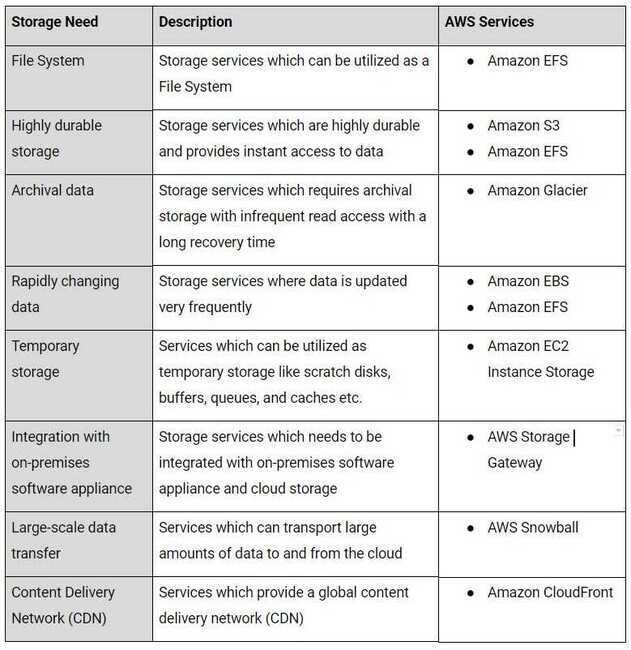

# Storage

1. Amazon S3 (Blob storage)
2. Amazon EBS
3. Amazon Elastic File System
4. Amazon EC2 Instance Storage
5. Amazon Glacier
6. AWS Storage Gateway
7. AWS Snowball
8. AWS Snowball Edge
9. AWS Snowmobile
10. AWS ECR
11. Amazon CloudFront
12. Amazon FSx - [Amazon FSx](https://aws.amazon.com/fsx/)
    1. Amazon FSx for NetApp ONTAP
    2. Amazon FSx for OpenZFS
    3. Amazon FSx for Windows File Server
    4. Amazon FSx for Lustre

- [Amazon S3](https://dzone.com/articles/five-things-you-probably-didnt-know-about-amazon-s) is cheapest for data storage alone. However, there are various other pricing parameters in S3, including cost per number of requests made, S3 Analytics, and data transfer out of S3 per gigabyte. EFS has the simplest cost structure.
- Amazon S3 can be accessed from anywhere. AWS EBS is only available in a particular region, while you can share files between regions on multiple EFS instances.
- [EBS](https://dzone.com/articles/using-ebs-and-efs-as-persistent-volume-in-kubernet) and EFS are both faster than Amazon S3, with high IOPS and lower latency.
- EBS is scalable up or down with a single API call. Since EBS is cheaper than EFS, you can use it for database backups and other low-latency interactive applications that require consistent, predictable performance.
- [EFS](https://dzone.com/articles/using-amazon-efs-for-container-workloads) is best used for large quantities of data, such as largeanalytic workloads. Data at this scale cannot be stored on a single EC2 instance allowed in EBS - requiring users to break up data and distribute it between EBS instances. The EFS service allows concurrent access to thousands of EC2 instances, making it possible to process and analyze large amounts of data seamlessly.

## Managed File Storage for EC2

EFS delivers a simple, scalable, elastic, highly available, and highly durable network file system as-a-service to EC2 instances. Amazon EFS storage capacity is elastic and is capable of growing and shrinking automatically as you add and remove files without disrupting your EFS applications.

### Usage

EFS is designed to provide a highly scalable network file system that can grow to petabytes and allows massively parallel access from EC2 instances. EFS supports Network File System versions 4 (NFSv4) and 4.1 (NFSv4.1).

When mounted up on Amazon EC2 instances, the EFS file system provides a standard file system interface and file system access. Multiple Amazon EC2 instances can access an Amazon EFS file system(as a shared storage location). Thus, applications that scale beyond a single instance can access a file system.You can mount your EFS file systems on your on-premises datacenter servers when connected to your Amazon Virtual Private Cloud (VPC) with AWS Direct Connect service.

### Durability & availability

Each Amazon EFS file system object (such as a directory, file or link) is redundantly stored across multiple availability zones within a region. Amazon EFS is designed to be as highly durable and available as Amazon S3.

### Security

There are three main levels of access controls to consider when it comes to EFS file system.

1. IAM permissions for API calls
2. Security groups for EC2 instances and mount targets
3. Network File System-level users, groups, and permissions.

Amazon groups play a critical role in establishing network connectivity between EC2 instances and EFS file systems. You can associate one security group with an EC2 instance and another security group with an EFS mount target associated with the file system. These security groups act as firewalls and enforce rules that define the traffic flow between EC2 instances and EFS file systems.

- Create mount path

## Amazon EC2 Instance Storage

EC2 Instance store provides temporary block-level storage for EC2 instances. This storage is located on disks that are physically attached to the host computer. Instance store is ideal for temporary storage of information that changes frequently such as buffers, caches and scratch data.

### Usage

In general, Instance storage volumes are ideal for temporary use as mentioned above. This can only be used from a single EC2 instance during that instance's lifetime. Unlike EBS volumes, instance store volumes cannot be detached or attached to another instance. Some instance types use NVMe or SATA-based solid state drives (SSD) to deliver high random I/O performance.

### Durability & Availability

EC2 instance store volumes are not intended to be used as durable disk storage. Applications using instance storage for persistent data generally provide data durability through replication, or by periodically copying data to durable storage. Data on instance store volumes persist only during the life of the associated EC2 instance. EC2 instance volumes are not recommended to be used for any data that must persist over time, such as permanent file or database storage.

### Security

IAM service helps to gain secure control over which users can perform operations such aslaunch and terminationof EC2 instances in your account. When you stop or terminate an instance, the applications and data in its instance store are erased, and thus no other instance can have access to the instance store in the future.

## Amazon Glacier

### Low-cost Archive Storage in the Cloud

Amazon Glacier is a secure, durable, and extremely low-cost storage service for data archiving and long-term backup. Glacier provides 'query-in-place functionality', which allows you to run powerful analytics directly on archived data at rest. Glacier can make use of other AWS services such as S3, CloudFront etc. to move data in and out seamlessly for better and effective results.

### Usage

Amazon Glacier stores data in the form of archives. An archive can represent a single file, or you can combine several files to be uploaded as a single archive, and archives are organized in vaults. AWS Glacier is the only cloud archive storage service that allows you to query data in place and retrieve only the subset of data that you need from within an archive.

### Durability & availability

Since AWS Glacier is an archiving service, durability must be of utmost priority. Glacier is designed to provide average annual durability of 99.999999999% for archives. Data is automatically distributed across a minimum of three physical facilities that are geographically separated within an AWS Region.

### Security

By default, only the account owner can access Amazon Glacier data. If other people or services need to access the data, you can set up data access controls in AWS Glacier by using theAWS Identity and Access Management (IAM)service. Similarly, Glacier uses server-side encryption to encrypt all data at rest. Amazon Glacier allows you to lock vaults where long-term records retention is mandated, along with the use of lockable policies.

### Retrieval

- **Expedited -** Expedited retrievals allow you to quickly access your data when occasional urgent requests for a subset of archives are required. For all but the largest archives (250 MB+), data accessed using Expedited retrievals are typically made available within 1--5 minutes. Provisioned Capacity ensures that retrieval capacity for Expedited retrievals is available when you need it.
- **Standard -** Standard retrievals allow you to access any of your archives within several hours. Standard retrievals typically complete within 3--5 hours. This is the default option for retrieval requests that do not specify the retrieval option.
- **Bulk -** Bulk retrievals are S3 Glacier's lowest-cost retrieval option, which you can use to retrieve large amounts, even petabytes, of data inexpensively in a day. Bulk retrievals typically complete within 5--12 hours.

## AWS Storage Gateway

### Hybrid Storage Integration

AWS Storage Gateway is a hybrid storage service that enables on-premises applications to implement seamless and secure storage integration with AWS cloud storage. AWS Storage Gateway supports industry standard storage protocols that work with existing applications as well.

### Usage

AWS Storage Gateway is recommended for backing up and archiving, disaster recovery, cloud bursting, storage tiering, and migration. Storage Gateway software can be downloaded as a Virtual Machine (VM) image that can be installed on a host in your data center or as an EC2 instance. Once you have installed the gateway and associated it with your AWS account through the AWS activation process, you can use the AWS Management Console to create gateway-cached volumes, gateway-stored volumes, or a gateway-virtual tape library (VTL).

To serve the above purposes, Gateway connects to AWS storage services, such as Amazon S3, Amazon Glacier, and Amazon EBS, providing storage for files, volumes, and virtual tapes in AWS.

### Durability & availability

Storage Gateway durably stores your on-premises application data by uploading it to Amazon S3 or Amazon Glacier. This service is designed to provide an average annual durability of 99.999999999 percent (yes, 11 nines).

### Security

Similar to most AWS storage services all data transferred through AWS Storage Gateway is secure and encrypted when at rest. IAM services provide security in controlling access to AWS Storage Gateway and when integrating with other storage services, access control can be used in combination with other services.

## AWS Snowball

### Petabyte-scale Data Transport

Snowball is a petabyte-scale data transport solution that uses a secure Snowball device to transfer large amounts of data in and out of the AWS cloud. The Snowball device is purpose-built for efficient data storage and transfer between Amazon and local premises.

### Usage

Snowball addresses common challenges with large-scale data transfers such as high network costs, long transfer times, and security concerns. All AWS regions have 80 TB Snowballs while US Regions have both 50 TB and 80 TB models.

With Snowball, you do not need to write any code or purchase any hardware to transfer your data. Simply create a job in the AWS Management Console and a Snowball device will be automatically shipped to the local premises. Once the device arrives, it must be attached to the premises local network. Download and run the Snowball client to establish a connection, and then use the client to select the file directories that you want to transfer to the device. The client will then encrypt and transfer the files to the snowball device at high speed.

Snowball might not be the ideal solution if the necessary data can be transferred over the Internet in less than one week.

### Durability & availability

Once the data is imported to AWS, the durability and availability characteristics of the target storage applies just like any other AWS services.

### Security

Snowball can be integrated with AWS Identity and Access Management (IAM) services to control access over which actions a user can perform. Similarly, an IAM user that creates a Snowball job must have permissions to access the Amazon S3 buckets that will be used for the import operations.

All data loaded onto a Snowball appliance is encrypted using 256-bit encryption. Snowball is physically secured using an industry-standard Trusted Platform Module (TPM) that uses a dedicated processor designed to detect any unauthorised modifications to the hardware, firmware, or software. In addition, Snowball is included in the AWS HIPAA compliance program so you can use Snowball to transfer large amounts of Protected Health Information (PHI) data in and out of AWS.

## AWS Snowball Edge

Petabyte-scale Data Transport with On-board Compute

## AWS Snowmobile

Exabyte-scale Data Transport

## AWS ECR

Amazon Elastic Container Registry (ECR) is a fully-managed [Docker](https://aws.amazon.com/docker/) container registry that makes it easy for developers to store, manage, and deploy Docker container images. Amazon ECR is integrated with [Amazon Elastic Container Service (ECS)](https://aws.amazon.com/ecs/), simplifying your development to production workflow. Amazon ECR eliminates the need to operate your own container repositories or worry about scaling the underlying infrastructure. Amazon ECR hosts your images in a highly available and scalable architecture, allowing you to reliably deploy containers for your applications. Integration with AWS Identity and Access Management (IAM) provides resource-level control of each repository. With Amazon ECR, there are no upfront fees or commitments. You pay only for the amount of data you store in your repositories and data transferred to the Internet.

https://docs.aws.amazon.com/AmazonECR/latest/userguide/pull-through-cache.html

## Amazon FSx for Lustre

FSx for Lustre makes it easy and cost-effective to launch and run the popular, high-performance Lustre file system. You use Lustre for workloads where speed matters, such as machine learning, high performance computing (HPC), video processing, and financial modeling.

The open-source Lustre file system is designed for applications that require fast storage—where you want your storage to keep up with your compute. Lustre was built to solve the problem of quickly and cheaply processing the world's ever-growing datasets. It's a widely used file system designed for the fastest computers in the world. It provides sub-millisecond latencies, up to hundreds of GBps of throughput, and up to millions of IOPS.

[What is Amazon FSx for Lustre? - FSx for Lustre](https://docs.aws.amazon.com/fsx/latest/LustreGuide/what-is.html)

[Amazon FSx for Lustre](https://aws.amazon.com/fsx/lustre/)

[Optimizing MMAP workloads on Amazon FSx for Lustre file systems | AWS Storage Blog](https://aws.amazon.com/blogs/storage/optimizing-mmap-workloads-on-amazon-fsx-for-lustre-file-systems/)

[Lustre](https://www.lustre.org/)

[Documentation | Lustre](https://www.lustre.org/documentation/)

[Lustre 101](https://lustre.ornl.gov/lustre101-courses/)

## Links

[Cloud Storage Options - Block Storage vs File Storage vs Object Storage Explained](https://www.freecodecamp.org/news/cloud-storage-options/)

