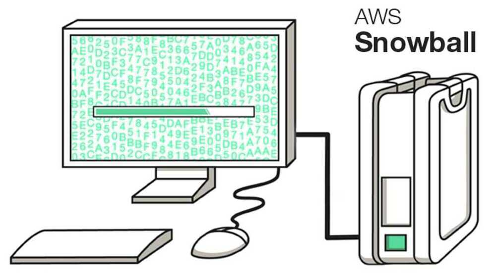

# Storage

1. Amazon S3 (Blob storage)
2. Amazon EBS
3. Amazon Elastic File System
4. Amazon EC2 Instance Storage
5. Amazon Glacier
6. AWS Storage Gateway
7. AWS Snowball
8. AWS Snowball Edge
9. AWS Snowmobile
10. AWS ECR
11. Amazon CloudFront
12. Amazon FSx - [Amazon FSx](https://aws.amazon.com/fsx/)
    1. Amazon FSx for NetApp ONTAP
    2. Amazon FSx for OpenZFS
    3. Amazon FSx for Windows File Server
    4. Amazon FSx for Lustre

Amazon Simple Storage Service (Amazon S3) is object based storage, Amazon Elastic Block Store (Amazon EBS) is block based storage and Amazon Elastic File System (Amazon EFS) is file based storage

- **Amazon Simple Storage Service (Amazon S3): Object-based storage.** - S3 stores data as objects within buckets. Each object consists of the data itself, a unique key (name), and metadata. This approach is highly scalable, durable, and cost-effective for storing large amounts of unstructured data like images, videos, backups, and data for cloud-native applications. Objects are accessed via an API and are not directly mounted to operating systems like traditional file systems.
- **Amazon Elastic Block Store (Amazon EBS): Block-based storage.** - EBS provides persistent block-level storage volumes that can be attached to Amazon EC2 instances. These volumes function like raw, unformatted hard drives, allowing operating systems to format them with a file system of choice (e.g., ext4, NTFS) and manage data at the block level. EBS is ideal for applications requiring low-latency, high-performance storage, such as databases, transactional workloads, and boot volumes for EC2 instances.
- **Amazon Elastic File System (Amazon EFS): File-based storage.** - EFS offers scalable, elastic, and shared file storage designed for use with multiple EC2 instances simultaneously. It provides a standard file system interface (NFS) that allows instances to access data in a hierarchical directory structure. EFS is suitable for use cases requiring shared access to file data across multiple servers, such as content management systems, development environments, and big data analytics.

- [Amazon S3](https://dzone.com/articles/five-things-you-probably-didnt-know-about-amazon-s) is cheapest for data storage alone. However, there are various other pricing parameters in S3, including cost per number of requests made, S3 Analytics, and data transfer out of S3 per gigabyte. EFS has the simplest cost structure.
- Amazon S3 can be accessed from anywhere. AWS EBS is only available in a particular region, while you can share files between regions on multiple EFS instances.
- [EBS](https://dzone.com/articles/using-ebs-and-efs-as-persistent-volume-in-kubernet) and EFS are both faster than Amazon S3, with high IOPS and lower latency.
- EBS is scalable up or down with a single API call. Since EBS is cheaper than EFS, you can use it for database backups and other low-latency interactive applications that require consistent, predictable performance.
- [EFS](https://dzone.com/articles/using-amazon-efs-for-container-workloads) is best used for large quantities of data, such as large analytic workloads. Data at this scale cannot be stored on a single EC2 instance allowed in EBS - requiring users to break up data and distribute it between EBS instances. The EFS service allows concurrent access to thousands of EC2 instances, making it possible to process and analyze large amounts of data seamlessly.

## Amazon EC2 Instance Storage

EC2 Instance store provides temporary block-level storage for EC2 instances. This storage is located on disks that are physically attached to the host computer. Instance store is ideal for temporary storage of information that changes frequently such as buffers, caches and scratch data.

### Usage

In general, Instance storage volumes are ideal for temporary use as mentioned above. This can only be used from a single EC2 instance during that instance's lifetime. Unlike EBS volumes, instance store volumes cannot be detached or attached to another instance. Some instance types use NVMe or SATA-based solid state drives (SSD) to deliver high random I/O performance.

### Durability & Availability

EC2 instance store volumes are not intended to be used as durable disk storage. Applications using instance storage for persistent data generally provide data durability through replication, or by periodically copying data to durable storage. Data on instance store volumes persist only during the life of the associated EC2 instance. EC2 instance volumes are not recommended to be used for any data that must persist over time, such as permanent file or database storage.

### Security

IAM service helps to gain secure control over which users can perform operations such as launch and termination of EC2 instances in your account. When you stop or terminate an instance, the applications and data in its instance store are erased, and thus no other instance can have access to the instance store in the future.

## AWS Storage Gateway

### Hybrid Storage Integration

AWS Storage Gateway is a hybrid storage service that enables on-premises applications to implement seamless and secure storage integration with AWS cloud storage. AWS Storage Gateway supports industry standard storage protocols that work with existing applications as well.

### Usage

AWS Storage Gateway is recommended for backing up and archiving, disaster recovery, cloud bursting, storage tiering, and migration. Storage Gateway software can be downloaded as a Virtual Machine (VM) image that can be installed on a host in your data center or as an EC2 instance. Once you have installed the gateway and associated it with your AWS account through the AWS activation process, you can use the AWS Management Console to create gateway-cached volumes, gateway-stored volumes, or a gateway-virtual tape library (VTL).

To serve the above purposes, Gateway connects to AWS storage services, such as Amazon S3, Amazon Glacier, and Amazon EBS, providing storage for files, volumes, and virtual tapes in AWS.

### Durability & availability

Storage Gateway durably stores your on-premises application data by uploading it to Amazon S3 or Amazon Glacier. This service is designed to provide an average annual durability of 99.999999999 percent (yes, 11 nines).

### Security

Similar to most AWS storage services all data transferred through AWS Storage Gateway is secure and encrypted when at rest. IAM services provide security in controlling access to AWS Storage Gateway and when integrating with other storage services, access control can be used in combination with other services.

Storage Gateway is available in three types

- File Gateway
- Volume Gateway
- Tape Gateway

which support various use cases like cloud-backed file shares, iSCSI-based block storage, and virtual tape libraries for backup and archiving.

### Volume Gateway

Volume Gateway provides cloud-backed storage volumes that you can mount as Internet Small Computer System Interface (iSCSI) devices from your on-premises application servers.

Volume Gateway supports the following volume configurations:

- **Cached volumes –** You store your data in Amazon Simple Storage Service (Amazon S3) and retain a copy of frequently accessed data subsets locally. Cached volumes offer a substantial cost savings on primary storage and minimize the need to scale your storage on-premises. You also retain low-latency access to your frequently accessed data.
- **Stored volumes –** If you need low-latency access to your entire dataset, first configure your on-premises gateway to store all your data locally. Then asynchronously back up point-in-time snapshots of this data to Amazon S3. This configuration provides durable and inexpensive offsite backups that you can recover to your local data center or Amazon Elastic Compute Cloud (Amazon EC2). For example, if you need replacement capacity for disaster recovery, you can recover the backups to Amazon EC2.

[What is Volume Gateway? - AWS Storage Gateway](https://docs.aws.amazon.com/storagegateway/latest/vgw/WhatIsStorageGateway.html)

## AWS Snowball

### Petabyte-scale Data Transport

Snowball is a petabyte-scale data transport solution that uses a secure Snowball device to transfer large amounts of data in and out of the AWS cloud. The Snowball device is purpose-built for efficient data storage and transfer between Amazon and local premises.

### Usage

Snowball addresses common challenges with large-scale data transfers such as high network costs, long transfer times, and security concerns. All AWS regions have 80 TB Snowballs while US Regions have both 50 TB and 80 TB models.

With Snowball, you do not need to write any code or purchase any hardware to transfer your data. Simply create a job in the AWS Management Console and a Snowball device will be automatically shipped to the local premises. Once the device arrives, it must be attached to the premises local network. Download and run the Snowball client to establish a connection, and then use the client to select the file directories that you want to transfer to the device. The client will then encrypt and transfer the files to the snowball device at high speed.

Snowball might not be the ideal solution if the necessary data can be transferred over the Internet in less than one week.

### Durability & availability

Once the data is imported to AWS, the durability and availability characteristics of the target storage applies just like any other AWS services.

### Security

Snowball can be integrated with AWS Identity and Access Management (IAM) services to control access over which actions a user can perform. Similarly, an IAM user that creates a Snowball job must have permissions to access the Amazon S3 buckets that will be used for the import operations.

All data loaded onto a Snowball appliance is encrypted using 256-bit encryption. Snowball is physically secured using an industry-standard Trusted Platform Module (TPM) that uses a dedicated processor designed to detect any unauthorised modifications to the hardware, firmware, or software. In addition, Snowball is included in the AWS HIPAA compliance program so you can use Snowball to transfer large amounts of Protected Health Information (PHI) data in and out of AWS.

## AWS Snowball Edge

Petabyte-scale Data Transport with On-board Compute

The main difference is that **AWS Snowball is a service primarily for data migration, while AWS Snowball Edge is a device that adds on-board compute capabilities to the original data transfer function, enabling edge computing**. Snowball Edge can run EC2 instances and Lambda functions directly on the device, making it suitable for tasks like local data processing, analytics, and machine learning in remote locations with limited or no internet access.

AWS Snowball, a part of the AWS Snow Family, is a data migration and edge computing device that comes in two options. Snowball Edge Storage Optimized devices provide both block storage and Amazon S3-compatible object storage, and 40 vCPUs. They are well suited for local storage and large scale data transfer. AWS Snowball Edge Compute Optimized devices provide 52 vCPUs, block and object storage, and an optional GPU for use cases like advanced machine learning and full-motion video analysis in disconnected environments.

AWS Snowball Edge Storage Optimized is the optimal choice if you need to securely and quickly transfer dozens of terabytes to petabytes of data to AWS. It provides up to 80 terabytes of usable HDD storage, 40 vCPUs, 1 terabyte of SATA SSD storage, and up to 40 gigabytes network connectivity to address large scale data transfer and pre-processing use cases.

The original AWS Snowball devices were transitioned out of service and AWS Snowball Edge Storage Optimized are now the primary devices used for data transfer. You may see the AWS Snowball device on the exam, just remember that the original AWS Snowball device had 80 terabytes of storage space.

If you want to minimize the time spent in Amazon S3 Standard for all files to avoid unintended Amazon S3 Standard storage charges. To do this, AWS recommends using a zero-day lifecycle policy. From a cost perspective, when using a zero-day lifecycle policy, you are only charged Amazon S3 Glacier Deep Archive rates. When billed, the lifecycle policy is accounted for first, and if the destination is Amazon S3 Glacier Deep Archive, you are charged Amazon S3 Glacier Deep Archive rates for the transferred files.

You can't move data directly from AWS Snowball into Amazon S3 Glacier, you need to go through Amazon S3 first, and then use a lifecycle policy. So this option is correct.

## AWS Snowmobile

Exabyte-scale Data Transport

In order to meet the needs of these customers, we are launching Snowmobile today. This secure data truck stores up to 100 PB of data and can help you to move exabytes to AWS in a matter of weeks (you can get more than one if necessary). Designed to meet the needs of our customers in the financial services, media & entertainment, scientific, and other industries, Snowmobile attaches to your network and appears as a local, NFS-mounted volume. You can use your existing backup and archiving tools to fill it up with data destined for Amazon Simple Storage Service (Amazon S3) or Amazon Glacier.

[AWS Snowmobile – Move Exabytes of Data to the Cloud in Weeks \| AWS News Blog](https://aws.amazon.com/blogs/aws/aws-snowmobile-move-exabytes-of-data-to-the-cloud-in-weeks/)

## AWS ECR

Amazon Elastic Container Registry (ECR) is a fully-managed [Docker](https://aws.amazon.com/docker/) container registry that makes it easy for developers to store, manage, and deploy Docker container images. Amazon ECR is integrated with [Amazon Elastic Container Service (ECS)](https://aws.amazon.com/ecs/), simplifying your development to production workflow. Amazon ECR eliminates the need to operate your own container repositories or worry about scaling the underlying infrastructure. Amazon ECR hosts your images in a highly available and scalable architecture, allowing you to reliably deploy containers for your applications. Integration with AWS Identity and Access Management (IAM) provides resource-level control of each repository. With Amazon ECR, there are no upfront fees or commitments. You pay only for the amount of data you store in your repositories and data transferred to the Internet.

https://docs.aws.amazon.com/AmazonECR/latest/userguide/pull-through-cache.html

## Amazon FSx

### Amazon FSx for Windows File Server

Amazon FSx for Windows File Server provides fully managed, highly reliable file storage that is accessible over the industry-standard Service Message Block (SMB) protocol. It is built on Windows Server, delivering a wide range of administrative features such as user quotas, end-user file restore, and Microsoft Active Directory (AD) integration. The Distributed File System Replication (DFSR) service is a new multi-master replication engine that is used to keep folders synchronized on multiple servers. Amazon FSx supports the use of Microsoft’s Distributed File System (DFS) to organize shares into a single folder structure up to hundreds of PB in size.

Amazon FSx for Windows is a perfect distributed file system, with replication capability, and can be mounted on Windows.

### Amazon FSx for Lustre

FSx for Lustre makes it easy and cost-effective to launch and run the popular, high-performance Lustre file system. You use Lustre for workloads where speed matters, such as machine learning, high performance computing (HPC), video processing, and financial modeling.

The open-source Lustre file system is designed for applications that require fast storage—where you want your storage to keep up with your compute. Lustre was built to solve the problem of quickly and cheaply processing the world's ever-growing datasets. It's a widely used file system designed for the fastest computers in the world. It provides sub-millisecond latencies, up to hundreds of GBps of throughput, and up to millions of IOPS.

[What is Amazon FSx for Lustre? - FSx for Lustre](https://docs.aws.amazon.com/fsx/latest/LustreGuide/what-is.html)

[Amazon FSx for Lustre](https://aws.amazon.com/fsx/lustre/)

[Optimizing MMAP workloads on Amazon FSx for Lustre file systems | AWS Storage Blog](https://aws.amazon.com/blogs/storage/optimizing-mmap-workloads-on-amazon-fsx-for-lustre-file-systems/)

[Lustre](https://www.lustre.org/)

[Documentation | Lustre](https://www.lustre.org/documentation/)

[Lustre 101](https://lustre.ornl.gov/lustre101-courses/)

### Amazon FSx for Lustre vs Amazon FSx for Windows File Server

**Amazon FSx for Lustre** is built for extreme performance in high-throughput, compute-intensive workloads like HPC, machine learning, and financial analytics, offering sub-millisecond latencies and millions of IOPS through its Lustre foundation. In contrast, **Amazon FSx for Windows File Server** is a fully managed service for Windows-based enterprise applications, providing native Microsoft Active Directory (AD) integration, end-user file restore, and Data Deduplication via the SMB protocol for common business workloads like file sharing and general-purpose processing.

## Links

- [aws-database-migration-service-dms](cloud/aws/aws-database-migration-service-dms.md)
- [AWS Data Sync - aws-database-migration-service-dms](cloud/aws/aws-database-migration-service-dms.md)
- [AWS Transfer Family - aws-database-migration-service-dms](cloud/aws/aws-database-migration-service-dms.md)

[Cloud Storage Options - Block Storage vs File Storage vs Object Storage Explained](https://www.freecodecamp.org/news/cloud-storage-options/)

