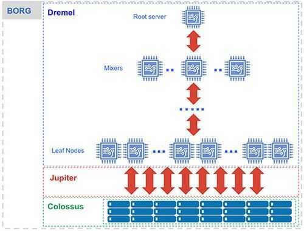

# BigQuery / Big Query

## Architecture

- Dremel - The execution engine
- Colossus - Distributed Storage
- Borg - Compute
- Jupiter - The Network
- BigQuery - The Service



## Separation of Compute and State

*Separation of compute and state* refers to the ability to maintain intermediate state between processing stages in a high-performance component separate from either the compute cluster or storage.

- Less state in compute means compute becomes more ephemeral and scalable. It's easier to re-parallelize processing intra-stage and interstage, and easier to recover from a lost node.
- Processing is more streamlined; processing stages don't conflict within the same compute nodes, resulting in resource contention and bottlenecks.
- It's easier for the processing engine to re-partition workloads between stages.
- Your processing engine can take advantage of pipelined execution. In other words, it doesn't have to wait for Stage N to finish before starting Stage N+1.
- The processing engine can implement dynamic work repartitioning (the ability to re-parallelize work due to slow workers or data skew).
- Keeping less state in processing nodes makes workloads more resilient to individual node issues.
- The service can utilize available resources much more efficiently across compute as well as shuffle.

https://cloud.google.com/blog/products/gcp/separation-of-compute-and-state-in-google-bigquery-and-cloud-dataflow-and-why-it-matters

https://cloud.google.com/blog/products/gcp/bigquery-under-the-hood

## Commands

```python
from google.cloud import bigquery
client = bigquery.Client()
dataset_ref = client.dataset("hacker_news", project="bigquery-public-data")
dataset_ref = client.dataset("chicago_crime", project="bigquery-public-data")
dataset = client.get_dataset(dataset_ref)
```

```sql
-- standardSQL
SELECT
    departure_airport,
    arrival_airport,
    COUNT(1) AS num_flights
FROM
    `bigquery-samples.airline_ontime_data.flights`
GROUP BY
    departure_airport,
    arrival_airport
ORDER BY
    num_flights DESC
LIMIT
    10

-- standardSQL
SELECT
    departure_delay,
    COUNT(1) AS num_flights,
    APPROX_QUANTILES(arrival_delay, 5) AS arrival_delay_quantiles
FROM
    `bigquery-samples.airline_ontime_data.flights`
GROUP BY
    departure_delay
HAVING
    num_flights > 100
ORDER BY
    departure_delay ASC
```

## Google Cloud Dataflow

- Dataflow is a unified programming model and a managed service for developing and executing a wide range of data processing patterns including ETL, batch computation, and continuous computation.
- The Dataflow model combines batch and stream processing so developers don't have to make tradeoffs between correctness, cost, and processing time.

## References

https://github.com/GoogleCloudPlatform/training-data-analyst/blob/master/courses/machine_learning/deepdive/02_generalization/repeatable_splitting.ipynb

https://github.com/GoogleCloudPlatform/training-data-analyst
