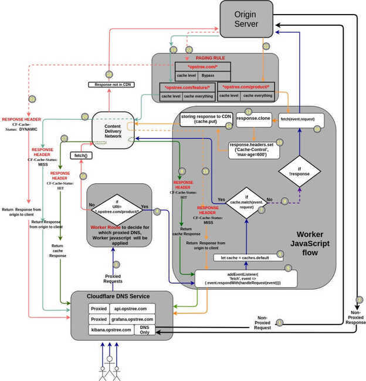

# Cloudflare

A "Cloudflare Worker" is JavaScript you write that runs on Cloudflare's edge. A "Cloudflare Service Worker" is specifically a worker which handles HTTP traffic and is written against the Service Worker API.

### What can I do with Service Workers on the edge?

Anything and everything. You're writing code, so the possibilities are infinite. Your Service Worker will intercept all HTTP requests destined for your domain, and can return any valid HTTP response. Your worker can make outgoing HTTP requests to any server on the public internet.

https://blog.cloudflare.com/introducing-cloudflare-workers

A flow diagram of how Cloudflare worker responds to an **HTTP request.**

https://blog.opstree.com/2020/06/30/cache-using-cloudflare-workers-cache-api

[**https://developers.cloudflare.com/firewall/cf-firewall-rules/actions**](https://developers.cloudflare.com/firewall/cf-firewall-rules/actions)
