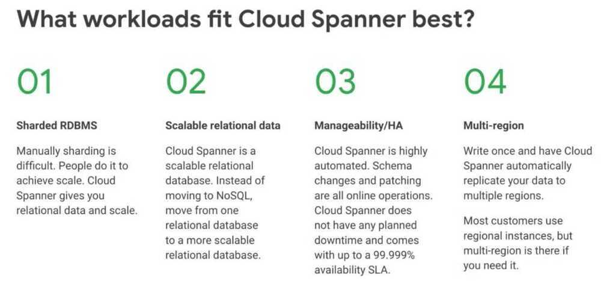
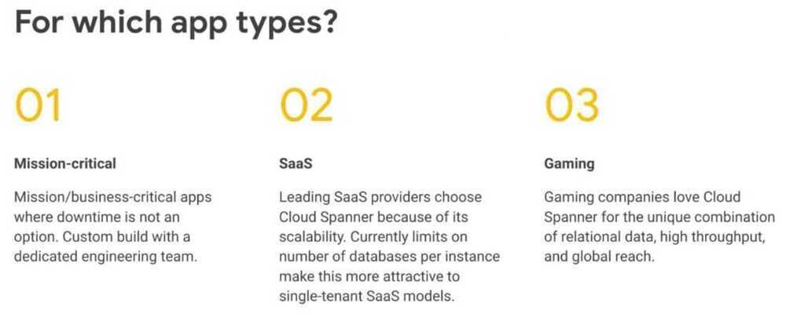
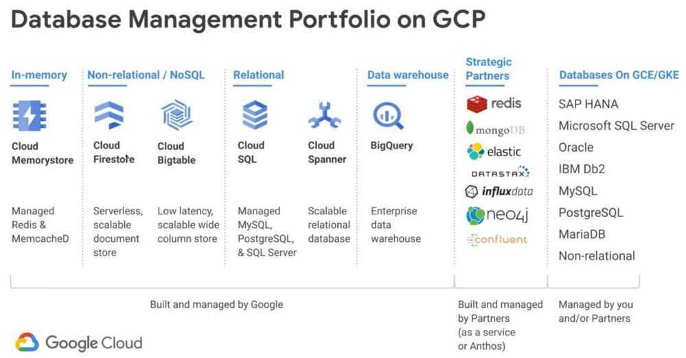
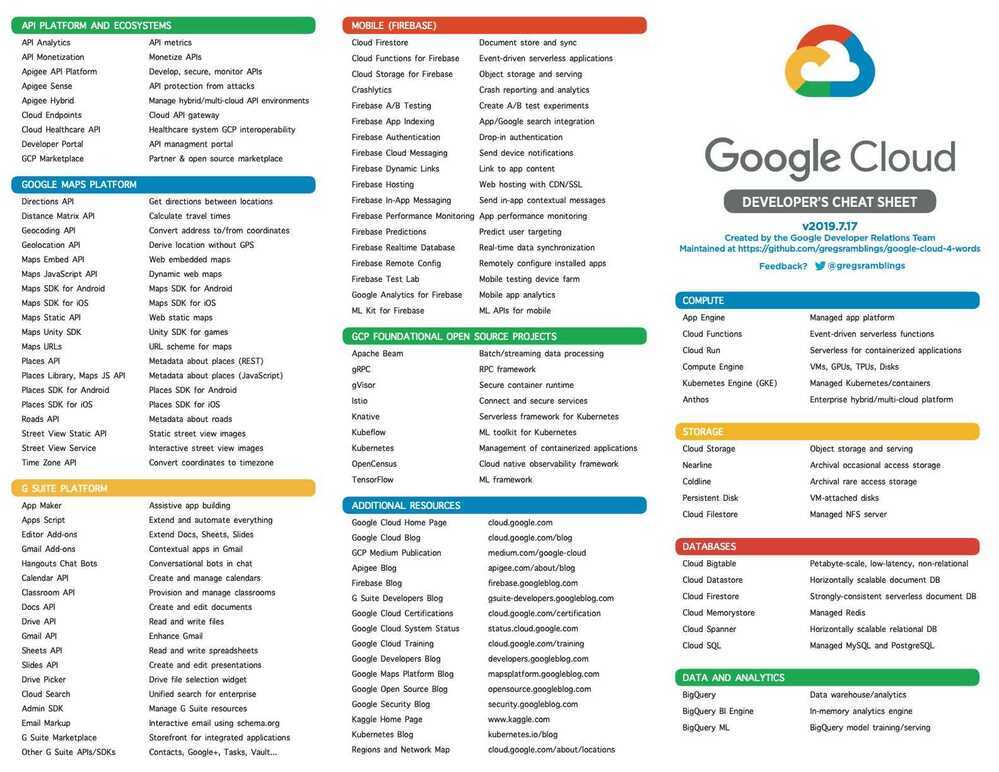
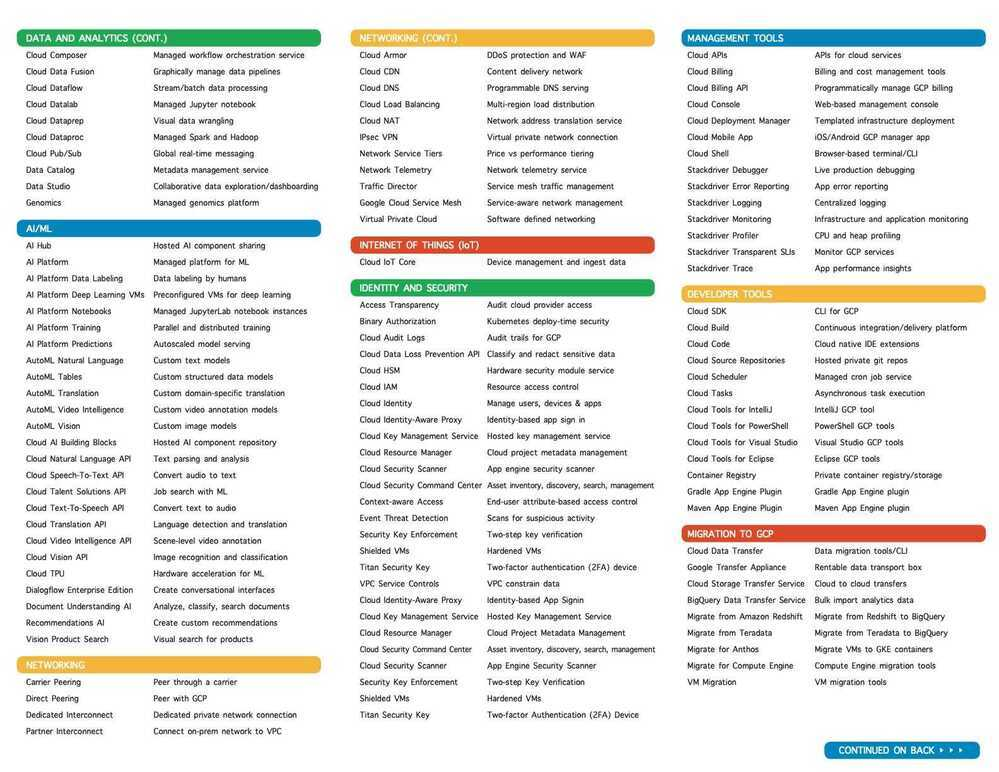

# Google Cloud Platform

[Google Cloud Developer Cheat Sheet](https://googlecloudcheatsheet.withgoogle.com/)

[GitHub - priyankavergadia/google-cloud-4-words: The Google Cloud Developer's Cheat Sheet](https://github.com/priyankavergadia/google-cloud-4-words)

[GitHub - priyankavergadia/GCPSketchnote: If you are looking to become a Google Cloud Engineer , then you are at the right place. GCPSketchnote is series where I share Google Cloud concepts in quick and easy to learn format.](https://github.com/priyankavergadia/GCPSketchnote)

[Cloud Architecture Guidance and Topologies  |  Cloud Architecture Center  |  Google Cloud](https://cloud.google.com/architecture)

## Compute

### Compute Engine

### App Engine

Serverless application that completely abstracts away infrastructure so you focus only on code

### Kubernetes Engine (GKE)

### Cloud Functions

Serverless environment to build and connect cloud services. With Cloud Functions you write simple, single-purpose functions that are attached to events emitted from your cloud infrastructure and services. Your Cloud Function is triggered when an event being watched is fired. Your code executes in a fully managed environment. There is no need to provision any infrastructure or worry about managing any servers.

Cloud Functions are written in Javascript and execute in a Node.js v6.11.5 environment on Google Cloud Platform. You can take your Cloud Function and run it in any standard Node.js runtime which makes both portability and local testing a breeze.

1. HTTP Functions
2. Background Functions

### Cloud Scheduler

Fully managed cron job service

<https://cloud.google.com/scheduler/docs/quickstart>

## Big Data

- Big Query

  BigQuery is a serverless data warehouse. Tables in BigQuery are organized into datasets.

- Cloud Dataflow
- Cloud Dataproc

  Cloud Dataproc is a managed Spark and Hadoop service that lets you take advantage of open source data tools for batch processing, querying, streaming, and machine learning. Cloud Dataproc automation helps you create clusters quickly, manage them easily, and save money by turning clusters off when you don't need them.

- Cloud Composer
- Cloud Datalab
- Cloud Dataprep
- Cloud Pub/Sub

  Geo-redundant real-time messaging for all message sizes and velocities

- Genomics
- Google Data Studio

## Identity & Security

- Cloud Identity
- Cloud IAM
- Cloud Identity-Aware Proxy
- Cloud Data Loss Prevention API
- Security Key Enforcement
- Cloud Resource Manager
- Cloud Security Command Center
- Cloud Security Scanner
- Access Transparency

## Internet of Things

- Cloud IoT Core

## Professional Services

- Consulting
- Technical Account Management
- Advanced Solutions Lab
- Training
- Certification
- QwikLabs

## Storage and Databases

### Cloud Storage

Geo-redundant object storage for high QPS (Query Per Second) needs

### gsutil

Cloud Storage allows world-wide storage and retrieval of any amount of data at any time. You can use Cloud Storage for a range of scenarios including serving website content, storing data for archival and disaster recovery, or distributing large data objects to users via direct download.

### Cloud SQL

### Cloud Bigtable

### Cloud Spanner

No-Compromise Relational Database Service

Cloud Spanner is the only enterprise-grade, globally-distributed, and strongly consistent database service built for the cloud specifically to combine the benefits of relational database structure with non-relational horizontal scale. This combination delivers high-performance transactions and strong consistency across rows, regions, and continents with an industry-leading 99.999% availability SLA, no planned downtime, and enterprise-grade security. Cloud Spanner revolutionizes database administration and management and makes application development more efficient.

Its basically a CP system (Consistency - Partition tolerance)

<https://cloud.google.com/blog/products/gcp/inside-cloud-spanner-and-the-cap-theorem>

<https://cloud.google.com/spanner/docs/true-time-external-consistency>

<https://ai.google/research/pubs/pub45855>

<https://thedataguy.in/internals-of-google-cloud-spanner>

A Spanner cluster [contains](https://cloud.google.com/spanner/docs/replication#replica_types) multiple read-write, may contain some read-only and some witness replicas.

- Read-write replicas serve reads and writes.
- Read-only replicas serve reads.
- Witnesses don't serve data but participate in leader election.

Read-only and witness replicas are only used for multi-regional Spanner clusters that can span across multiple geographical regions. Single region clusters only use read-write replicas. Each replica lives in a different zone in the region to avoid single point of failure due to zonal outages.

- Fully managed
- No versioning (you don't know which spanner you are using)
- No messing with tablespaces
- No software patching
- No upgrades
- No downtime
- No index rebuilds
- No resharding
- Dynamically scalable (up and down) within seconds





#### When cloud spanner fits less well

- Lift and shift
- Lots of in-database business logic (triggers, stored procedures)
- Compatibility needed
- App is very sensitive to very low latency (micro/nano/low single digit ms)
- Stale reads
- External (strong) consistency
- Low-latency synchronous replication - data is available on commit
- True ACID database

#### Considerations

- Key choice in tables and indexes
- Sequential- or timestamp-based keys can cause hotspots limiting performance
- Random UUIDs or hashes distribute data better
- Lack of: Triggers, stored procedures, and check constraints
- Not null constraint exits, keys are unique, unique column values via indexes
- Foreign key constraints and on-delete cascades only with parent-child interleaved tables
- No sequence generation for keys
- Indexes are tables too
- Same contraints for index keys
- Querying non-covering index is a table join
- Primary key is the ROWID
- Uniquely identifies the row
- Used to determine where the row is in the storage

#### Backup and DR

- Managed export/import
- Historial data snapshots
- System-managed backups
- TrueTime and MVCC
- Linearization - C of "ACID"
- Serialization - I of "ACID"
- Read snapshots - MVCC to avoid read locks = External Consistency

#### Create interleaved tables

An _interleaved table_ is a table that you declare to be an interleaved child of another table because you want the rows of the child table to be physically stored with the associated parent row. As mentioned earlier, the parent table primary key must be the first part of the child table composite primary key.

[About schemas  |  Cloud Spanner  |  Google Cloud](https://cloud.google.com/spanner/docs/schema-and-data-model)

### Cloud Datastore

Highly-scalable NoSQL database. It automatically handles sharding and replication, providing you with a highly available and durable database that scales automatically to handle your applications' load. Datastore provides a myriad of capabilities such as ACID transactions, SQL-like queries, and indexes

### Persistent Disk

### Cloud Memorystore



## API Platform and Ecosystems

- Google Maps Platform
- Apigee API Platform

  Enterprise API management for multi-cloud environments

  An API proxyis your interface to developers that want to use your backend services. Rather than having them consume those services directly, they access an Edge API proxy that you create. With a proxy, you can provide value-added features such as:

  - Security
  - Rate limiting
  - Quotas
  - Caching & persistence
  - Analytics
  - Transformations
  - CORS
  - Fault handling

- API Monetization
- Developer Portal
- API Analytics
- Apigee Sense
- Cloud Endpoints

API management apps built on Google Cloud

## Management Tools

- Stackdriver Overview
- Monitoring
- Logging
- Error Reporting
- Trace
- Debugger
- Profiler
- Cloud Deployment Manager
- Cloud Console
- Cloud Shell
  - ephemeral vm
- Cloud Mobile App
- Cloud Billing API
- Cloud APIs

## Networking

- Virtual Private Cloud (VPC)
- Cloud Load Balancing
- Cloud Armor
- Cloud CDN
- Cloud Interconnect
- Cloud DNS
- Network Service Tiers

## Cloud AI

- Cloud AutoML
- Cloud TPU
- Cloud Machine Learning Engine
- Cloud Job Discovery
- Dialogflow Enterprise Edition
- Cloud Natural Language
- Cloud Speech-to-Text
- Cloud Text-to-Speech
- Cloud Translation API
- Cloud Vision API
- Cloud Video Intelligence

## Data Transfer

- Google Transfer Appliance
- Cloud Storage Transfer Service
- Google BigQuery Data Transfer Service

## Developer Tools

- Cloud SDK
- Container Registry
- Container Builder
- Cloud Source Repositories
- Cloud Tools for Intellij
- Cloud Tools for Powershell
- Cloud Tools for Visual Studio
- Cloud Tools for Eclipse
- Gradle App Engine Plugin
- Cloud Test Lab
- [Assured Open Source Software  |  Google Cloud](https://cloud.google.com/assured-open-source-software)

## Productivity Tools

- G Suite
- Hire
- Chrome Android

## Gcloud Commands

```bash
gcloud auth list

gcloud auth login

gcloud config set project project-id
gcloud config set compute/zone asia-south1-a

gcloud iam service-accounts create [NAME]

gcloud projects add-iam-policy-binding playground-209220 --member "serviceAccount:deepak-mac@playground-209220.iam.gserviceaccount.com" --role "roles/owner"

gcloud iam service-accounts keys create deepak-cred.json --iam-account deepak-mac@playground-209220.iam.gserviceaccount.com

gcloud container clusters list
gcloud container clusters create <cluster_name>
gcloud container clusters get-credentials <cluster_name>

gcloud container clusters update your-first-cluster-1 --enable-autoscaling --min-nodes 1 --max-nodes 4 --zone asia-south1-a

gcloud container clusters describe your-first-cluster-1 --zone asia-south1-a
gcloud container node-pools list --cluster your-first-cluster-1

gcloud sql instances create postgres-instance --database-version POSTGRES_9_6 --tier db-g1-small  #create a postgres instance
gcloud sql users set-password postgres --host=% --instance postgres-instance --password [PASSWORD]  #set a password for the postgres instance

gcloud compute addresses create endpoints-ip --region us-central1  #create a static ip

gcloud compute ssh --project deepak-project-619 --zone us-east1-b root@instance-1
```

## POC problems

1. Not able to use cloud dataflow for transforming and passing data to smap
2. Cloud dataflow uses apache beam which is in Java and all functions must be written in java
3. Data visualization must be created from scratch using cloud datastudio
4. Not great device management, no control on devices inbuilt using cloud iot core

## References

**Google BigTable** - <https://cloudplatform.googleblog.com/2018/04/what-we-learned-doing-serverless-the-Smart-Parking-story.html>

<https://github.com/gregsramblings/google-cloud-4-words>

<https://medium.com/google-cloud/13-most-common-google-cloud-reference-architectures-23630b46326d>




