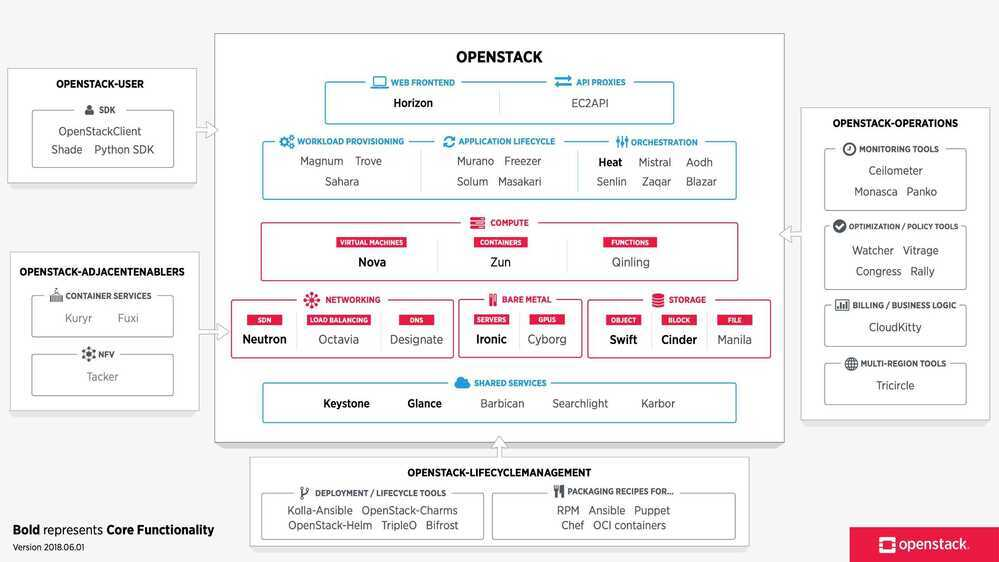

# Openstack

OpenStack is a cloud operating system that controls large pools of compute, storage, and networking resources throughout a datacenter, all managed through a dashboard that gives administrators control while empowering their users to provision resources through a web interface.

## Neutron

Neutron is an OpenStack project to provide "network connectivity as a service" between interface devices (e.g., vNICs) managed by other OpenStack services (e.g., Nova).

https://github.com/openstack/neutron
