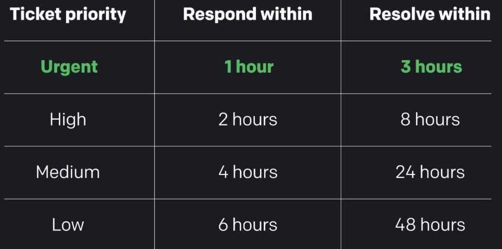

# Ticketing / TMS

## Ticketing Management System (TMS)

## Features

- Triage
- Automate ticket lifecycle / Chat routing
- Omnichannel / multichannel
- FAQs
- Autoresolution

## Products

- Opensource
  - **<https://tiledesk.com> - chatbot, helpdesk, everything, APIs**

- <https://github.com/polonel/trudesk>
- <https://github.com/osTicket/osTicket>

docker run --name osticket_mysql -d -e MYSQL_ROOT_PASSWORD=secret
-e MYSQL_USER=osticket -e MYSQL_PASSWORD=secret -e MYSQL_DATABASE=osticket mariadb

- <https://docs.trudesk.io>
- <https://github.com/django-helpdesk/django-helpdesk>

<https://django-helpdesk.readthedocs.io/en/0.2.x>

<http://django-helpdesk-demo.herokuapp.com>

- <https://github.com/salesagility/SuiteCRM>
- **ngdesk**
- <https://freescout.net>
- faveo
- <https://www.hesk.com>

- HelpScout
- **Intercom**
- zoho
- zendesk

<https://www.zendesk.com/lp/startups>

- **odoo**

The only platform you will ever need to help run your business:

integrated apps, kept simple, and loved by millions of happy users.

- salesforce
- netsuite
- hubspot

<https://blog.hubspot.com/service/free-help-desk-software>

<https://www.msp360.com/resources/blog/top-7-free-and-open-source-ticketing-systems-for-msps>

<https://learnwoo.com/best-open-source-help-desk-support-ticketing-system>

[Help desk automation: 3 simple ways to assign support tickets better.](https://www.youtube.com/watch?v=cvgIZ92KOEQ)

- Direct Assignment
- Round Robin Assignment

## Customer Self Service Portal / Self Service Strategy / Knowledgebase / Knowledge base

A self-service strategy is a multi-pronged approach to solving customer issues. Remember that not everyone learns the same way, so you need to set up several routes for customers to find their answers. That may involve having visuals and videos, AI chatbots, or CRM integration. Talk to your customer service reps about how to develop the [best content for your knowledge base](https://support.zendesk.com/hc/en-us/articles/203664076-Best-practices-Developing-content-for-your-knowledge-base) and FAQ sections, and build a strategy from there.

## What can you do to make your self-service customers know you value them?

The best thing you can do is make the process of self service easy and fast. Making the entire process painless, from asking the question to getting an answer, proves that you value their time and sanity as much as your own.

## What are some disadvantages of customer self service?

The only disadvantages of customer self service software come from how you use it. If you lean too much on customer self service and pull back from person-to-person support, you risk frustrating those customers who appreciate a more personal touch.

<https://www.zendesk.com/service/help-center/customer-self-service>

<https://www.hubspot.com/knowledge-base>

## OpenSource - uvdesk

<https://www.uvdesk.com/en/blog/an-open-source-alternative-to-freshdesk>

<https://www.uvdesk.com/en/api-doc>

<https://github.com/uvdesk/community-skeleton>

<https://ease.ghost.io>

<https://gatbsy-theme-help-center.netlify.app>

<https://helpjuice.com/knowledge-base-examples>

<https://help.msg91.com>

<https://help.sliceit.com/support/home>

## tawk.to

<https://tawk.to/deepaksood619>

<https://deepaksood619.tawk.help>

deepaksood619@gmail.com

10f818eb17b796493b49e999

<https://goldenpi.com>

<https://developer.tawk.to/jsapi>

<https://help.tawk.to/article/how-to-use-messaging-and-ticketing>

[Tutorials / KB / ENG](https://www.youtube.com/playlist?list=PLTxV5K5lUotCZE_dt6Hc_Iw62GJYIy-AX)

## bookstackapp - <https://www.bookstackapp.com>

BookStack is a simple, self-hosted, easy-to-use platform for organising and storing information.

<https://rasa.com/docs/action-server/knowledge-bases>

## Paid

<https://www.helpdocs.io>

ACPT - Agent, Customer, Process, Technology

QRC - Query / Request / Complaint

## How to handle support tickets

1. Get details on the case

2. Set status
    - Open

When a new ticket is created in the ticketing system, it gets an "Open" status. Tickets with an "Open" status should be answered as soon as possible. This status means that no agent has yet addressed the customer's case, and they're still waiting for your response. Respond to the customer to let them know that you're on your way to take care of their case.

- Pending

When you respond to an open ticket, its status will automatically change to "Pending." Tickets get a "Pending" status whenever you're waiting for a response from a customer or additional input or information so that you can proceed. If the customer responds, the ticket will go back to "Open" status.

- On hold

A ticket with an "On hold" status is a case that cannot be completed right away. This means that the customer service agent needs to consult with someone on the team or another department about the issue. Select the "On hold" status to ensure you get back to the customer when you have the answer and the best solution.

- Solved

Mark a ticket as "Solved" when you're 100% sure that you've provided the customer with the necessary answers and left them satisfied with the outcome of the conversation. After that, move on because many other cases need to end up with this status in your ticketing software.

- Closed

There can be times when someone sends you a collaboration proposal or a message with information that isn't a question or challenge for your team. You can briefly reply to such requests, and then mark them as "Closed." This way, the issue has been resolved, and you won't send an [automated feedback request](https://www.helpdesk.com/help/automated-workflows/) again.

- Spam

The "Spam" status is reserved for malicious or other unnecessary messages you don't need to deal with.

3. Set the priority
    - Urgent
    - High
    - Medium
    - Low

4. Tag the case

5. Add the responsible team

6. Choose the right agent

7. Add other people involved in the case

8. Respond to the ticket

## Strategies to assign tickets to agents

1. Manual assignment

2. Supervisor assignment

3. Automated assignment

<https://www.liveagent.com/academy/ticketing-system-best-practices>

<https://www.helpdesk.com/learn/customer-support-essentials/customer-ticket-assignment-strategies>

## L1, L2, & L3 Technical Support

## L1 or level 1 support

This is your first support line. The first line of support is usually provided via chat, phone, and email communications. Your pre-sale support emails and support chats will be addressed by a Level 1 software engineer. With Infogain's L1 Support/Help Desk, you get a single point of contact (Phone/email/Chat/Portal), basic troubleshooting and resolution, call routing and escalation.

Additional services include:

- A dedicated toll-free number
- Customer and product specific knowledge repository
- Defined response SLA's(Service Level Agreement)
- Routing of service calls to third-party based on decision tree
- Complete ticket management with escalation and service level reporting
- Store equipment and network troubleshooting

## L2 or level 2 support

L2 support handles the tickets that L1 routes to them. This support team can also generate tickets for any problem they notice. L2 support specialists have more skills, more experience in solving complicated problems relevant to them and can help L1 support people troubleshoot problems. Infogain's L2 Support covers in-depth application and systems incident resolution featuring a knowledge base, detailed documentation, training and incident trending analysis.

Additional services include:

- Advanced Troubleshooting/resolution
- Batch/infrastructure monitoring
- Configuration Management
- Process Automation (RPA)
- Root Cause Analysis
- Incident Analysis/Trending

## L3 or level 3 support

L3 is the last line of support and typically consists of a development team that deals with technical problems. They are experts in their domain and handle the most difficult problems, mostly assisting both level 1 and level 2 specialists. They do also code changes, research and develop solutions for challenging new or unknown issues. Infogain's L3 Support covers base application, customizations, and integrations. In addition to taking advantage of our proven methodologies, source control and standards.

Additional services include:

- Fixing defects
- Minor enhancements
- Root cause analysis
- Performance tuning and capacity planning

<https://www.infogain.com/blog/a-quick-guide-to-l1-l2-and-l3-technical-support>
