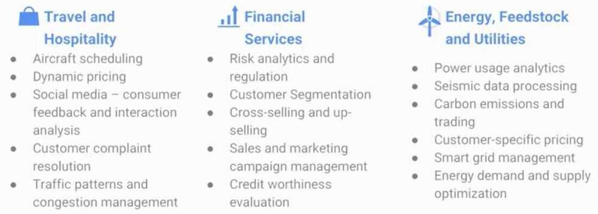
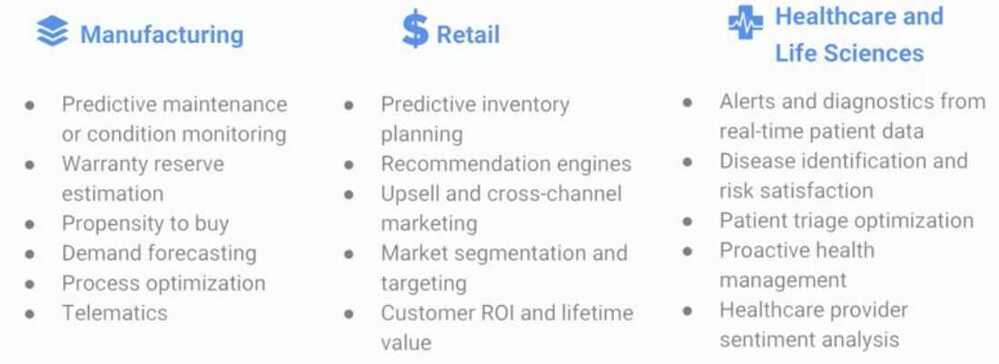
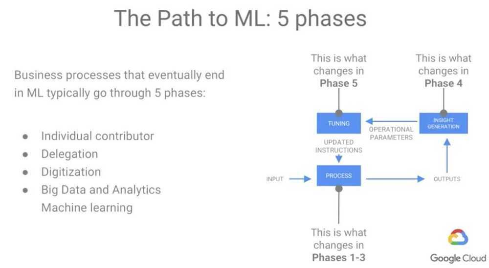
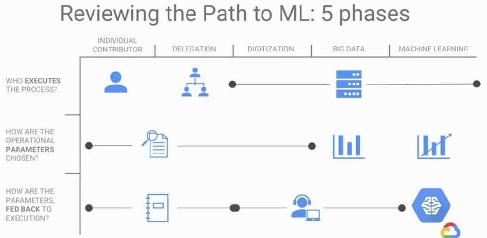
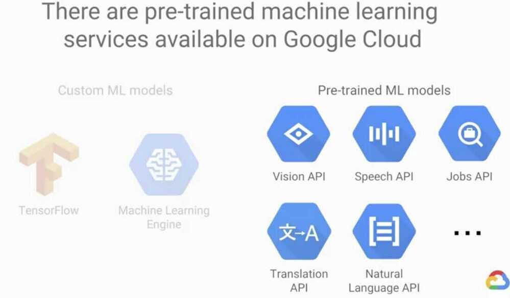
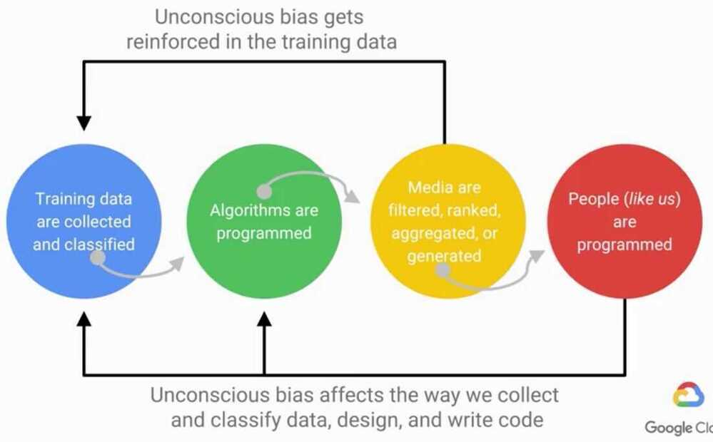

# Coursera - How Google does ML

## Mathematical Models used in ML

1. Neural Network

2. Linear methods

3. Decision trees

4. Radial basis functions

5. Ensembles of trees

6. Radial basis functions followed by linear methods

7. Support vector machines

8. Bagged decision trees

## Learning Objectives

1. Build a data strategy around ML.

2. Discover where bias in machine learning models originates.

3. Explore Compute Engine and the basics of Cloud Storage.

4. Execute ad-hoc queries at scale.

5. Invoke pre-trained ML models from Datalab.**Phases of modelling**

Training phase

Prediction / Inference Phase

## Applications

## Topics

1. Training and serving skew

2. Inclusive ML

   - **Equality of opportunity**

   - **How to find errors in your dataset using Facets**

3. Bias

   - interaction bias (when a set of people are used they tend to draw generic things and computer then is biased towards non-generic things)

   - latent bias (when fed pictures of scientists, model can be biased towards men)

   - selection bias (select photos to train model from every place and not your album)

4. Ingest-transform-publish data

## Path to ML

1. Individual Contributor

2. Delegation - Gently ramp up to include more people

3. Digitization - Automate mundane parts of the process

4. Big Data and Analytics - Measure and achieve data-driven success

5. Machine Learning - Automated feedback loop that can outpace human scale

## Resources

https://www.coursera.org/learn/google-machine-learning
