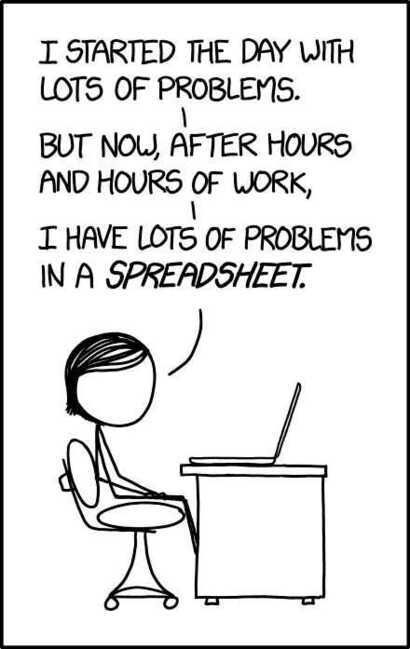

# Microsoft Excel / Google Sheets

## Features

- Timeline View

https://support.google.com/docs/answer/12935277><https://www.youtube.com/watch?v=Vl0H-qTclOg&feature=youtu.be&ab_channel=freeCodeCamp.org

- enter data
- navigate through a spreadsheet
- create formulas to solve problems
- create charts and graphs
- understand relative vs absolute references
- import and export data
- implement VLOOKUP
- use pivot tables
- split and concatenate text
Columns - 16,384

Rows - 1,048,576- Text to column

- Pivot Tables
- Preferences > View > Developer Tab in the Ribbon (For macros)
- Fix cells (Absolute and Relative Cells, use dollar as prefix or postfix in functions for addresses of cells)
- Select special
- Dynamic names (="P&L:"&C4)
- Named cell ranges
- Dropdown menu (Data validation)
- Conditional Formatting
- Custom cell formatting

## Shortcuts

- cmd + fn + up/down - move between sheets
- fn + f4 - locking the cell
- fn + f2 - edit the cell
- ctrl + ; - paste today's date in cell
- ctrl + 1 - open format box
- ctrl + cmd + v - open paste special dialog box
  - t - paste format
- ctrl + shift + l = add filter to data tables

## Examples / Functions

[Google Sheets function list](https://support.google.com/docs/table/25273)

- =IF(A4>$B$1,B4,C4)
  - =IF(A4>$B$1,IF(B4>$C$2,B4,C4),C4)
  - =IF(OR(A4<$B$1,B4<$C$2),C4,B4)
  - =IF(AND(A4<$B$1,B4<$C$2),C4,B4)
  - =IF(D7>=96,"A",IF(D7>=86,"B",IF(D7>=76,"C",IF(D7>=61,"D",IF(D7>=51,"E", "F")))))
- =SUMIF(C6:C15,D19,D6:D15)
- =AVERAGEIF(B5:B11,"<"&300000,C5:C11)
- =SUMPRODUCT(B5:B7,C5:C7)/SUM(B5:B7)
- =MID(B4,1,10)
- =IRR(B4:B8)
- =XIRR(B5:B9,C5:C9)
- =YEAR(B4)
- =MONTH(B4)
- =DAY(B4)
- =TODAY()
- =EOMONTH(B10,3)
- =EOMONTH(B10,-3)
- =IFERROR(SUM(C4:C6),"NA")
- =AVERAGE(C6:C11)
- =MEDIAN(C6:C11)
- =MAX(C6:C11)
- =MIN(C6:C11)
- =VLOOKUP(B10,B7:E12,3,)
- =PMT(D5,D6,D4) - calculate emi amount for loan
- What-if analysis
  - GoalSeek
- =PERCENTILE(A2:A20, 0.5) # to get 50th percentile value
- =PERCENTILERANK(A2:A20, A2) # relative position of a particular data point within a dataset expressed as a percentage
- PERCENTRANK.INC: Calculates the percentile rank of a value, including the smallest and largest values.
- PERCENTRANK.EXC: Calculates the percentile rank of a value, excluding the smallest and largest values.

- IF
  - SUMIF, SUMIFS, COUNTIF, COUNTIFS
- =FILTER(I:I, ISNA(MATCH(I:I, C:C, 0))) - filter one column based on other column

## Others

- Conditional Formating - Color Scales

## Microsoft Excel - Useful Tools & Tips

- How to Make Your Spreadsheets Look Professional
- Inserting, Deleting, and Modifying Rows & Columns
- Excel Formulas for Beginners
- Excel Functions
- Work Efficiently by Using Cut, Copy, and Paste
- Format Cells
- Pasting Values, Formulas and Formats with Paste Special
- Inserting a Line Break with Alt + Enter
- Do More with Your Sales Data with Excel's Text to Columns Feature
- Create Easily Printable Excel Documents
- How to Wrap Text in Excel and Adjust a Cell's Size
- Insert Hyperlinks into Excel Spreadsheets
- Using Excel's Freeze Panes to Handle Large Datasets
- Find Excel Functionalities in a Quicker Way - Tell Me What You Want to Do
- A Quick Introduction to Excel's Pivot Tables
- Initial Formatting Is Key for Creating Professional-looking Spreadsheets
- Macros Are a Great Timesaver! Here's Why
- How to Use the Same Macro On Multiple Workbooks
- The Secret to Faster Scrolling in Excel
- Be even quicker: F5 + Enter
- Using Absolute and Relative Cell References
- Find and Select Cells That Meet Specific Conditions
- How to Create Dynamic Names in Excel Spreadsheets
- Using Named Ranges to Make Formulas More Readable
- How to Add a Drop-down List in Excel
- Using Custom-sort to Sort Multiple Columns Within a Table
- Saving Time in Excel and Doing Everything Faster by Using Excel Shortcuts
- Multiply by 1
- Find and Replace - References
- Find and Replace - Formatting
- Green References
- Beauty Saving - The Professional Way of Saving Files
- The Power of F2
- Conditional Formatting
- Introduction to Custom Cell Formatting
- Custom Formatting - An example

## Microsoft Excel - Beginner, Intermediate & Advanced Functions

- Key Excel Functions: If
- Enlarge the formula bar
- Key Excel Functions: Sum, Sumif, Sumifs
- Key Excel Functions: Count, Counta, Countif, Countifs
- Key Excel Functions: Average & Averageif
- Key Excel Functions: Left, Right, Mid, Upper, Lower, Proper, Concatenate, &
- Working with text in Excel
- Find the Highest and Lowest Values in a Range: Max & Min
- = and + are interchangeable when you start typing a formula
- Use Round in Your Financial Models
- Excel's Lookup Functions: Vlookup & Hlookup Made Easy
- Index, Match, and Their Combination - The Perfect Substitute for Vlookup
- Using Excel's Iferror Function to Trap Spreadsheet Errors
- A Useful Tool for Financial Analysis - The Rank Function
- Create Flexible Financial Models with Choose
- Goal Seek Will Help You Find the Result You Are Looking For
- Perform Sensitivity Analysis with Excel's Data Tables Functionality

## Microsoft Excel - Practical Exercise "Build a P&L From Scratch"

- Introduction to the Case Study
- What You Will See Next
- Understand Your Data Source Before You Start Working on It
- Ordering the Source Worksheet
- Create a Code: The Best Way to Organize Your Data and Work Efficiently with It
- Learn How to Create a Database
- Using Lookup Functions (Vlookup) to Fill the Database Sheet
- Use Sumif to Complete the Database Sheet
- Using Index & Match as a Substitute for Vlookup
- The Mapping Exercise
- Mapping the Rows in the Database Sheet
- Building the Structure of the P&L Sheet
- A Practical Example of Professional Formatting in Excel
- Populate the P&L Sheet with Sumif
- Learn How to Find Mistakes with Countif
- Calculating Growth Rates in Excel

## Microsoft Excel - Building Professional Charts in Excel

- Introduction to Excel Charts
- Beginner's Guide to Inserting Charts in Excel
- Modifying Excel Charts - The Easy Way
- Making Your Excel Charts Sexier - Proven Tips
- Creating a Bridge Chart in Excel 2016 - As Easy as It Gets
- New Ways to Visualize Your Data - Treemap Charts
- How to Represent Trends with Sparklines
- Stacked Column Chart with a Secondary Axis
- Doughnut Chart
- Area Chart
- Bridge Chart

## Introduction to Pivot tables

- Intro to Pivot tables
- Editing a Pivot table
- Formatting a Pivot table
- Adjusting a Pivot table
- GETPIVOTDATA
- Slicers

## A practical case study with Pivot Tables

- Introduction to the case study
- Working with an SAP data extraction
- Preliminary mapping of the data extraction
- Creating an output structure of the FMCG model
- Improving the layout and appearance of the FMCG report
- Inserting formulas and automating calculations
- Creating a Master Pivot Table: The main data source for the FMCG report
- GetPivotData is great! Extracting data from the Master Pivot Table
- Combining Slicers and GetPivotData: The key to our success
- Getting fancy with Excel slicers
- This is how the report can be used in practice by high-level executives
- https://365datascience.teachable.com/courses/enrolled/526364

## Advanced Microsoft Excel

### Proficient Excel formatting

- Why Excel and why modeling
- Let's start from scratch and create a P&L sheet
- Cell styles allows you to be faster
- Pasting values, formulas, and formats with Paste Special
- Formatting Cells Part I - Working with data in Excel
- Formatting Cells Part II - Customize numbers the way you like
- Highlight key data with Excel Conditional Formatting
- Filter by color

## How to be 3.0x faster than average users

- Use multiple screens simultaneously
- F1 to F12 - Using Excel's function keys
- How to select visible cells only
- Grouping Excel rows and columns - The correct way to do it!
- Working on multiple sheets at the same time

## Excel mechanics

- Find & Replace - Our favourite Excel tool
- A great way to apply Find & Replace
- What Are Circular References in Excel
- Circular References - An example
- Trace precedents - Display the relationship between formulas and cells

## Not so simple Excel functions

- What is a nested function
- Advanced Excel functions Index; Match; Index & Match
- Advanced Excel functions Index, Match, Match
- Advanced Excel functions Indirect; Vlookup & Indirect
- Advanced Excel functions Rows; Columns; Vlookup & Columns
- Advanced Excel functions Vlookup & Match
- Advanced Excel functions Choose; Vlookup & Choose
- Advanced Excel functions Offset; Offset & Match
- Date functions

## Excel tips & tricks

- Excel tips & tricks Part 1
- Excel tips & tricks Part 2
- Excel tips & tricks Part 3
- Excel tips & tricks Part 4

https://365datascience.teachable.com/courses/enrolled/233558

[Google Sheets - Full Course](https://www.youtube.com/watch?v=N2opj8XzYBY&ab_channel=freeCodeCamp.org)

- `=GOOGLEFINANCE("GOOGL")`
- `=image("https://image.jpg")`

## Google Drive

[Set up a shared drive - Google Workspace Learning Center](https://support.google.com/a/users/answer/9310249?authuser=0)

[22 of the Best Free Google Sheets Templates](https://www.spreadsheetclass.com/google-sheets-templates/)

## Google Doc

Extension - Page Sizer
