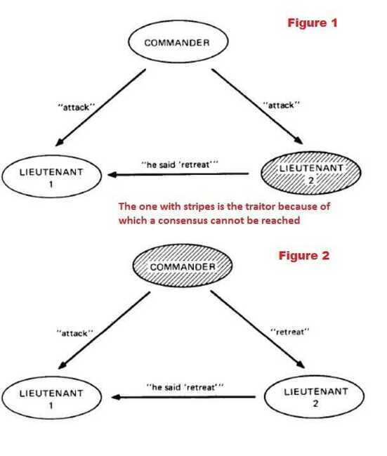
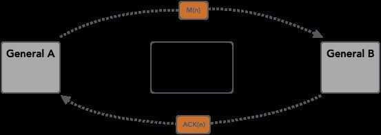

# Byzantine Generals' Problem

All participating nodes have to agree upon every message that is transmitted between the nodes. If a group of nodes is corrupt or the message that they transmit is corrupt then still the network as a whole should not be affected by it and should resist this 'Attack'. In short, the network in its entirety has to agree upon every message transmitted in the network. This agreement is called as **consensus**.

## Two Generals Problem

Two Generals problem tells us that two communicating processes will always be one step away from being certain that the other party has received a derivative acknowledgement

It is related to the more general [Byzantine Generals](https://en.wikipedia.org/wiki/Byzantine_Generals) Problem and appears often in introductory classes about [computer networking](https://en.wikipedia.org/wiki/Computer_networking)(particularly with regard to the [Transmission Control Protocol](https://en.wikipedia.org/wiki/Transmission_Control_Protocol), where it shows that TCP can't guarantee state consistency between endpoints and why), though it applies to any type of two-party communication where failures of communication are possible.

### Problem

Imagine two armies, led by generals, preparing to attack a fortified city. Armies are located on the two sides of the city and can succeed in their siege only if their attack is synchronized. They can communicate by sending messengers and already have a devised attack plan. Now they only have to agree on the fact that they both will proceed with the attack, otherwise the attack can not succeed.

General A sends a message MSG(attack at 7PM) stating that their army will proceed with the attack. Once messenger is dispatched, A doesn't know whether messenger has arrived or not. General B, upon receiving the message, has to send an acknowledgement ACK(MSG(attack at 7PM)). However, messenger carrying this acknowledgement might get captured or fail to deliver, so now B doesn't have any way of knowing if the messenger has successfully delivered it. To be sure about it, B has to wait for a second-order acknowledgement ACK(ACK(MSG(attack at 7PM) stating that A had received an acknowledgement for the acknowledgement.

No amount of further confirmations can solve the problem, as the generals will be one ACK away from knowing if they can safely proceed with the attack. Generals are doomed to wonder if the message carrying this last acknowledgment has reached the destination.

## Types of Byzantine Failures

There are two categories of failures that are considered. One is **fail-stop** (in which the node fails and stops operating) and other is **arbitrary-node failure**. Some of the arbitrary node failures are given below :

- Failure to return a result
- Respond with an incorrect result
- Respond with a deliberately misleading result
- Respond with a different result to different parts of the system

https://medium.com/all-things-ledger/the-byzantine-generals-problem-168553f31480

[Byzantine fault - Wikipedia](https://en.wikipedia.org/wiki/Byzantine_fault)

https://en.wikipedia.org/wiki/Quantum_Byzantine_agreement

https://en.wikipedia.org/wiki/Two_Generals%27_Problem

[**https://bravenewgeek.com/understanding-consensus/**](https://bravenewgeek.com/understanding-consensus/)

[Two Generals' Problem Explained - YouTube](https://www.youtube.com/watch?v=s8Wbt0b8bwY&ab_channel=Finematics)

## Byzantine Fault Tolerance (BFT)

Byzantine fault tolerance (BFT) is the property of a system that is able to resist the class of failures derived from the Byzantine Generals’ Problem. This means that a BFT system is able to continue operating even if some of the nodes fail or act maliciously.

There is more than one possible solution to the Byzantine Generals’ Problem and, therefore, multiple ways of building a BFT system. Likewise, there are different approaches for a blockchain to achieve Byzantine fault tolerance and this leads us to the so-called consensus algorithms.

Note that the PoW algorithm is not 100% tolerant to the Byzantine faults, but due to the [cost-intensive mining process](https://academy.binance.com/en/articles/what-is-cryptocurrency-mining) and the underlying cryptographic techniques, PoW has proven to be one of the most secure and reliable implementations for blockchain networks. In that sense, the Proof of Work consensus algorithm, designed by [Satoshi Nakamoto](https://academy.binance.com/en/glossary/satoshi-nakamoto), is considered by many as one of the most genius solutions to the Byzantine faults.

[Byzantine Fault Tolerance Explained | Binance Academy](https://academy.binance.com/en/articles/byzantine-fault-tolerance-explained)

### pBFT (Practical Byzantine Fault Tolerance)

Practical Byzantine Fault Tolerance is a consensus algorithm introduced in the late 90s by Barbara Liskov and Miguel Castro. pBFT was designed to work efficiently in asynchronous(no upper bound on when the response to the request will be received) systems. It is optimized for low overhead time. Its goal was to solve many problems associated with already available Byzantine Fault Tolerance solutions. Application areas include distributed computing and blockchain.

#### Advantages of pBFT

- **Energy efficiency** : pBFT can achieve distributed consensus without carrying out complex mathematical computations(like in PoW). Zilliqa employs pBFT in combination with PoW-like complex computations round for every 100th block.
- **Transaction finality** : The transactions do not require multiple confirmations(like in case of PoW mechanism in Bitcoin where every node individually verifies all the transactions before adding the new block to the blockchain; confirmations can take between 10-60 minutes depending upon how many entities confirm the new block) after they have been finalized and agreed upon.
- **Low reward variance** : Every node in the network takes part in responding to the request by the client and hence every node can be incentivized leading to low variance in rewarding the nodes that help in decision making.

#### How pBFT works?

Nodes in a pBFT enabled distributed system are sequentially ordered with one node being the primary(or the leader node) and others referred to as secondary(or the backup nodes). Note here that any eligible node in the system can become the primary by transitioning from secondary to primary(typically, in the case of a primary node failure). The goal is that all honest nodes help in reaching a consensus regarding the state of the system using the majority rule.

A practical Byzantine Fault Tolerant system can function on the condition that the maximum number of malicious nodes must not be greater than or equal to one-third of all the nodes in the system. As the number of nodes increase, the system becomes more secure.

pBFT consensus rounds are broken into 4 phases(refer with the image below):

- The client sends a request to the primary (leader) node.
- The primary (leader) node broadcasts the request to the all the secondary (backup) nodes.
- The nodes (primary and secondaries) perform the service requested and then send back a reply to the client.
- The request is served successfully when the client receives ‘m+1’ replies from different nodes in the network with the same result, where m is the maximum number of faulty nodes allowed.

The primary(leader) node is changed during every view(pBFT consensus rounds) and can be substituted by a **view change protocol** if a predefined quantity of time has passed without the leading node broadcasting a request to the backups(secondary). If needed, a majority of the honest nodes can vote on the legitimacy of the current leading node and replace it with the next leading node in line.

#### Limitations of pBFT

The pBFT consensus model works efficiently only when the number of nodes in the distributed network is small due to the high communication overhead that increases exponentially with every extra node in the network.

- **Sybil attacks** : The pBFT mechanisms are susceptible to [Sybil attacks](https://write.geeksforgeeks.org/sybil-attack/), where one entity(party) controls many identities. As the number of nodes in the network increase, sybil attacks become increasingly difficult to carry out. But as pBFT mechanisms have scalability issues too, the pBFT mechanism is used in combination with other mechanism(s).
- **Scaling** : pBFT does not scale well because of its communication (with all the other nodes at every step) overhead. As the number of nodes in the network increase (increases as O(n^k), where n is the messages and k is the number of nodes), so does the time taken to respond to the request.

#### Platforms using pBFT variants

- Zilliqa - pBFT in combination with [PoW](https://write.geeksforgeeks.org/proof-of-workpow-consensus/) consensus
- Hyperledger Fabric - permissioned version of pBFT
- Tendermint - pBFT + DPoS(Delegated Proof-of-Stake)

#### Variations of pBFT

- RBFT - Redundant BFT
- ABsTRACTs
- Q/U
- HQ - Hybrid Quorum Protocol for BFT
- Adapt
- Zyzzyva - Speculative Byzantine Fault Tolerance
- Aardvark

[practical Byzantine Fault Tolerance(pBFT) - GeeksforGeeks](https://www.geeksforgeeks.org/practical-byzantine-fault-tolerancepbft/)
