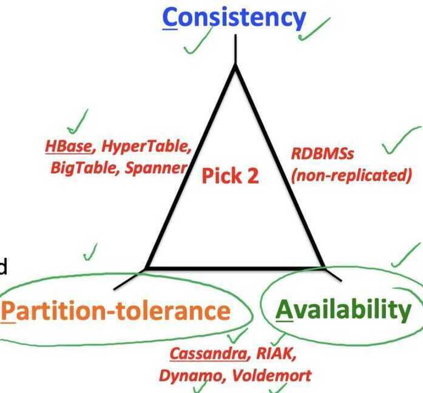

# CAP Theorem

Proposed by Eric Brewer (Berkeley)

## C - Consistency

- Every read receives the most recent write or an error
- all nodes see same data at any time, or reads return latest written value by any client

## A - Availability

- Every request receives a (non-error) response -- without guarantee that it contains the most recent write
- the system allows operations all the time, and operations return quickly

## P - Partition Tolerence

- The system continues to operate despite an arbitrary number of messages being dropped (or delayed) by the network between nodes
- the system continues to work inspite of network partitions

Can only achieve two of these.

In the presence of a network partition, you must choose betwen consistency and availability

## Why is Availability Important?

- Availability = Reads/writes complete reliable and quickly
- Measurements have shown that a 500 ms increase in latency for operations at Amazon.com or at Google.com can cause a 20% drop in revenue.
- At Amazon, each added millisecond of latency implies a $6M yearly loss
- **User cognitive drift:** If more than a second elapses between clicking and material appearing, the user's mind is already somewhere else
- SLAs (Service Level Agreements) written by providers predominantly deal with latencies faced by clients.

## Why is Consistency Important?

- Consistency = all nodes see same data at any time, or reads return latest written value by any client.
- When you access your bank or investment account via multiple clients, you want the updates done from one client to be visible to other clients.
- When thousands of customers are looking to book a flight, all updates from any client (e.g., book a flight) should be accessible by other clients.

## Why is Partition-Tolerance Important?

- Partitions happen. They happen for countless reasons. Switches fail, NICs fail, link layers fail, servers fail, processes fail. Partitions happen even when systemsdon'tfail due to GC pauses or prolonged I/O latency for example. Let's acceptthis as fact andmove on. What this means is that a "CA" system is CAonly until it's not. Once that partition happens, all your assumptions and all your guarantees hit the fan in spectacular fashion. Where does this leave us?
- Partitions can happen across datacenters when the internet gets disconnected
    - Internet router outages
    - Under-sea cables cut
    - DNS not working
- Partitions can also occur within a datacenter, e.g. a rack switch outage
- Still desire system to continue functioning normally under this scenario
- Partition tolerance ensures that system still functions in face of partition or network failure

## CAP Theorem Fallout

- Since partition-tolerance is essential in today's cloud computing systems, CAP theorem implies that a system has to choose between consistency and availability

## Cassandra

- Eventual (weak) consistency, Availability, Partition-tolerance

## Traditional RDMSs

- Strong consistency over availability under a partition

## CAP Tradeoff

- Starting point for NoSQL Revolution
- A distributed storage system can achieve at most two of C, A, and P.
- When partition-tolerance is important, you have to choose between consistency and availability

## Eventual Consistency

- If all writes stop (to a key), then all its values (replicas) will converge eventually.
- If writes continue, then system always tries to keep converging.
    - Moving wave of updated values lagging behind the latest values sent by clients, but always trying to catch up.
- May still return stale values to clients (e.g., if many back-to-back writes).
- But works well when there a few periods of low writes - system converges quickly

## RDBMS vs Key-value stores

- While RDBMS provide ACID
    - Atomicity
    - Consistency
    - Isolation
    - Durability
- Key-value stores like Cassandra provide BASE
    - Basically Available Soft-state Eventual Consistency
    - Prefers Availability over Consistency
Despite your best efforts, your system will experience enough faults that it will have to make a choice between reducing yield (i.e., stop answering requests) and reducing harvest (i.e., giving answers based on incomplete data). This decision should be based on business requirements.

## PACELC (pass-elk) Theorem

In [theoretical computer science](https://en.wikipedia.org/wiki/Theoretical_computer_science), thePACELC theoremis an extension to the [CAP theorem](https://en.wikipedia.org/wiki/CAP_theorem). It states that in case of network partitioning (P) in a [distributed computer system](https://en.wikipedia.org/wiki/Distributed_computing), one has to choose between availability (A) and consistency (C) (as per the CAP theorem), but else (E), even when the system is running normally in the absence of partitions, one has to choose between latency (L) and consistency (C).

### Database PACELC ratings

- The default versions of [DynamoDB](https://en.wikipedia.org/wiki/Amazon_DynamoDB), [Cassandra](https://en.wikipedia.org/wiki/Apache_Cassandra), [Riak](https://en.wikipedia.org/wiki/Riak) and [Cosmos DB](https://en.wikipedia.org/wiki/Cosmos_DB) are **PA/EL systems**: if a partition occurs, they give up consistency for availability, and under normal operation they give up consistency for lower latency.
- Fully ACID systems such as [VoltDB](https://en.wikipedia.org/wiki/VoltDB)/H-Store, Megastore and**[MySQL Cluster](https://en.wikipedia.org/wiki/MySQL_Cluster) are PC/EC**: they refuse to give up consistency, and will pay the availability and latency costs to achieve it.[BigTable](https://en.wikipedia.org/wiki/Bigtable) and related systems such as [HBase](https://en.wikipedia.org/wiki/Apache_HBase) are also PC/EC.
- [Couchbase](https://docs.couchbase.com/server/6.0/learn/clusters-and-availability/clusters-and-availability.html) provides a range of consistency and availability options during a partition, and equally a range of latency and consistency options with no partition. Unlike most other databases, Couchbase doesn't have a single API set nor does it scale/replicate all data services homogeneously. For writes, Couchbase favors Consistency over Availability making it formally CP, but on read there is more user-controlled variability depending on index replication, desired consistency level and type of access (single document lookup vs range scan vs full-text search, etc). On top of that, there is then further variability depending on cross-datacenter-replication (XDCR) which takes multiple CP clusters and connects them with asynchronous replication and Couchbase Lite which is an embedded database and creates a fully multi-master (with revision tracking) distributed topology.
- [Cosmos DB](https://en.wikipedia.org/wiki/Cosmos_DB) supports five tunable consistency levels that allow for tradeoffs between C/A during P, and L/C during E.[Cosmos DB](https://en.wikipedia.org/wiki/Cosmos_DB) never violates the specified consistency level, so it's formally CP.
- [MongoDB](https://en.wikipedia.org/wiki/MongoDB) can be classified as a PA/EC system. In the baseline case, the system guarantees reads and writes to be consistent.
- PNUTS is a PC/EL system.
- Hazelcast IMDG and indeed most in-memory data grids are an implementation of a PA/EC system; Hazelcast can be configured to be EL rather than EC.Concurrency primitives (Lock, AtomicReference, CountDownLatch, etc.) can be either PC/EC or PA/EC.
- [FaunaDB](https://news.ycombinator.com/item?id=18257128) implements [Calvin](http://cs.yale.edu/homes/thomson/publications/calvin-sigmod12.pdf), a transaction protocol created by Dr. Daniel Abadi and author of PACELC theorem, and offers users adjustable controls for LC tradeoff. It is PC/EC for strictly serializable transactions, and EL for serializable reads.

| **DDBS** | **P+A** | **P+C** | **E+L** | **E+C** |
|---|---|---|---|---|
| DynamoDB | Yes | Yes |
| Cassandra | Yes | Yes |
| Cosmos DB | Yes | Yes |
| Couchbase | Yes | Yes | Yes |
| Riak | Yes | Yes |
| VoltDB/H-Store | Yes | Yes |
| Megastore | Yes | Yes |
| BigTable/HBase | Yes | Yes |
| MySQL Cluster | Yes | Yes |
| MongoDB | Yes | Yes |
| PNUTS | Yes | Yes |
| Hazelcast IMDG | Yes | Yes | Yes | Yes |
| FaunaDB | Yes | Yes | Yes |

## Links

- [PACELC theorem - Wikipedia](https://en.wikipedia.org/wiki/PACELC_theorem)
- [CAP Twelve Years Later: How the "Rules" Have Changed](https://www.infoq.com/articles/cap-twelve-years-later-how-the-rules-have-changed)
- [CAP, PACELC, ACID, BASE - Essential Concepts for an Architect’s Toolkit](https://blog.bytebytego.com/p/cap-pacelc-acid-base-essential-concepts)
