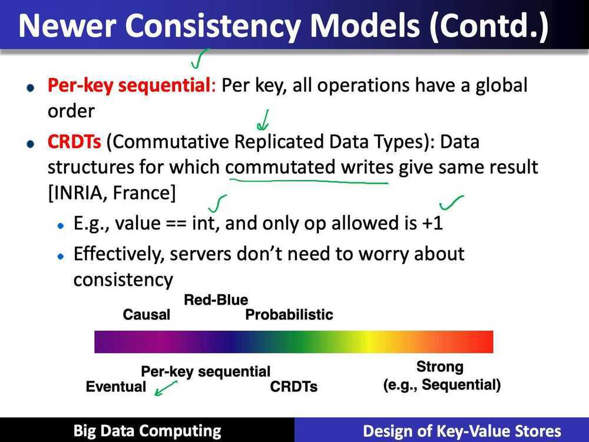

# Consistency

When we're talking about *consistency* in distributed systems, we are referring to the concept that you will have some data distributed in different nodes of your system, and each one of those might have a copy of your data. If it's a read-only dataset, any client connecting to any of the nodes will always receive the same data, so there is no consistency problem. When it comes to read-write datasets, some conflicts can arise. Each one of the nodes can update its own copy of the data, so if a client connects to different nodes in your system, it might receive different values for the same data.

## Consistency levels

Consistency levels from Werner Vogel's Eventually Consistent:

- **Strong consistency-** after an update completes, all further operations correctly use the new value
- **Weak conssistency-** operations after an update completes may not correctly use the new value
- **Eventual consistency-** if no new updates are made to an object, at some point in future it will return correct value
- **Inconsistency window-** the period between an update and the system guaranteeing the correct value will be returned
- **Casual consistency-** once an updated version is communicated to a process, it is guaranteed to not use older versions
- **Monotonic read consistency-** similar to casual consistency, but from perspective of receiving process: once a process has seen a version, it will never use previous versions
- **Monotonic write consistency-** writes within a process are serialized
- **Read-your-writes consistency-** reads after a write return the updated version
- **Session consistency-** reads after writes are always correct within a given session
- **Read level, write level** and **replica level** are the number of nodes in a distributed storage system involved in the reading, writing and replication of a piece of data. The [Dynamo paper](https://www.allthingsdistributed.com/files/amazon-dynamo-sosp2007.pdf) describes this approach in some detail, and it's used heavily by both Cassandra and MongoDB as well (among many others)

| Strong Consistency   | See all previous writes.            |
|----------------------|-------------------------------------|
| Eventual Consistency | See subset of previous writes.      |
| Consistent Prefix    | See initial sequence of writes.     |
| Bounded Staleness    | See all "old" writes.               |
| Monotonic Reads      | See increasing subset of writes.    |
| Read My Writes       | See all writes performed by reader. |

1. **Strong consistency** is particularly easy to understand. It guarantees that a read operation returns the value that was last written for a given object. If write operations can modify or extend portions of a data object, such as appending data to a log, then the read returns the result of applying all writes to that object. In other words, a read observes the effects of all previously completed writes.
2. **Eventual consistency** is the weakest of the guarantees, meaning that it allows the greatest set of possible return values. For whole-object writes, an eventually consistent read can return any value for a data object that was written in the past. More generally, such a read can return results from a replica that has received an arbitrary subset of the writes to the data object being read.
3. By requesting a **consistent prefix,** a reader is guaranteed to observe an ordered sequence of writes starting with the first write to a data object. For example, the read may be answered by a replica that receives writes in order from a master replica but has not yet received an unbounded number of recent writes. In other words, the reader sees a version of the data store that existed at the master at some time in the past. This is similar to the "snapshot isolation" consistency offered by many database management systems.
4. **Bounded staleness** ensures that read results are not too out-of-date. Typically, staleness is defined by a time period T, say 5 minutes. The storage system guarantees that a read operation will return any values written more than T minutes ago or more recently written values. Alternative, some systems have defined staleness in terms of the number of missing writes or even the amount of inaccuracy in a data value. I find that time-bounded staleness is the most natural concept for application developers.
5. **Monotonic Reads** is a property that applies to a sequence of read operations that are performed by a given storage system client. As such, it is often called a "session guarantee." With monotonic reads, a client can read arbitrarily stale data, as with eventual consistency, but is guaranteed to observe a data store that is increasingly up-to-date over time. In particular, if the client issues a read operation and then later issues another read to the same object(s), the second read will return the same value(s) or the results of later writes.
6. **Read My Writes** is a property that also applies to a sequence of operations performed by a single client. It guarantees that the effects of all writes that were performed by the client are visible to the client's subsequent reads. If a client writes a new value for a data object and then reads this object, the read will return the value that was last written by the client (or some other value that was later written by a different client). (Note: In other papers, this has been called "Read Your Writes," but I have chosen to rename it to more accurately describe the guarantee from the client's viewpoint.)

## Convergence

Convergence is the state in which all the nodes of the system have eventually achieved consistency.- **Eventual Consistency (NoSQL, Higher Availability)**

## Read will see some write and eventually it will see the latest write

Eventual consistency is a model in distributed computing that guarantees that given an update to a data item in your dataset, *eventually*, at a point in the future, all access to this data item in any node will return the same value. Because each one of the nodes can update its own copy of the data item, if two or more nodes modify the same data item, you will have a conflict. ***Conflict resolution algorithms*** are then required to achieve convergence.
One special case for eventual consistency is when you have your data distributed in multiple nodes, but only one of them is allowed to make updates to the data. If one node is the canonical source of information for the updates, you won't have conflicts in the other nodes as long as they are able to apply the updates in the exact same order as the canonical information source. You add the possibility of write unavailability, but that's a bearable trade-off for some business use cases.

## Eventually Consistent Resolution Strategies (conflict resolution algorithms)

1. **LWW (last write wins)**

If we are able to add a synchronized timestamp or counter to all of our updates, the last update always wins the conflict.

A last write wins (or all other writes lose) strategy is one way to converge on a single version for all copies of a value in a distributed system. But what are you losing by dropping those other versions? Ignoring clock skew for a moment, you can't even be sure the last write saw earlier writes from other clients. This is data loss.
2. **Semantic Resolution**

Another strategy is storing multiple versions of the datum and using semantic resolution. Use the semantics of the domain to define a path to a single value. An example being union operation that takes two divergent copies of a value and creates a single consistent version. But this passes the pain to the developer to build ad-hoc resolution strategies for the use case at hand.
3. **CRDTs**

What if someone built a series of reusable data types for you? Convergent Replicated Data Types are those data types, and offer a principled approach to eventually consistent data modelling. Some very cool maths ensures these defined data types always converge to a single correct value.

CRDTs can be considered one of the key building blocks of a distributed system, enabling strong eventual consistency and a highly available, low latency application.- **Strong Consistency (SQL)**

## Our reads will read the latest writes

Strong consistency is a model that is most familiar to database developers, given that it resembles the traditional transaction model with its Atomicity, Consistency, Isolation, and Durability (ACID) properties. In this model, any update in any node requires that all nodes agree on the new value before making it visible for client reads. It sounds naively simple, but it also introduces the require‐ ment of blocking all the nodes until they converge. It might be espe‐ cially problematic depending on network latency and throughput.- **External Consistency**

Under external consistency, the system behaves as if all transactions were executed sequentially, even though Cloud Spanner actually runs them across multiple servers (and possibly in multiple datacenters) for higher performance and availability.

https://cloud.google.com/spanner/docs/true-time-external-consistency

Strong Consistency Models

- Linearizability: Each operation by a client is visible (or available) instantaneously to all other clients
- Sequential Consistency [Lamport]:
    - "... the result of any execution is the same as if the operations of all the processors were executed in some sequential order, and the operations of each individual processor appear in this sequence in the order specified by its program.
    - After the fact, find a reasonable ordering of the operations (can reorder operations) that obeys sanity (consistency) at all clients, and across clients
- Transaction ACID properties, example: newer key-value / NoSQL stores called as NewSQL (NoSQL + ACID)
    - Hyperdex [Cornell]
    - Spanner [Spanner]
    - Transaction chains [Microsoft Reasearch]
Conclusion
- Traditional databases (RDMSs) work with strong consistency, and offer ACID
- Modern workloads don't need such strong guarantees, but do need fast response times (availability)
- Unfortunately, CAP theorem
- Key-value ? NoSQL systems offer BASE
    - Basically Available Soft-state Eventual Consistency
    - Eventual consistency, and a variety of other consistency models striving towards strong consistency

## References

https://www.dotconferences.com/2015/06/dan-brown-convergent-replicated-data-types
