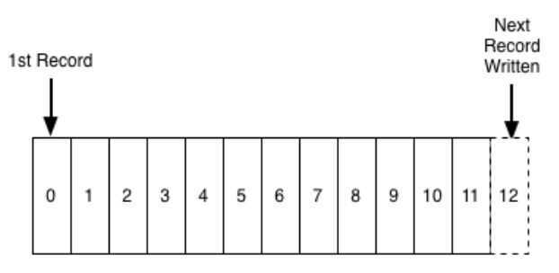

# Distributed Logging

## Logs

A log is perhaps the simplest possible storage abstraction. It is an append-only, totally-ordered sequence of records ordered by time. It looks like this:

Database people generally differentiate between *physical* and *logical* logging. **Physical logging** means logging the contents of each row that is changed. **Logical logging** means logging not the changed rows but the SQL commands that lead to the row changes (the insert, update, and delete statements).

Every programmer is familiar with another definition of logging - the unstructured error messages or trace info an application might write out to a local file using syslog or log4j. For clarity I will call this **"application logging".**

Logging can be used for -

1. **Data Integration -** Making all of an organization's data easily available in all its storage and processing systems.
2. **Real-time data processing -** Computing derived data streams.
3. **Distributed system design -** How practical systems can by simplified with a log-centric design.

## Logs Type

1. Common log format
2. Combined log format - (Common log format + referrer + user-agent)

## Basics of logging

1. Aggregate your logs
2. Trace the flow
3. Explicitly log control flow events
4. Log metrics
5. Structured log format

## Logging Best Practices

- Who was using the system when it failed?
- Where in the code did the application fail?
- What was the system doing when it failed?
- When did the failure occur?
- Why did the application fail?

## Common Log Format

The format is extended by the [Combined Log Format](https://en.wikipedia.org/w/index.php?title=Combined_Log_Format&action=edit&redlink=1) with [referrer](https://en.wikipedia.org/wiki/Referrer) and [user-agent](https://en.wikipedia.org/wiki/User-agent) fields.

## Example

127.0.0.1 user-identifier frank [10/Oct/2000:13:55:36 -0700] "GET /apache_pb.gif HTTP/1.0" 200 2326

A "-" in a field indicates missing data.- 127.0.0.1is the IP address of the client (remote host) which made the request to the server.

- user-identifieris the [RFC 1413](https://tools.ietf.org/html/rfc1413)[identity](https://en.wikipedia.org/wiki/Ident_Protocol) of the client. Usually "-".
- frankis the userid of the person requesting the document. Usually "-" unless .htaccess has requested authentication.
- 10/Oct/2000:13:55:36 -0700 is the date, time, and time zone that the request was received, by default in [strftime](https://en.wikipedia.org/wiki/Strftime) format%d/%b/%Y:%H:%M:%S %z.
- "GET /apache_pb.gif HTTP/1.0" is the request line from the client. The methodGET,/apache_pb.gifthe resource requested, andHTTP/1.0the [HTTP protocol](https://en.wikipedia.org/wiki/Hypertext_Transfer_Protocol).
- 200 is the [HTTP status code](https://en.wikipedia.org/wiki/HTTP_status_code) returned to the client. 2xx is a successful response, 3xx a redirection, 4xx a client error, and 5xx a server error.
- 2326 is the size of the object returned to the client, measured in [bytes](https://en.wikipedia.org/wiki/Byte).https://en.wikipedia.org/wiki/Common_Log_Format

## Tools

1. ELK

## References

https://engineering.linkedin.com/distributed-systems/log-what-every-software-engineer-should-know-about-real-time-datas-unifying

https://github.com/magnhaug/blogposts/blob/master/distributed-logging

https://blog.treasuredata.com/blog/2016/08/03/distributed-logging-architecture-in-the-container-era

https://devops.stackexchange.com/questions/422/how-to-have-multiple-log-streams-in-docker

[Logging at Zerodha - Zerodha Tech Blog](https://zerodha.tech/blog/logging-at-zerodha/)

- Clickhouse
- Metabase
