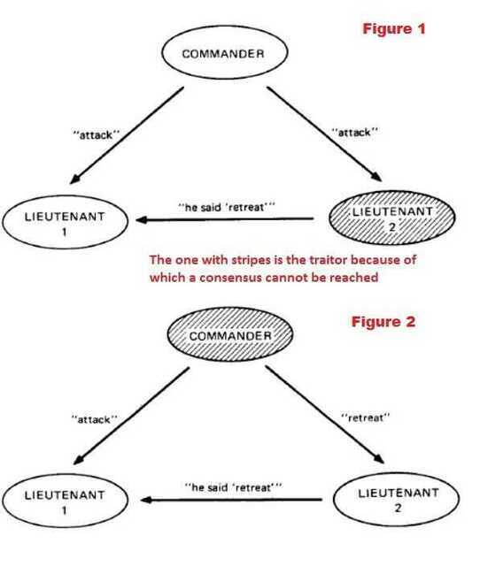

# Fallacies and Problems

## Fallacies of distributed computing

The **fallacies of distributed computing** are a set of assertions made by [L Peter Deutsch](https://en.wikipedia.org/wiki/L_Peter_Deutsch) and others at [Sun Microsystems](https://en.wikipedia.org/wiki/Sun_Microsystems) describing false assumptions that [programmers](https://en.wikipedia.org/wiki/Programmer) new to [distributed](https://en.wikipedia.org/wiki/Distributed_computing) [applications](https://en.wikipedia.org/wiki/Application_software) invariably make.

The [fallacies](https://en.wikipedia.org/wiki/Fallacy) are:

1. The [network](https://en.wikipedia.org/wiki/Computer_network) is reliable.
2. [Latency](https://en.wikipedia.org/wiki/Latency_(engineering)) is zero.
3. [Bandwidth](https://en.wikipedia.org/wiki/Throughput) is infinite.
4. The network is [secure](https://en.wikipedia.org/wiki/Computer_security).
5. [Topology](https://en.wikipedia.org/wiki/Network_topology) doesn't change.
6. There is one [administrator](https://en.wikipedia.org/wiki/Network_administrator).
7. Transport cost is zero.
8. The network is homogeneous.

**The effects of the fallacies**

1. Software applications are written with little error-handling on networking errors. During a network outage, such applications may stall or infinitely wait for an answer packet, permanently consuming memory or other resources. When the failed network becomes available, those applications may also fail to retry any stalled operations or require a (manual) restart.
2. Ignorance of network latency, and of the [packet loss](https://en.wikipedia.org/wiki/Packet_loss) it can cause, induces application- and transport-layer developers to allow unbounded traffic, greatly increasing dropped packets and wasting bandwidth.
3. Ignorance of bandwidth limits on the part of traffic senders can result in bottlenecks.
4. Complacency regarding network security results in being blindsided by malicious users and programs that continually adapt to security measures.
5. Changes in [network topology](https://en.wikipedia.org/wiki/Network_topology) can have effects on both bandwidth and latency issues, and therefore can have similar problems.
6. Multiple administrators, as with [subnets](https://en.wikipedia.org/wiki/Subnetwork) for rival companies, may institute conflicting policies of which senders of network traffic must be aware in order to complete their desired paths.
7. The "hidden" costs of building and maintaining a network or subnet are non-negligible and must consequently be noted in budgets to avoid vast shortfalls.
8. If a system assumes a homogeneous network, then it can lead to the same problems that result from the first three fallacies.

<https://en.wikipedia.org/wiki/Fallacies_of_distributed_computing>

<https://medium.com/baseds/foraging-for-the-fallacies-of-distributed-computing-part-1-1b35c3b85b53>

<https://medium.com/baseds/foraging-for-the-fallacies-of-distributed-computing-part-2-b8ff29beed56>

## Byzantine Generals' Problem / Two Generals' Problem

All participating nodes have to agree upon every message that is transmitted between the nodes. If a group of nodes is corrupt or the message that they transmit is corrupt then still the network as a whole should not be affected by it and should resist this 'Attack'. In short, the network in its entirety has to agree upon every message transmitted in the network. This agreement is called as **consensus**.

### Two Generals Problem

Two Generals problem tells us that two communicating processes will always be one step away from being certain that the other party has received a derivative acknowledgement

It is related to the more general [Byzantine Generals](https://en.wikipedia.org/wiki/Byzantine_Generals) Problem and appears often in introductory classes about [computer networking](https://en.wikipedia.org/wiki/Computer_networking)(particularly with regard to the [Transmission Control Protocol](https://en.wikipedia.org/wiki/Transmission_Control_Protocol), where it shows that TCP can't guarantee state consistency between endpoints and why), though it applies to any type of two-party communication where failures of communication are possible.

### Problem

Imagine two armies, led by generals, preparing to attack a fortified city. Armies are located on the two sides of the city and can succeed in their siege only if their attack is synchronized. They can communicate by sending messengers and already have a devised attack plan. Now they only have to agree on the fact that they both will proceed with the attack, otherwise the attack can not succeed.

General A sends a message MSG(attack at 7PM) stating that their army will proceed with the attack. Once messenger is dispatched, A doesn't know whether messenger has arrived or no. General B, upon receiving the message, has to send an acknowledgement ACK(MSG(attack at 7PM)). However, messenger carrying this acknowledgement might get captured or fail to deliver, so now B doesn't have any way of knowing if the messenger has successfully delivered it. To be sure about it, B has to wait for a second-order acknowledgement ACK(ACK(MSG(attack at 7PM) stating that A had received an acknowledgement for the acknowledgement.

No amount of further confirmations can solve the problem, as the generals will be one ACK away from knowing if they can safely proceed with the attack. Generals are doomed to wonder if the message carrying this last acknowledgment has reached the destination.

<https://medium.com/all-things-ledger/the-byzantine-generals-problem-168553f31480>

[Byzantine fault - Wikipedia](https://en.wikipedia.org/wiki/Byzantine_fault)

<https://en.wikipedia.org/wiki/Quantum_Byzantine_agreement>

<https://en.wikipedia.org/wiki/Two_Generals%27_Problem>

[**https://bravenewgeek.com/understanding-consensus/**](https://bravenewgeek.com/understanding-consensus/)

[Two Generals' Problem Explained - YouTube](https://www.youtube.com/watch?v=s8Wbt0b8bwY&ab_channel=Finematics)
