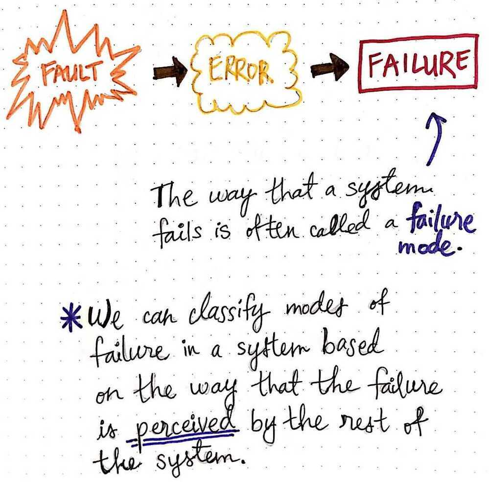

# Vocabulary

Harvest and Yield

CALM - Consistency as Logical Monotonicity

A program has a consistent, coordination-free distributed implementation if any only if it is monotonic.

## Availability configurations

- **Active-active** implies that a request routed to any node will be handled properly.
- **Active-passive** implies that a request will always be routed to a single active node, but that it's possible to quickly elect a new active node if the current active node becomes degraded.

## Conflict resolution

- **[last writer wins](https://dl.acm.org/citation.cfm?doid=1435417.1435432)-** the most recently written version is the correct version
- **[read repair](https://en.wikipedia.org/wiki/Eventual_consistency)-** inconsistencies fixed at read time, slowing reads
- **write repair-** inconsistencies fixed at write, slowing writes
- **asynchronous repair-** inconsistencies fixed out of band somehow, not synchronously within read or write operation
- **vector clocks** create a logical clock to reconcile writes, described in [Dynamo paper](https://www.allthingsdistributed.com/files/amazon-dynamo-sosp2007.pdf)

## Other stuff

- **Single point of failure**(SPOF) a single component that causes dependent services to fail
- [**Fault domains**](https://lethain.com/fault-domains/) is a set of components that share a SPOF
- **Fault tolerant** describes a system that has multiple fault domains at the same level of functionality
- **Replication** is streaming changes from one process to another
- **Synchronous replication** is commiting change on a replica at same time as committing on the primary (e.g. MySQL's [semisynchronous replication](https://dev.mysql.com/doc/refman/5.5/en/replication-semisync.html). Typically very, very slow

https://lethain.com/distributed-systems-vocabulary

## State Machine Replication

In [computer science](https://en.wikipedia.org/wiki/Computer_science), **state machine replication** or **state machine approach** is a general method for implementing a fault-tolerant service by replicating servers and coordinating client interactions with server replicas. The approach also provides a framework for understanding and designing replication management protocols.

https://en.wikipedia.org/wiki/State_machine_replication

## Highy Available and Fault Tolerant

**Highly Available**

- mostly available
- minimal downtime
- cheaper to implement

**Fault Tolerant**

- always available
- zero downtime
- expensive to implement

https://medium.com/baseds/ready-and-available-distributed-systems-161023aca378

## Fault

A fault is really just anything in our system that is different from what we expect it to be. Whenever some piece of our system deviates from its expected behavior, or whenever something unexpectedly occurs in our system, that behavior itself is a fault!

Fault -> Error -> Failure

**3 types of faults**

1. Transient - occurs once and goes away
2. Intermintent - occurs, disappears, occurs again
3. Permanent - occurs once and continues until fixed

**Two flavors of faults**

1. Fail-silent / Fail-stop

    The node with the fault stops working, and either produces no result, or a result that shows the node failed

2. [Byzantine failure](computer-science/distributed-system/byzantine-generals-problem.md)

    The node with the fault may keep working, but produces an unexpected result/error

A fault, which can originate in any part of a system, can cause unexpected behavior, which results in an unexpected result, or an error. If that error isn't handled in some way or hidden from the rest of the system, the originating node - where the fault first presented itself - will return that error, which is what we also call afailure. When we talk about different kinds of failures in a system, which could come from different kinds of faults, we can categorize them in different ways.

The different classifications for the kinds of failures we see in a distributed system are also known as failure modes.Failure modesare how we can identify the exact way that a system has failed. Interestingly, failure modes are classified somewhat holistically; that is to say, when we try to identify what kind of failure we're dealing with, we take the whole system into account.

### Types of Failures

- **timing failures**
    - If a node in a system delivers a response correctly, but that response is outside the expected time interval.
    - A node with a timing failure could deliver a response that is earlier or later than expected; these are also called Performance failures
- **omission failures**
    - It is a failure where the node's reponse never appears to be sent (or, in other words, is an "infinitely late" timing failure)
    - Omission failures come in two forms, since a node can both send and receive responses
        - Send Omission Failure - A node fails to send a response
        - Receive Omission Failure - A node fails to receive an incoming message/another node's response
- **crash failures**
    - A crash failure occurs if a node experiences an omission failure once and stops responding completely, and becomes unresponsive (aka, crashes)
- **response failures**
    - occurs when a node actually does respond, but its response is incorrect
    - There are 2 forms of response failures; the node's response may be:
        - incorrect in value (Value Failure)
        - incorrect in state, indicating something went wrong with the flow control/logic of the system (state transition failure)
- arbitrary failures
    - occurs when a node sends different responses through the system, and can produce arbitrary messages at arbitrary times also called a Byzantine failure
    - In a Byzantine failure, a node can send differing responses to other nodes, and it can forge responses/messages from other nodes
    - A subset of this failure is Authentication Detectable Byzantine Failures, where a node cannot forge a message on the behalf of another node

### Error

Errors are manifestations of faults within our system, and when an error occurs and then spreads or propagates through the system

https://medium.com/baseds/fantastic-faults-and-what-to-call-them-56d91a1b198c

https://medium.com/baseds/modes-of-failure-part-1-6687504bfed6

https://medium.com/baseds/modes-of-failure-part-2-4d050794be2f

https://medium.com/baseds/weeding-out-distributed-system-bugs-28a01e37f70c
